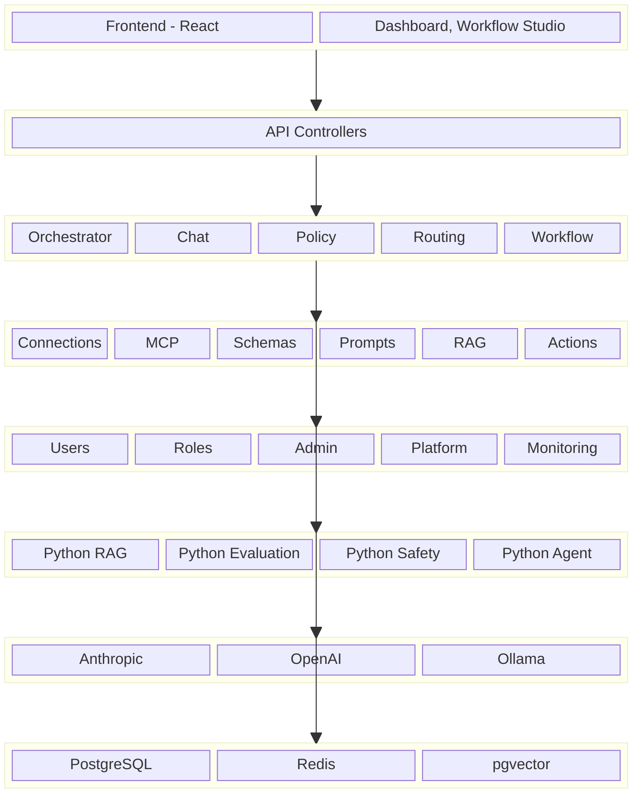
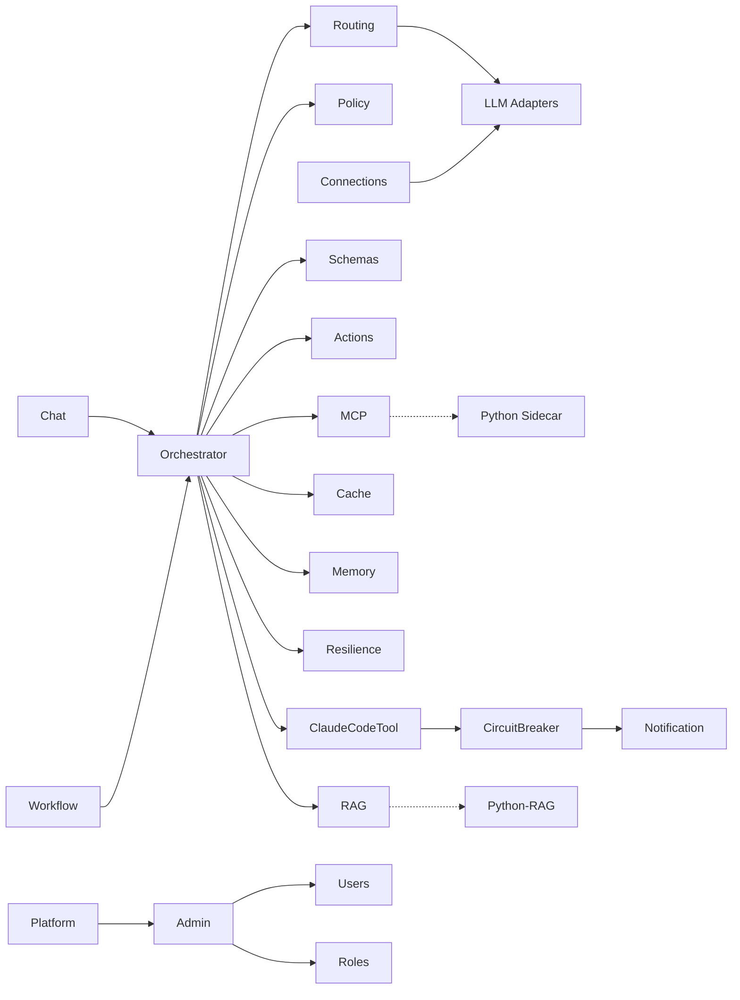

# Aimbase 모듈 요약 대시보드

> 설계 버전: 2.5 | 최종 수정: 2026-03-29 | 관련 CR: CR-007, CR-011, CR-012

> 프로젝트 전체 구조를 한눈에 파악. Sprint 계획 수립 시 참조.

---

## 시스템 구조도

> 레이어별 모듈 배치. "이 시스템이 어떻게 생겼는지" 전체 그림.

---

## 모듈 의존 관계도

> 모듈 간 호출 방향. 변경 영향 범위 파악용.

---

## 모듈 현황

| 모듈 | 기능수 | MVP포함 | MVP제외 | 책임 요약 | 비고 |
|------|--------|---------|---------|-----------|------|
| 채팅 (Chat) | 2 | 2 | 0 | LLM 채팅 완료 (동기/스트리밍), 세션 기반 대화 관리 | 핵심 모듈 |
| 연결 (Connections) | 6 | 6 | 0 | 외부 서비스 연결 관리 (LLM, DB, 메시징), 헬스체크 | 어댑터 패턴 |
| MCP | 6 | 3 | 3 | Model Context Protocol 서버 등록, 도구 탐색/실행 | MCP SDK 0.10.0 |
| 스키마 (Schemas) | 5 | 3 | 2 | JSON Schema 정의, 버전 관리, 데이터 유효성 검증 | 구조화된 출력용 |
| 정책 (Policies) | 7 | 5 | 2 | 정책 규칙 관리, SpEL 조건 평가, 시뮬레이션 | DENY/APPROVAL/RATE_LIMIT/TRANSFORM/LOG |
| 프롬프트 (Prompts) | 6 | 4 | 2 | 프롬프트 템플릿 관리, 버전관리, 변수 치환, A/B 테스트 | {{변수}} 구문 |
| 라우팅 (Routing) | 7 | 5 | 2 | 모델 라우팅 규칙 관리, 전략별 설정, Fallback 체인, 의도 분류기, Smart Routing | round-robin/cost/latency/intent, CR-012 |
| 워크플로우 (Workflows) | 10 | 7 | 3 | DAG 기반 워크플로우 정의/실행, 승인 게이트, 병렬 실행, 출력 스키마 바인딩 | Kahn 알고리즘, CR-007 |
| 워크플로우 스튜디오 (FE) | 6 | 5 | 1 | 비주얼 DAG 에디터, 드래그&드롭 노드 배치, 실행 시각화, 스키마 편집 | React Flow (CR-005, CR-007) |
| RAG | 12 | 5 | 7 | 지식소스 관리, 문서 인제스션, 벡터 검색, 검색 설정 | pgvector + Tika |
| 관리 (Admin) | 7 | 6 | 1 | 대시보드, 로그 조회, 승인/거부, 사용량 통계 | 테넌트 관리자용 |
| 사용자 (Users) | 6 | 4 | 2 | 사용자 CRUD, API 키 관리 | RBAC 연동 |
| 역할 (Roles) | 5 | 2 | 3 | RBAC 역할 CRUD, 16개 권한 조합 | 8 리소스 x read/write |
| 모니터링 (Monitoring) | 2 | 1 | 1 | 사용량/비용/성능 모니터링 | Prometheus 연동 |
| 플랫폼관리 (Platform) | 10 | 8 | 2 | 테넌트 프로비저닝/관리, 구독 쿼터, 플랫폼 대시보드 | Super Admin 전용 |
| 오케스트레이터 (내부) | 10 | 6 | 4 | 세션, 컨텍스트 트리밍, 모델 라우팅, 도구 호출 루프, 도구 필터링, 도구 강제 선택, 구조화 출력 요청, LLM별 구조화 분기, 대화 요약/압축, 요약 주입 | 내부 서비스, CR-006, CR-007, CR-012 |
| 캐시 (Cache) | 2 | 1 | 1 | LLM 응답 Exact Match 캐시(Redis), Semantic Match 캐시(pgvector) | CR-012 |
| 메모리 (Memory) | 2 | 1 | 1 | 메모리 4계층 분리(SYSTEM_RULES/LONG_TERM/SHORT_TERM/USER_PROFILE), 메모리 관리 API | CR-012 |
| Resilience | 2 | 2 | 0 | 범용 서킷 브레이커, Fallback Chain 실행기 | CR-012 |
| 액션 (내부) | 3 | 3 | 0 | Write/Notify 액션 실행, 정책 기반 제어 | 내부 서비스 |
| ClaudeCodeTool | 6 | 4 | 2 | Claude Code CLI 래퍼, 에러 패턴 DB, 서킷 브레이커, 알림 연동, 세션 관리, 스키마 개선 | CR-011, Docker 전용 |
| **Spring 소계** | **116** | **80** | **36** | | |
| **FE 전용 소계** | **6** | **5** | **1** | | CR-005, CR-007 |
| Python-RAG (MCP Server 1) | 6 | 4 | 2 | 시맨틱 청킹, 로컬 임베딩, 하이브리드 검색, 리랭킹, 쿼리 변환, 파인튜닝 | FastMCP |
| Python-평가 (MCP Server 2) | 3 | 2 | 1 | RAG 품질 평가(RAGAS), LLM 출력 평가(DeepEval), 프롬프트 회귀 테스트 | FastMCP |
| Python-안전성 (MCP Server 3) | 2 | 1 | 1 | PII 탐지/마스킹(Presidio), 출력 가드레일 | FastMCP |
| Python-에이전트 (MCP Server 4) | 1 | 0 | 1 | 고급 추론 체인(LangGraph) | FastMCP, 향후 |
| **Python 소계** | **12** | **7** | **5** | | |
| **총 합계** | **134** | **92** | **42** | | |

---

## 프로젝트 유형별 모듈 분류

| 구분 | BE 전용 모듈 | FE 전용 모듈 | BE+FE 모듈 |
|------|-------------|-------------|------------|
| 핵심 | 오케스트레이터, 액션, 세션, LLM어댑터, RAG 파이프라인, 캐시, 메모리, Resilience | - | 채팅, 연결, MCP, 정책, 워크플로우, RAG |
| 관리 | 테넌트 프로비저닝, Flyway 마이그레이션 | 대시보드 UI, 모니터링 차트 | 사용자, 역할, 관리, 플랫폼관리 |
| 보조 | 정책엔진, 감사로깅, PII마스킹 | 테마, 공통 컴포넌트 | 스키마, 프롬프트, 라우팅 |
