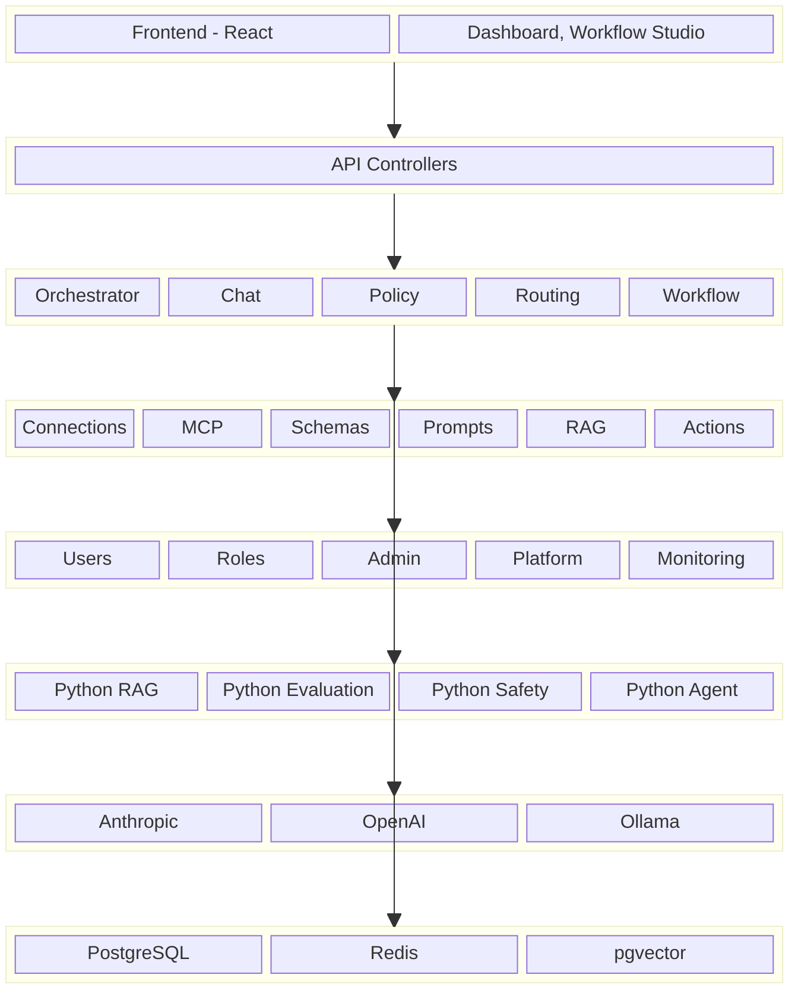
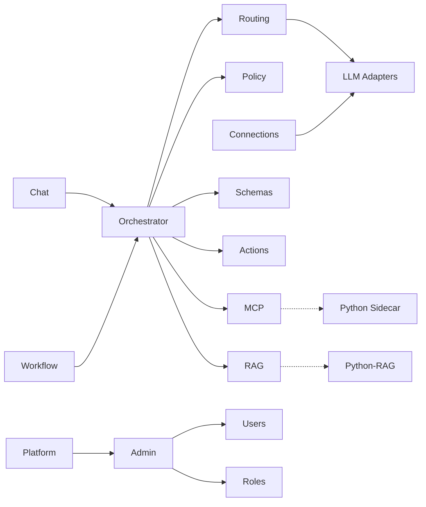

# Aimbase 모듈 요약 대시보드

> 설계 버전: 2.8 | 최종 수정: 2026-03-28 | 관련 CR: CR-006, CR-007, CR-011, CR-015, CR-016, CR-017, CR-019, CR-020, CR-021, CR-025

> 프로젝트 전체 구조를 한눈에 파악. Sprint 계획 수립 시 참조.

---

## 시스템 구조도

> 레이어별 모듈 배치. "이 시스템이 어떻게 생겼는지" 전체 그림.

---

## 모듈 의존 관계도

> 모듈 간 호출 방향. 변경 영향 범위 파악용.

---

## 모듈 현황

| 모듈 | 기능수 | MVP포함 | MVP제외 | 책임 요약 | 비고 |
|------|--------|---------|---------|-----------|------|
| 채팅 (Chat) | 4 | 4 | 0 | LLM 채팅 완료 (동기/스트리밍), 세션 기반 대화 관리, TTS/STT API | 핵심 모듈, CR-011 |
| 연결 (Connections) | 6 | 6 | 0 | 외부 서비스 연결 관리 (LLM, DB, 메시징), 헬스체크 | 어댑터 패턴 |
| MCP | 6 | 3 | 3 | Model Context Protocol 서버 등록, 도구 탐색/실행 | MCP SDK 0.10.0 |
| 스키마 (Schemas) | 5 | 3 | 2 | JSON Schema 정의, 버전 관리, 데이터 유효성 검증 | 구조화된 출력용 |
| 정책 (Policies) | 9 | 5 | 4 | 정책 규칙 관리, SpEL 조건 평가, 시뮬레이션, 6개 규칙 타입 확장, 규칙 타입별 JSON 템플릿 자동 생성 | DENY/APPROVAL/RATE_LIMIT/TRANSFORM/LOG, CR-015 |
| 프롬프트 (Prompts) | 6 | 4 | 2 | 프롬프트 템플릿 관리, 버전관리, 변수 치환, A/B 테스트 | {{변수}} 구문 |
| 라우팅 (Routing) | 5 | 3 | 2 | 모델 라우팅 규칙 관리, 전략별 설정, Fallback 체인 | round-robin/cost/latency |
| 워크플로우 (Workflows) | 12 | 7 | 5 | DAG 기반 워크플로우 정의/실행, 승인 게이트, 병렬 실행, 출력 스키마 바인딩, WorkflowStep name 필드, JSON 역직렬화 강화 | Kahn 알고리즘, CR-007, CR-017 |
| 워크플로우 스튜디오 (FE) | 7 | 5 | 2 | 비주얼 DAG 에디터, 드래그&드롭 노드 배치, 실행 시각화, 스키마 편집, ConfigPanel 전 StepType 설정 | React Flow (CR-005, CR-007, CR-017) |
| RAG | 24 | 10 | 14 | 지식소스 관리, 문서 인제스션, 벡터 검색, 검색 설정, Contextual Retrieval, Parent-Child 검색, Query Transform, RAGAS 평가, LLM Judge 평가, 테이블/OCR 파싱, 시맨틱 캐시, Citation | pgvector + Tika, CR-011, CR-016 |
| 관리 (Admin) | 7 | 6 | 1 | 대시보드, 로그 조회, 승인/거부, 사용량 통계 | 테넌트 관리자용 |
| 사용자 (Users) | 6 | 4 | 2 | 사용자 CRUD, API 키 관리 | RBAC 연동 |
| 역할 (Roles) | 5 | 2 | 3 | RBAC 역할 CRUD, 16개 권한 조합 | 8 리소스 x read/write |
| 모니터링 (Monitoring) | 2 | 1 | 1 | 사용량/비용/성능 모니터링 | Prometheus 연동 |
| 플랫폼관리 (Platform) | 10 | 8 | 2 | 테넌트 프로비저닝/관리, 구독 쿼터, 플랫폼 대시보드 | Super Admin 전용 |
| 오케스트레이터 (내부) | 8 | 4 | 4 | 세션, 컨텍스트 트리밍, 모델 라우팅, 도구 호출 루프, ToolFilterContext 기반 도구 필터링, tool_choice 도구 강제 선택, 구조화 출력 요청(response_format), LLM별 구조화 분기 | 내부 서비스, CR-006, CR-007 |
| 액션 (내부) | 3 | 3 | 0 | Write/Notify 액션 실행, 정책 기반 제어 | 내부 서비스 |
| MCP 관리도구 | 14 | 14 | 0 | Aimbase 관리 API를 MCP 도구로 노출 (조회 6 + 워크플로우 CRUD 8). 도메인 팀 Self-Service | CR-020 |
| 프로젝트 (Project) | 10 | 9 | 1 | 회사 내 프로젝트 정의, 멤버 관리, 리소스 할당(N:M), 워크플로우 스코핑, X-Project-Id 필터 | CR-021 |
| 시스템 키 (API Keys) | 7 | 0 | 7 | API Key 독립 엔티티, CRUD, 인증 필터 확장(만료/scope), 관리 UI | CR-025 |
| **Spring 소계** | **149** | **94** | **55** | | |
| **FE 전용 소계** | **7** | **5** | **2** | | CR-005, CR-007, CR-017 |
| Python-RAG (MCP Server 1) | 11 | 7 | 4 | 시맨틱 청킹, 로컬 임베딩, 하이브리드 검색, 리랭킹, 쿼리 변환, 파인튜닝, Contextual Chunk, Parent-Child 검색, 고급 파싱, 시맨틱 캐시 | FastMCP, CR-011 |
| Python-평가 (MCP Server 2) | 5 | 3 | 2 | RAG 품질 평가(RAGAS), LLM Judge 평가(Faithfulness/Relevancy), LLM 출력 평가(DeepEval), 프롬프트 회귀 테스트, RAGAS 5메트릭 | FastMCP, CR-011, CR-016 |
| Python-안전성 (MCP Server 3) | 2 | 1 | 1 | PII 탐지/마스킹(Presidio), 출력 가드레일 | FastMCP |
| Python-에이전트 (MCP Server 4) | 1 | 0 | 1 | 고급 추론 체인(LangGraph) | FastMCP, 향후 |
| Python-도구 (MCP Server 5) | 12 | 8 | 4 | MCP 도구 실행/관리, 도구 체인, 도구 선택 최적화, 도구 결과 캐싱, 도구 권한 제어 | FastMCP, CR-019 |
| **Python 소계** | **31** | **19** | **12** | | |
| **총 합계** | **187** | **118** | **69** | | |

---

## 프로젝트 유형별 모듈 분류

| 구분 | BE 전용 모듈 | FE 전용 모듈 | BE+FE 모듈 |
|------|-------------|-------------|------------|
| 핵심 | 오케스트레이터, 액션, 세션, LLM어댑터, RAG 파이프라인 | - | 채팅, 연결, MCP, 정책, 워크플로우, RAG |
| 관리 | 테넌트 프로비저닝, Flyway 마이그레이션 | 대시보드 UI, 모니터링 차트, 프로젝트 관리 UI | 사용자, 역할, 관리, 플랫폼관리, 프로젝트, 시스템 키(CR-025) |
| 보조 | 정책엔진, 감사로깅, PII마스킹, MCP 관리도구 | 테마, 공통 컴포넌트 | 스키마, 프롬프트, 라우팅 |
