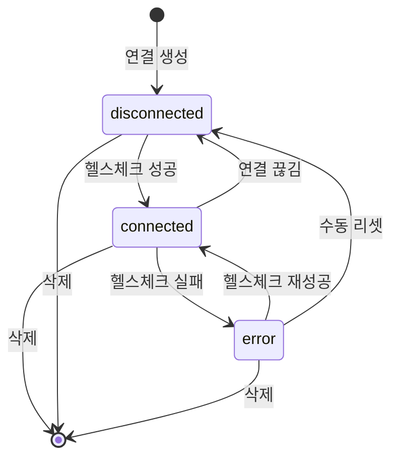
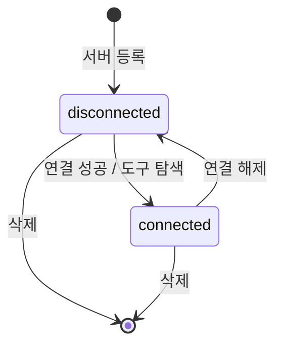
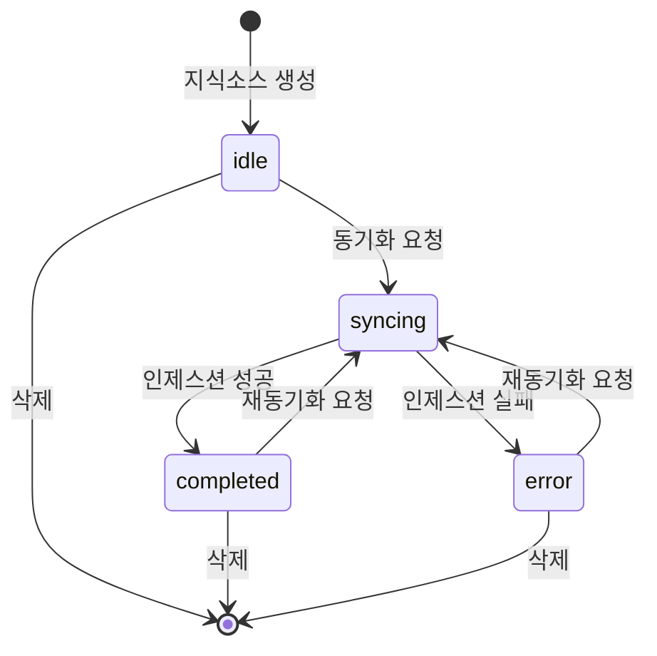
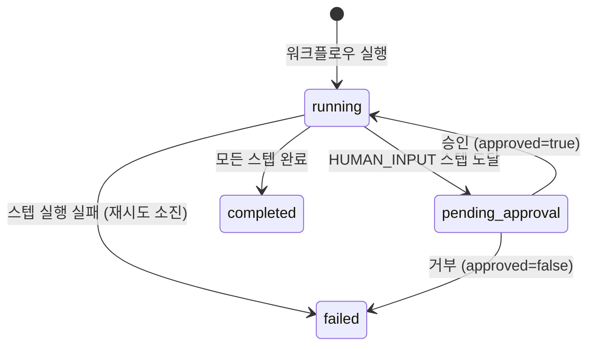
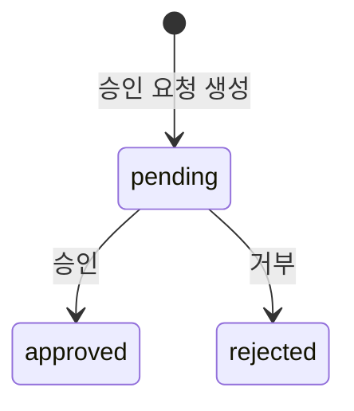
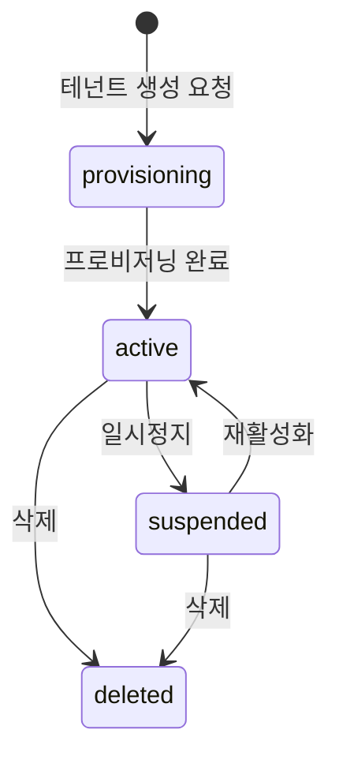
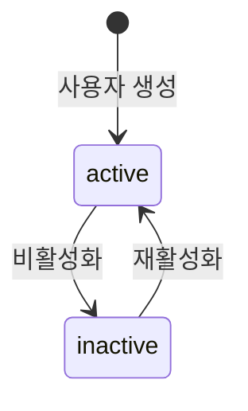

# T1-5. FSM 상태 정의서

> 설계 버전: 1.0 | 최종 수정: 2026-03-10 | 관련 CR: CR-001

> **프로젝트**: Aimbase
> **작성일**: 2026-03-10 (역설계)

---

## 전체 요약

| 엔티티 | 상태 코드 목록 |
|--------|---------------|
| Connection | `connected`, `disconnected`, `error` |
| MCPServer | `disconnected`, `connected` |
| KnowledgeSource | `idle`, `syncing`, `completed`, `error` |
| WorkflowRun | `running`, `pending_approval`, `completed`, `failed` |
| PendingApproval | `pending`, `approved`, `rejected` |
| Tenant | `provisioning`, `active`, `suspended`, `deleted` |
| User | `active`, `inactive` |

---

## Connection (연결)

### disconnected | 연결 해제
- **설명**: 연결이 생성되었으나 아직 활성화되지 않은 상태
- **진입 조건**: 최초 생성 / 연결 끊김 / 에러 후 리셋
- **허용 다음 상태**: `connected`
- **관련 기능 ID**: PRD-004, PRD-008

### connected | 연결됨
- **설명**: 외부 서비스에 정상 연결된 상태
- **진입 조건**: 헬스체크 성공
- **허용 다음 상태**: `disconnected`, `error`
- **관련 기능 ID**: PRD-008

### error | 에러
- **설명**: 헬스체크 실패 또는 연결 오류 발생 상태
- **진입 조건**: 헬스체크 실패
- **허용 다음 상태**: `connected`, `disconnected`
- **관련 기능 ID**: PRD-008

---

## MCPServer (MCP 서버)

### disconnected | 미연결
- **설명**: MCP 서버가 등록되었으나 연결되지 않은 상태
- **진입 조건**: 최초 등록 / 연결 해제 요청
- **허용 다음 상태**: `connected`
- **관련 기능 ID**: PRD-010, PRD-014

### connected | 연결됨
- **설명**: MCP 서버에 연결되어 도구 사용이 가능한 상태
- **진입 조건**: 도구 탐색 성공 / autoStart 자동 연결
- **허용 다음 상태**: `disconnected`
- **관련 기능 ID**: PRD-013
- **비고**: autoStart=true인 서버는 앱 시작 시 자동으로 connected 전환

---

## KnowledgeSource (지식소스)

### idle | 대기
- **설명**: 지식소스가 생성되었으나 아직 동기화되지 않은 상태
- **진입 조건**: 최초 생성
- **허용 다음 상태**: `syncing`
- **관련 기능 ID**: PRD-048

### syncing | 동기화 중
- **설명**: 문서 파싱, 청킹, 임베딩 생성이 진행 중인 상태
- **진입 조건**: 동기화 요청 (POST /{id}/sync)
- **허용 다음 상태**: `completed`, `error`
- **관련 기능 ID**: PRD-052
- **비고**: 동기화 중 재요청 불가

### completed | 완료
- **설명**: 인제스션이 정상 완료된 상태. 벡터 검색 가능.
- **진입 조건**: 인제스션 파이프라인 성공 완료
- **허용 다음 상태**: `syncing` (재동기화)
- **관련 기능 ID**: PRD-053

### error | 에러
- **설명**: 인제스션 실패 상태
- **진입 조건**: 파싱/청킹/임베딩 과정 중 오류
- **허용 다음 상태**: `syncing` (재시도)
- **관련 기능 ID**: PRD-052

---

## WorkflowRun (워크플로우 실행)

### running | 실행 중
- **설명**: 워크플로우 스텝이 순차/병렬로 실행 중인 상태
- **진입 조건**: 워크플로우 실행 요청 / 승인 후 재개
- **허용 다음 상태**: `pending_approval`, `completed`, `failed`
- **관련 기능 ID**: PRD-043

### pending_approval | 승인 대기
- **설명**: HUMAN_INPUT 스텝에서 승인을 기다리는 상태
- **진입 조건**: HUMAN_INPUT 타입 스텝 도달
- **허용 다음 상태**: `running` (승인), `failed` (거부)
- **관련 기능 ID**: PRD-046
- **비고**: PendingApprovalEntity 자동 생성

### completed | 완료
- **설명**: 모든 스텝이 성공적으로 완료된 상태
- **진입 조건**: 마지막 스텝 실행 성공
- **허용 다음 상태**: 없음 (종결 상태)
- **관련 기능 ID**: PRD-044

### failed | 실패
- **설명**: 스텝 실행 실패 또는 승인 거부로 종료된 상태
- **진입 조건**: 재시도 횟수 초과 / 승인 거부
- **허용 다음 상태**: 없음 (종결 상태)
- **관련 기능 ID**: PRD-044

---

## PendingApproval (승인 대기)

### pending | 대기
- **설명**: 승인을 기다리는 상태
- **진입 조건**: HUMAN_INPUT 스텝 도달 또는 REQUIRE_APPROVAL 정책 트리거
- **허용 다음 상태**: `approved`, `rejected`
- **관련 기능 ID**: PRD-063

### approved | 승인됨
- **설명**: 관리자가 승인한 상태
- **진입 조건**: 승인 처리 (POST /approve)
- **허용 다음 상태**: 없음 (종결 상태)
- **관련 기능 ID**: PRD-064

### rejected | 거부됨
- **설명**: 관리자가 거부한 상태
- **진입 조건**: 거부 처리 (POST /reject)
- **허용 다음 상태**: 없음 (종결 상태)
- **관련 기능 ID**: PRD-065

---

## Tenant (테넌트)

### provisioning | 프로비저닝 중
- **설명**: 테넌트 DB 생성, 마이그레이션, 초기화가 진행 중인 상태
- **진입 조건**: 테넌트 생성 요청
- **허용 다음 상태**: `active`
- **관련 기능 ID**: PRD-080

### active | 활성
- **설명**: 테넌트가 정상 운영 중인 상태. API 접근 가능.
- **진입 조건**: 프로비저닝 완료 / 재활성화
- **허용 다음 상태**: `suspended`, `deleted`
- **관련 기능 ID**: PRD-084

### suspended | 정지
- **설명**: 테넌트가 일시 정지되어 API 접근이 차단된 상태
- **진입 조건**: 관리자의 일시정지 요청
- **허용 다음 상태**: `active`, `deleted`
- **관련 기능 ID**: PRD-083

### deleted | 삭제
- **설명**: 테넌트가 완전 삭제된 상태. DB 드롭 완료.
- **진입 조건**: 삭제 요청
- **허용 다음 상태**: 없음 (종결 상태)
- **관련 기능 ID**: PRD-085
- **비고**: 복구 불가

---

## User (사용자)

### active | 활성
- **설명**: 사용자가 정상적으로 시스템을 사용할 수 있는 상태
- **진입 조건**: 사용자 생성 / 재활성화
- **허용 다음 상태**: `inactive`
- **관련 기능 ID**: PRD-067

### inactive | 비활성
- **설명**: 사용자가 비활성화되어 로그인 불가한 상태
- **진입 조건**: DELETE /users/{id} (소프트 삭제)
- **허용 다음 상태**: `active`
- **관련 기능 ID**: PRD-070

---

## 작성 규칙

1. **화이트리스트 원칙**: 명시되지 않은 상태 전환은 불허한다
2. **진입 조건 필수**: 모든 상태는 어떤 조건에서 진입하는지 명시한다
3. **종결 상태 표시**: 더 이상 전환이 없는 상태는 "없음 (종결 상태)"로 표시한다
4. **관련 기능 ID 매핑**: 각 상태는 관련 기능(PRD-xxx)과 연결한다
5. **Mermaid 다이어그램**: 모든 엔티티에 시각적 상태도를 포함한다
6. **비고**: 특이사항이 있는 경우 비고란에 기재한다
