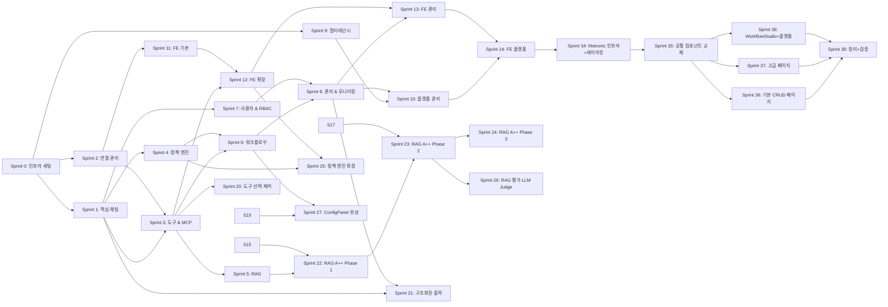

# T1-7. Sprint 구조도

> 설계 버전: 2.5 | 최종 수정: 2026-03-28 | 관련 CR: CR-006, CR-007, CR-011, CR-015, CR-016, CR-017, CR-026

> **프로젝트**: Aimbase
> **작성일**: 2026-03-10 (역설계)

---

## Sprint 의존관계

---

## Sprint 구조

### Sprint 0: 인프라 세팅

| 기능ID | 작업내용 | 의존관계 | 검증기준 | 담당 | 상태 |
|--------|---------|---------|---------|------|------|
| - | Gradle 프로젝트 구조 생성 (platform-core 모듈) | 없음 | ./gradlew build 성공 | BE | 완료 |
| - | Docker Compose 구성 (PostgreSQL, Redis, pgvector) | 없음 | docker compose up 정상 기동 | BE | 완료 |
| - | Flyway Master DB 마이그레이션 (V1~V2) | Docker Compose | Master 테이블 생성 확인 | BE | 완료 |
| - | Flyway Tenant DB 마이그레이션 (V1~V17) | Docker Compose | 모든 Tenant 테이블 생성 확인 | BE | 완료 |
| - | application.yml / .env 설정 | 없음 | Spring Boot 기동 성공 | BE | 완료 |
| - | TenantRoutingDataSource 구현 | Flyway | 멀티DB 라우팅 동작 확인 | BE | 완료 |
| - | SecurityConfig, RedisConfig, OpenApiConfig | 없음 | /swagger-ui.html 접근 가능 | BE | 완료 |
| - | ApiResponse 공통 래퍼 구현 | 없음 | 통합테스트 통과 | BE | 완료 |

---

### Sprint 1: 핵심 채팅

| 기능ID | 작업내용 | 의존관계 | 검증기준 | 담당 | 상태 |
|--------|---------|---------|---------|------|------|
| PRD-001 | ChatController + OrchestratorEngine (동기) | Sprint 0 | POST /chat/completions 200 응답 | BE | 완료 |
| PRD-002 | SSE 스트리밍 지원 | PRD-001 | stream=true 시 SSE 이벤트 수신 | BE | 완료 |
| PRD-089 | SessionStore (Redis) 구현 | Sprint 0 | 세션별 메시지 저장/조회 | BE | 완료 |
| PRD-090 | ContextWindowManager 구현 | PRD-089 | 토큰 초과 시 이전 메시지 트리밍 | BE | 완료 |
| PRD-091 | ModelRouter + ConnectionAdapterFactory | Sprint 0 | 모델명 기반 어댑터 선택 | BE | 완료 |
| - | LLMAdapter 인터페이스 + Anthropic/OpenAI/Ollama 구현 | Sprint 0 | 3개 프로바이더 채팅 성공 | BE | 완료 |
| - | UnifiedMessage/ContentBlock 통합 모델 | 없음 | 프로바이더 간 메시지 변환 | BE | 완료 |

---

### Sprint 2: 연결 관리

| 기능ID | 작업내용 | 의존관계 | 검증기준 | 담당 | 상태 |
|--------|---------|---------|---------|------|------|
| PRD-003 | ConnectionController GET / | Sprint 0 | 목록 조회 + 페이지네이션 | BE | 완료 |
| PRD-004 | ConnectionController POST / | Sprint 0 | 연결 생성 후 DB 저장 확인 | BE | 완료 |
| PRD-005 | ConnectionController GET /{id} | PRD-004 | 상세 조회 정상 | BE | 완료 |
| PRD-006 | ConnectionController PUT /{id} | PRD-004 | 수정 반영 확인 | BE | 완료 |
| PRD-007 | ConnectionController DELETE /{id} | PRD-004 | 삭제 후 404 확인 | BE | 완료 |
| PRD-008 | ConnectionController POST /{id}/test | PRD-004 | 헬스체크 ok/latencyMs 반환 | BE | 완료 |

---

### Sprint 3: 도구 & MCP

| 기능ID | 작업내용 | 의존관계 | 검증기준 | 담당 | 상태 |
|--------|---------|---------|---------|------|------|
| PRD-092 | ToolCallHandler (도구 호출 루프) | Sprint 1 | 도구 호출 → 결과 → 재호출 루프 | BE | 완료 |
| - | ToolRegistry + 내장 도구 (Calculator, GetCurrentTime) | Sprint 1 | 내장 도구 실행 성공 | BE | 완료 |
| PRD-009 | MCPController GET / | Sprint 0 | MCP 서버 목록 조회 | BE | 완료 |
| PRD-010 | MCPController POST / | Sprint 0 | MCP 서버 등록 | BE | 완료 |
| PRD-013 | MCPController POST /{id}/discover | PRD-010 | 도구 탐색 + ToolRegistry 등록 | BE | 완료 |
| PRD-014 | MCPController POST /{id}/disconnect | PRD-010 | 연결 해제 + 도구 등록 해제 | BE | 완료 |
| - | MCPServerManager (자동연결, 도구 캐싱) | PRD-010 | autoStart 서버 앱 시작 시 연결 | BE | 완료 |

---

### Sprint 4: 정책 엔진

| 기능ID | 작업내용 | 의존관계 | 검증기준 | 담당 | 상태 |
|--------|---------|---------|---------|------|------|
| PRD-020~024 | PolicyController CRUD | Sprint 0 | 정책 생성/조회/수정/삭제 | BE | 완료 |
| PRD-025 | PolicyController PATCH activate | PRD-021 | 활성/비활성 토글 | BE | 완료 |
| PRD-026 | PolicyController POST simulate | PRD-021 | 시뮬레이션 결과 반환 | BE | 완료 |
| PRD-095 | PolicyEngine 구현 (SpEL 조건 평가) | PRD-021 | DENY/APPROVAL/TRANSFORM 동작 | BE | 완료 |
| - | RateLimiter (Redis 슬라이딩 윈도우) | Sprint 0 | Rate Limit 초과 시 거부 | BE | 완료 |
| - | PIIMasker (PII 마스킹) | 없음 | 민감정보 마스킹 확인 | BE | 완료 |
| - | AuditLogger 구현 | Sprint 0 | 감사 로그 DB 저장 확인 | BE | 완료 |

---

### Sprint 5: RAG

| 기능ID | 작업내용 | 의존관계 | 검증기준 | 담당 | 상태 |
|--------|---------|---------|---------|------|------|
| PRD-047~051 | KnowledgeController CRUD | Sprint 0 | 지식소스 CRUD | BE | 완료 |
| PRD-052 | IngestionPipeline (Tika + 청킹 + 임베딩) | PRD-048 | 문서 인제스션 → 벡터 저장 | BE | 완료 |
| PRD-053 | VectorSearcher (코사인 유사도) | PRD-052 | 쿼리 → top-K 결과 반환 | BE | 완료 |
| PRD-054 | 인제스션 로그 조회 | PRD-052 | 인제스션 이력 조회 | BE | 완료 |
| PRD-055~058 | RetrievalConfigController CRUD | Sprint 0 | 검색 설정 CRUD | BE | 완료 |
| - | RAGService (컨텍스트 빌더) | PRD-053 | 채팅 시 RAG 컨텍스트 주입 확인 | BE | 완료 |

---

### Sprint 6: 워크플로우

| 기능ID | 작업내용 | 의존관계 | 검증기준 | 담당 | 상태 |
|--------|---------|---------|---------|------|------|
| PRD-038~042 | WorkflowController CRUD | Sprint 0 | 워크플로우 CRUD | BE | 완료 |
| PRD-043 | WorkflowEngine (DAG 실행, Kahn 정렬) | PRD-039 | 스텝 순차/병렬 실행 | BE | 완료 |
| PRD-044~045 | 실행 이력 조회 | PRD-043 | 실행 결과 + 상세 조회 | BE | 완료 |
| PRD-046 | HUMAN_INPUT 승인 처리 | PRD-043 | 일시정지 → 승인 → 재개 | BE | 완료 |
| - | 스텝 실행기 (LLM/Tool/Action/Condition/Parallel) | Sprint 3, 4 | 각 스텝 유형 정상 실행 | BE | 완료 |
| PRD-093 | ActionExecutor (Write) | Sprint 2 | PostgreSQL INSERT/UPDATE | BE | 완료 |
| PRD-094 | ActionExecutor (Notify - Slack/WebSocket) | Sprint 2 | Slack/WS 알림 발송 | BE | 완료 |

---

### Sprint 7: 사용자 & RBAC

| 기능ID | 작업내용 | 의존관계 | 검증기준 | 담당 | 상태 |
|--------|---------|---------|---------|------|------|
| PRD-066~071 | UserController CRUD + API 키 | Sprint 0 | 사용자 CRUD + 키 생성 | BE | 완료 |
| PRD-072~076 | RoleController CRUD | Sprint 0 | 역할 CRUD + 권한 매핑 | BE | 완료 |
| - | JWT 인증 (SecurityConfig) | Sprint 0 | 토큰 기반 인증/인가 | BE | 완료 |

---

### Sprint 8: 관리 & 모니터링

| 기능ID | 작업내용 | 의존관계 | 검증기준 | 담당 | 상태 |
|--------|---------|---------|---------|------|------|
| PRD-059 | AdminController dashboard | Sprint 6, 7 | 대시보드 통계 반환 | BE | 완료 |
| PRD-060~062 | AdminController 로그 조회 | Sprint 4, 6 | 액션/감사/사용량 로그 조회 | BE | 완료 |
| PRD-063~065 | AdminController 승인/거부 | Sprint 6 | 승인 대기 관리 | BE | 완료 |
| PRD-077~078 | 모니터링 API | Sprint 1 | 모델별 성능 통계 | BE | 완료 |
| PRD-033~037 | RoutingController CRUD | Sprint 1 | 라우팅 설정 관리 | BE | 완료 |
| PRD-015~019 | SchemaController CRUD + validate | Sprint 0 | 스키마 관리 + 검증 | BE | 완료 |
| PRD-027~032 | PromptController CRUD + test | Sprint 0 | 프롬프트 관리 + 렌더링 | BE | 완료 |

---

### Sprint 9: 멀티테넌시

| 기능ID | 작업내용 | 의존관계 | 검증기준 | 담당 | 상태 |
|--------|---------|---------|---------|------|------|
| - | TenantContext (ThreadLocal) | Sprint 0 | 요청별 테넌트 격리 | BE | 완료 |
| - | TenantResolver (인터셉터) | Sprint 0 | 헤더/JWT에서 tenantId 추출 | BE | 완료 |
| - | TenantDataSourceManager | Sprint 0 | 동적 DataSource 생성/캐싱 | BE | 완료 |
| - | TenantOnboardingService | Sprint 0 | 6단계 프로비저닝 자동화 | BE | 완료 |
| - | FlywayMultiTenantConfig | Sprint 0 | Master/Tenant 별 마이그레이션 | BE | 완료 |

---

### Sprint 10: 플랫폼 관리

| 기능ID | 작업내용 | 의존관계 | 검증기준 | 담당 | 상태 |
|--------|---------|---------|---------|------|------|
| PRD-079~085 | PlatformController 테넌트 관리 | Sprint 9 | 테넌트 CRUD + 정지/활성화/삭제 | BE | 완료 |
| PRD-086~087 | PlatformController 구독 관리 | Sprint 9 | 구독 조회/수정 | BE | 완료 |
| PRD-088 | PlatformController 사용량 대시보드 | Sprint 9 | 플랫폼 전체 통계 | BE | 완료 |

---

### Sprint 11: FE 기본 (프론트엔드)

| 기능ID | 작업내용 | 의존관계 | 검증기준 | 담당 | 상태 |
|--------|---------|---------|---------|------|------|
| - | React + Vite + TypeScript 프로젝트 생성 | 없음 | npm run dev 정상 | FE | 완료 |
| - | AppShell + Sidebar + PageHeader 레이아웃 | 없음 | 네비게이션 정상 동작 | FE | 완료 |
| - | 공통 컴포넌트 (DataTable, Modal, Badge, FormField 등) | 없음 | 컴포넌트 렌더링 | FE | 완료 |
| - | API Client (Axios + 인터셉터) | 없음 | API 호출 정상 | FE | 완료 |
| - | theme.ts (색상, 폰트 정의) | 없음 | 테마 적용 | FE | 완료 |
| - | Dashboard 페이지 | Sprint 8 BE API | 대시보드 통계 표시 | FE | 완료 |
| - | Connections 페이지 | Sprint 2 BE API | 연결 CRUD + 헬스체크 UI | FE | 완료 |

---

### Sprint 12: FE 확장

| 기능ID | 작업내용 | 의존관계 | 검증기준 | 담당 | 상태 |
|--------|---------|---------|---------|------|------|
| - | MCPServers 페이지 | Sprint 3 BE API | MCP 서버 관리 + 도구 탐색 UI | FE | 완료 |
| - | Schemas 페이지 | Sprint 8 BE API | 스키마 관리 + 검증 UI | FE | 완료 |
| - | Policies 페이지 | Sprint 4 BE API | 정책 관리 + 시뮬레이션 UI | FE | 완료 |
| - | Prompts 페이지 | Sprint 8 BE API | 프롬프트 버전 관리 + A/B 테스트 UI | FE | 완료 |
| - | Workflows 페이지 | Sprint 6 BE API | 워크플로우 DAG 시각화 + 실행 UI | FE | 완료 |
| - | Knowledge 페이지 | Sprint 5 BE API | 지식소스 관리 + 검색 테스트 UI | FE | 완료 |

---

### Sprint 13: FE 관리

| 기능ID | 작업내용 | 의존관계 | 검증기준 | 담당 | 상태 |
|--------|---------|---------|---------|------|------|
| - | Auth 페이지 (Users + Roles) | Sprint 7 BE API | 사용자/역할 관리 + API 키 UI | FE | 완료 |
| - | Monitoring 페이지 | Sprint 8 BE API | 모델 성능/비용 차트 | FE | 완료 |

---

### Sprint 14: FE 플랫폼

| 기능ID | 작업내용 | 의존관계 | 검증기준 | 담당 | 상태 |
|--------|---------|---------|---------|------|------|
| - | Tenants 페이지 | Sprint 10 BE API | 테넌트 CRUD + 정지/활성화 UI | FE | 완료 |
| - | Subscriptions 페이지 | Sprint 10 BE API | 구독 쿼터 인라인 편집 UI | FE | 완료 |
| - | PlatformMonitoring 페이지 | Sprint 10 BE API | 플랫폼 전체 통계 + 테넌트별 사용량 | FE | 완료 |

---

---

### Sprint 15: Python 사이드카 — RAG Pipeline (MCP Server 1) [v2.0, CR-002]

| 기능ID | 작업내용 | 의존관계 | 검증기준 | 담당 | 상태 |
|--------|---------|---------|---------|------|------|
| - | Python 프로젝트 세팅 (uv + pyproject.toml + FastMCP) | 없음 | FastMCP 서버 기동 확인 | Python | 완료 |
| - | Docker Compose에 Python 서비스 추가 | Sprint 0 | docker compose up 정상 기동 | Python | 완료 |
| PY-001 | 시맨틱 청킹 (LlamaIndex SemanticSplitter) | Python 세팅 | MCP tool 호출 → 청크 반환 | Python | 완료 |
| PY-002 | 로컬 임베딩 (sentence-transformers, KoSimCSE) | Python 세팅 | MCP tool 호출 → 임베딩 벡터 반환 | Python | 완료 |
| PY-004 | 하이브리드 검색 (BM25 + 벡터 + RRF) | PY-002 | MCP tool 호출 → 하이브리드 결과 반환 | Python | 완료 |
| PY-003 | 리랭킹 (cross-encoder) | PY-004 | MCP tool 호출 → 리랭킹 결과 반환 | Python | 완료 |
| PRD-052 | 인제스션 파이프라인 이관 (Tika→Unstructured) | PY-001, PY-002 | Spring MCP Client → Python 인제스션 호출 성공 | Python+BE | 완료 |
| PRD-053 | 벡터 검색 이관 | PY-003, PY-004 | Spring MCP Client → Python 검색 호출 성공 | Python+BE | 완료 |

---

### Sprint 16: Python 사이드카 — Safety (MCP Server 3) [v2.0, CR-002]

| 기능ID | 작업내용 | 의존관계 | 검증기준 | 담당 | 상태 |
|--------|---------|---------|---------|------|------|
| PY-009 | PII 탐지/마스킹 (Presidio + 한국어 커스텀) | Sprint 15 Python 세팅 | MCP tool 호출 → PII 탐지 + 마스킹 결과 | Python | 완료 |
| PRD-095 | PII 마스킹 이관 (PIIMasker→Presidio MCP) | PY-009 | Spring PolicyEngine → Python PII MCP 호출 성공 | Python+BE | 완료 |

---

### Sprint 17: Python 사이드카 — Evaluation (MCP Server 2) [v2.0, CR-002]

| 기능ID | 작업내용 | 의존관계 | 검증기준 | 담당 | 상태 |
|--------|---------|---------|---------|------|------|
| PY-006 | RAG 품질 평가 (RAGAS) | Sprint 15 | MCP tool 호출 → faithfulness/relevancy 점수 | Python | 완료 |
| PY-007 | LLM 출력 평가 (DeepEval) | Sprint 15 Python 세팅 | MCP tool 호출 → hallucination/toxicity 점수 | Python | 완료 |

---

### Sprint 18: Python 사이드카 — 고급 기능 (향후) [v2.0, CR-002]

| 기능ID | 작업내용 | 의존관계 | 검증기준 | 담당 | 상태 |
|--------|---------|---------|---------|------|------|
| PY-005 | 쿼리 변환 (HyDE, Multi-Query) | Sprint 15 | MCP tool 호출 → 변환된 쿼리 반환 | Python | 완료 |
| PY-008 | 프롬프트 회귀 테스트 | Sprint 17 | A/B 비교 점수 반환 | Python | 완료 |
| PY-010 | 출력 가드레일 (Guardrails AI) | Sprint 16 | MCP tool 호출 → 안전성 검증 결과 | Python | 완료 |
| PY-011 | 고급 추론 체인 (LangGraph) | Sprint 15 | MCP tool 호출 → 추론 결과 반환 | Python | 완료 |
| PY-012 | 임베딩 파인튜닝 파이프라인 | Sprint 15 | 학습 완료 → 모델 파일 생성 | Python | 완료 |

---

### Sprint 19: FE 워크플로우 스튜디오 [v2.3, CR-005]

| 기능ID | 작업내용 | 의존관계 | 검증기준 | 담당 | 상태 |
|--------|---------|---------|---------|------|------|
| FE-001 | 비주얼 캔버스 에디터 (React Flow) | Sprint 12 FE | 드래그&드롭 노드 배치 + 엣지 연결 | FE | 미완료 |
| FE-002 | 노드 팔레트 (6개 스텝 유형) | FE-001 | 팔레트→캔버스 드래그 추가 | FE | 미완료 |
| FE-003 | 노드 설정 패널 | FE-001 | 노드 클릭→설정 편집→저장 | FE | 미완료 |
| FE-004 | 캔버스 ↔ JSON 양방향 변환 | FE-001 | 저장→API 호출→리로드 정합성 | FE | 미완료 |
| FE-005 | 실행 시각화 | FE-001, Sprint 6 BE | 실행 시 노드별 상태 실시간 표시 | FE | 미완료 |
| - | 라우팅 추가 (/workflows/new, /:id/edit) | Sprint 12 FE | 스튜디오 페이지 진입 | FE | 미완료 |
| - | @xyflow/react + dagre 의존성 추가 | 없음 | npm install 성공 | FE | 미완료 |

---

### Sprint 21: 구조화된 출력 (BE + FE) [v2.5, CR-007]

| 기능ID | 작업내용 | 의존관계 | 검증기준 | 담당 | 상태 |
|--------|---------|---------|---------|------|------|
| PRD-098 | ChatRequest에 response_format 파라미터 추가 + OrchestratorEngine 분기 | Sprint 1, Sprint 8(스키마) | response_format 지정 시 구조화된 JSON 응답 반환 | BE | 미완료 |
| PRD-099 | LLM 어댑터별 구조화 출력 분기 (OpenAI/Claude/Ollama) | PRD-098 | OpenAI strict, Claude 프롬프트+ToolUse, Ollama format:json | BE | 미완료 |
| PRD-019 | SchemaService.validate() 연동 — LLM 응답 후처리 검증 | PRD-098 | 스키마 위반 시 재시도 또는 에러 | BE | 미완료 |
| PRD-100 | WorkflowEntity에 output_schema JSONB 컬럼 + WorkflowEngine 자동 주입 | Sprint 6, PRD-098 | 워크플로우 실행 시 output_schema 자동 적용 | BE | 미완료 |
| PRD-101 | 워크플로우 스튜디오 스키마 편집 UI | Sprint 19, PRD-100 | 스키마 선택/편집 → JSON 반영 | FE | 미완료 |
| - | Flyway 마이그레이션 (workflows 테이블에 output_schema 컬럼 추가) | Sprint 0 | 마이그레이션 성공 | BE | 미완료 |
| - | ContentBlock.Structured 레코드 추가 | PRD-098 | sealed interface 확장 | BE | 미완료 |

---

### Sprint 22: RAG A++ 고도화 — Phase 1 (Contextual Retrieval + Parent-Child) [v3.1, CR-011]

| 기능ID | 작업내용 | 의존관계 | 검증기준 | 담당 | 상태 |
|--------|---------|---------|---------|------|------|
| PRD-116 | Contextual Retrieval — IngestionPipeline에 contextual 모드 추가 | Sprint 5, Sprint 15 | contextual=true 인제스션 시 맥락 프리픽스 포함 임베딩 생성 | BE+Python | 미완료 |
| PY-023 | contextual_chunk MCP 도구 구현 | Sprint 15 | MCP tool 호출 → LLM 맥락 프리픽스 생성 | Python | 미완료 |
| PRD-117 | Parent-Child 계층 청킹 + 검색 | Sprint 5 | child 매칭 → parent 반환 검증 | BE+Python | 미완료 |
| PY-024 | parent_child_search MCP 도구 구현 | Sprint 15 | MCP tool 호출 → 계층 검색 결과 반환 | Python | 미완료 |
| PRD-118 | Parent-Child FE 설정 UI | Sprint 12 | 청킹 전략 드롭다운 + 파라미터 입력 | FE | 미완료 |
| - | Flyway 마이그레이션 (embeddings.parent_id, context_prefix, content_hash) | Sprint 0 | 마이그레이션 성공 | BE | 미완료 |
| PRD-119 | Query Transform 전략 오케스트레이션 | Sprint 5, PY-025 | HyDE/Multi-Query/Step-Back 검색 결과 확인 | BE | 미완료 |
| PY-025 | transform_query 고도화 (HyDE/Multi-Query/Step-Back LLM 연동) | Sprint 18 | 3가지 전략별 MCP tool 호출 성공 | Python | 미완료 |

---

### Sprint 23: RAG A++ 고도화 — Phase 2 (RAGAS + 고급 파싱) [v3.1, CR-011]

| 기능ID | 작업내용 | 의존관계 | 검증기준 | 담당 | 상태 |
|--------|---------|---------|---------|------|------|
| PRD-120 | RAG 평가 API (RAGAS 5개 메트릭) | Sprint 17, PY-026 | 5개 메트릭 점수 반환 + DB 저장 | BE | 미완료 |
| PY-026 | evaluate_rag_quality MCP 도구 (RAGAS) | Sprint 17 | MCP tool 호출 → 5개 메트릭 산출 | Python | 미완료 |
| PRD-121 | RAG 평가 대시보드 (FE) | Sprint 12, PRD-120 | 레이더 차트 + 추이 라인 차트 렌더링 | FE | 미완료 |
| PRD-122 | 테이블 구조 추출 파싱 | Sprint 15, PY-027 | PDF 내 표가 Markdown 테이블로 변환 확인 | BE+Python | 미완료 |
| PRD-123 | OCR 지원 (스캔 PDF/이미지) | Sprint 15, PY-027 | 스캔 PDF에서 텍스트 추출 확인 | BE+Python | 미완료 |
| PY-027 | advanced_parse MCP 도구 (테이블/OCR/레이아웃) | Sprint 15 | MCP tool 호출 → 구조화된 파싱 결과 반환 | Python | 미완료 |

---

### Sprint 24: RAG A++ 고도화 — Phase 3 (캐시 + Citation + 증분 + TTS/STT) [v3.1, CR-011]

| 기능ID | 작업내용 | 의존관계 | 검증기준 | 담당 | 상태 |
|--------|---------|---------|---------|------|------|
| PRD-124 | 시맨틱 캐시 (Redis 임베딩 비교) | Sprint 5, PY-028 | 유사 질문 캐시 히트 + 캐시 미스 정상 동작 | BE+Python | 미완료 |
| PY-028 | semantic_cache MCP 도구 | Sprint 15 | MCP tool 호출 → 캐시 비교 결과 반환 | Python | 미완료 |
| PRD-125 | 인라인 Citation (출처 번호 삽입) | Sprint 1, Sprint 5 | LLM 응답에 [1][2] 인용 + citations 필드 반환 | BE | 미완료 |
| - | 증분 인제스션 (content_hash 비교 → 변경분만 재처리) | Sprint 5 | 동일 문서 재sync 시 스킵 확인 | BE | 미완료 |
| - | 인제스션 로그 확장 (documents_skipped/updated/new 필드) | Sprint 5 | 증분 인제스션 통계 반환 확인 | BE | 미완료 |
| PRD-126 | TTS API (OpenAI TTS 프록시) | Sprint 1, Sprint 2 | POST /tts → 오디오 바이너리 스트리밍 반환 | BE | 미완료 |
| PRD-127 | STT API (OpenAI Whisper 프록시) | Sprint 1, Sprint 2 | POST /stt → 텍스트 + segments 반환 | BE | 미완료 |

---

### Sprint 20: 도구 선택 제어 (BE + FE) [v3.0, CR-006]

| 기능ID | 작업내용 | 의존관계 | 검증기준 | 담당 | 상태 |
|--------|---------|---------|---------|------|------|
| PRD-096 | ToolFilterContext record 구현 (allowedTools, excludeTools, tags) | Sprint 3 | isToolAllowed(), filterTools() 정상 동작 | BE | 미완료 |
| PRD-097 | tool_choice 파라미터 지원 (auto/none/required/{tool_name}) | Sprint 3 | LLM 어댑터별 tool_choice 매핑 검증 | BE | 미완료 |
| - | ChatRequest에 tool_choice, allowed_tools, blocked_tools 필드 추가 | PRD-096, PRD-097 | API 파라미터 정상 수신 | BE | 미완료 |
| - | ConfigPanel에서 LLM_CALL 노드에 tool_choice, allowed_tools, blocked_tools 필드 제공 | Sprint 19 | FE에서 도구 선택 제어 설정 가능 | FE | 미완료 |

---

### Sprint 25: 정책 엔진 Rule Type 확장 (BE + FE) [v3.3, CR-015]

| 기능ID | 작업내용 | 의존관계 | 검증기준 | 담당 | 상태 |
|--------|---------|---------|---------|------|------|
| PRD-128 | 6개 규칙 타입 정의 + JSON 템플릿 자동 생성 | Sprint 4 | content_filter, cost_limit, token_limit, rate_limit, model_filter, time_restriction 템플릿 생성 확인 | BE | 미완료 |
| PRD-129 | FE Policies 페이지에 규칙 타입 select + 자동 JSON 템플릿 | Sprint 12 | 타입 변경 시 JSON 에디터에 템플릿 자동 채움 | FE | 미완료 |
| - | generateRuleTemplate() 함수 구현 | PRD-128 | 6개 타입별 올바른 JSON 구조 반환 | FE | 미완료 |

---

### Sprint 26: RAG 평가 LLM Judge (Python + BE + FE) [v3.4, CR-016]

| 기능ID | 작업내용 | 의존관계 | 검증기준 | 담당 | 상태 |
|--------|---------|---------|---------|------|------|
| PY-029 | LLM Judge 함수 구현 (_llm_judge_faithfulness, _llm_judge_context_relevancy, _llm_judge_answer_relevancy) | Sprint 23 | Claude Haiku API 호출 → 점수+근거 반환 | Python | 미완료 |
| - | _call_llm_for_score() 공통 함수 (Claude Haiku API 호출) | PY-029 | 프롬프트→점수(0.0~1.0)+reasoning 반환 | Python | 미완료 |
| PRD-130 | evaluate_rag() API에 mode 파라미터 추가 (fast/accurate) | PY-029 | fast=임베딩 유사도, accurate=LLM Judge 분기 검증 | BE+Python | 미완료 |
| PRD-131 | FE RagEvaluation 페이지에 Fast/Accurate 라디오 버튼 | PRD-130 | 모드 선택 → API 호출 시 mode 전달 | FE | 미완료 |
| - | 평가 결과에 judge_reasoning 접이식 패널 추가 | PRD-131 | Accurate 모드 결과에서 근거 표시 | FE | 미완료 |

---

### Sprint 27: 워크플로우 ConfigPanel 완성 (BE + FE) [v3.5, CR-017]

| 기능ID | 작업내용 | 의존관계 | 검증기준 | 담당 | 상태 |
|--------|---------|---------|---------|------|------|
| PRD-132 | WorkflowStep record에 name 필드 추가 + @JsonIgnoreProperties + @JsonAlias("dependencies") | Sprint 6 | 기존 JSON 호환 + name 필드 정상 저장 | BE | 미완료 |
| PRD-133 | ConfigPanel 전체 StepType별 설정 폼 구현 | Sprint 19 | LLM_CALL, TOOL_CALL, CONDITION, PARALLEL, HUMAN_INPUT, ACTION 6가지 설정 편집 가능 | FE | 미완료 |
| - | LLM_CALL 설정: connection_id, model, prompt, system, temperature, tool_choice, allowed_tools, blocked_tools, response_schema | PRD-133, Sprint 20 | 모든 필드 입력→JSON 반영 검증 | FE | 미완료 |
| - | ACTION 설정: type(WRITE/NOTIFY), adapter, destination, payload ({{step.output}} 변수 치환) | PRD-133 | 변수 치환 가이드 인라인 표시 + payload 정상 반영 | FE | 미완료 |
| - | 스키마 프리셋 (분류/요약/추출) 제공 | PRD-133, Sprint 21 | 프리셋 선택 → response_schema 자동 채움 | FE | 미완료 |

---

### Sprint 34: Metronic 인프라 + 레이아웃 교체 (FE) [v5.0, CR-026]

| 기능ID | 작업내용 | 의존관계 | 검증기준 | 담당 | 상태 |
|--------|---------|---------|---------|------|------|
| - | Tailwind CSS 4 + Metronic 의존성 추가 | 없음 | npm run dev 정상 기동 | FE | 완료 |
| - | Metronic UI 컴포넌트 ~25개 선별 복사 | 없음 | 컴포넌트 import 정상 | FE | 완료 |
| - | CSS 변수 커스터마이징 (Aimbase 브랜드 색상) | 없음 | 색상 테마 적용 확인 | FE | 완료 |
| - | AppShell 레이아웃 교체 (인라인→Tailwind) | Tailwind 설치 | 전체 레이아웃 정상 | FE | 완료 |
| - | Sidebar(LNB) 교체 (이모지→Lucide, 인라인→Tailwind) | Tailwind 설치 | 네비게이션 + 활성 상태 정상 | FE | 완료 |
| - | PageHeader 교체 | Tailwind 설치 | 제목/액션 영역 정상 | FE | 완료 |

---

### Sprint 35: 공통 컴포넌트 교체 (FE) [v5.0, CR-026]

| 기능ID | 작업내용 | 의존관계 | 검증기준 | 담당 | 상태 |
|--------|---------|---------|---------|------|------|
| - | ActionButton → Metronic Button 래퍼 | Sprint 34 | 5개 variant 시각 확인 | FE | 완료 |
| - | Badge → Metronic Badge 래퍼 | Sprint 34 | 6개 color 시각 확인 | FE | 완료 |
| - | Modal → Metronic Dialog 래퍼 | Sprint 34 | 열기/닫기 정상 | FE | 완료 |
| - | DataTable → Metronic Table 기반 | Sprint 34 | hover + click 정상 | FE | 완료 |
| - | FormField + inputStyle/selectStyle/textareaStyle 교체 | Sprint 34 | 폼 입력 정상 | FE | 완료 |
| - | StatCard, EmptyState, LoadingSpinner 교체 | Sprint 34 | 렌더링 정상 | FE | 완료 |
| - | theme.ts → CSS 변수 브릿지 전환 | Sprint 34 | 기존 페이지 색상 유지 | FE | 완료 |

---

### Sprint 36: 기본 CRUD 페이지 교체 (FE) [v5.0, CR-026]

| 기능ID | 작업내용 | 의존관계 | 검증기준 | 담당 | 상태 |
|--------|---------|---------|---------|------|------|
| - | Login 페이지 스타일 교체 | Sprint 35 | 로그인 폼 동작 정상 | FE | 완료 |
| - | Dashboard 페이지 스타일 교체 | Sprint 35 | StatCard + 로그 카드 표시 정상 | FE | 완료 |
| - | Connections 페이지 스타일 교체 | Sprint 35 | 카드 CRUD + 모달 정상 | FE | 완료 |
| - | Schemas 페이지 스타일 교체 | Sprint 35 | DataTable + 편집 패널 정상 | FE | 완료 |
| - | Policies 페이지 스타일 교체 | Sprint 35 | 아코디언 + 모달 CRUD 정상 | FE | 완료 |
| - | Prompts, Knowledge, MCPServers, Auth 페이지 스타일 교체 | Sprint 35 | 각 페이지 CRUD 정상 | FE | 완료 |

---

### Sprint 37: 고급 페이지 교체 (FE) [v5.0, CR-026]

| 기능ID | 작업내용 | 의존관계 | 검증기준 | 담당 | 상태 |
|--------|---------|---------|---------|------|------|
| - | Workflows 목록 + WorkflowDetail 스타일 교체 | Sprint 35 | 목록→상세 흐름 정상 | FE | 완료 |
| - | RagEvaluation 페이지 스타일 교체 | Sprint 35 | 메트릭 카드 표시 정상 | FE | 완료 |
| - | Documents 페이지 스타일 교체 (Tabs 적용) | Sprint 35 | 탭 전환 + 업로드 정상 | FE | 완료 |
| - | Projects 페이지 스타일 교체 | Sprint 35 | 카드 CRUD 정상 | FE | 완료 |
| - | Monitoring 페이지 스타일 교체 (Recharts 유지) | Sprint 35 | 차트 렌더링 정상 | FE | 완료 |

---

### Sprint 38: WorkflowStudio + 플랫폼 페이지 교체 (FE) [v5.0, CR-026]

| 기능ID | 작업내용 | 의존관계 | 검증기준 | 담당 | 상태 |
|--------|---------|---------|---------|------|------|
| - | WorkflowStudio 주변 UI 교체 (React Flow 캔버스 유지) | Sprint 35 | 노드 드래그&드롭, 연결, 저장, 실행 정상 | FE | 완료 |
| - | NodePalette, StudioToolbar, ConfigPanel 스타일 교체 | Sprint 35 | 설정 폼 입력 정상 | FE | 완료 |
| - | WorkflowNode 카드 스타일 교체 (Handle 유지) | Sprint 35 | 노드 표시 + 연결점 정상 | FE | 완료 |
| - | Tenants, Subscriptions, ApiKeys, PlatformMonitoring 교체 | Sprint 35 | 플랫폼 CRUD 정상 | FE | 완료 |

---

### Sprint 39: 정리 + 최종 검증 (FE) [v5.0, CR-026]

| 기능ID | 작업내용 | 의존관계 | 검증기준 | 담당 | 상태 |
|--------|---------|---------|---------|------|------|
| - | theme.ts 잔여 인라인 참조 정리 | Sprint 36~38 | 인라인 스타일 잔여물 제거 | FE | 완료 |
| - | 미사용 코드 제거 (hover useState 등) | Sprint 36~38 | Tailwind hover: 클래스로 전환 완료 | FE | 완료 |
| - | 전체 페이지 시각 + 반응형 검증 | Sprint 36~38 | 20+ 페이지 정상 | FE | 완료 |
| - | npm run build 정상 + tsc --noEmit 통과 | Sprint 36~38 | 빌드 에러 없음 | FE | 완료 |
| - | 설계 문서 최종 갱신 (T2-1, CLAUDE.md, T1-7) | Sprint 38 | 문서 현행화 완료 | FE | 완료 |

---

## Sprint 분리 원칙

1. **인프라 선행**: Sprint 0에서 DB, 설정, 공통 모듈을 먼저 구축
2. **핵심 → 부가**: 채팅(핵심) → 연결/도구(부가) → 정책/워크플로우(고급) 순서
3. **BE → FE → Python**: 백엔드 API → 프론트엔드 (Sprint 11~14) → Python 사이드카 (Sprint 15~18)
4. **의존 최소화**: 각 Sprint는 최소한의 선행 Sprint에만 의존
5. **Python 사이드카**: RAG Pipeline(핵심) → Safety(PII) → Evaluation(품질) → 고급 기능(향후) 순서
