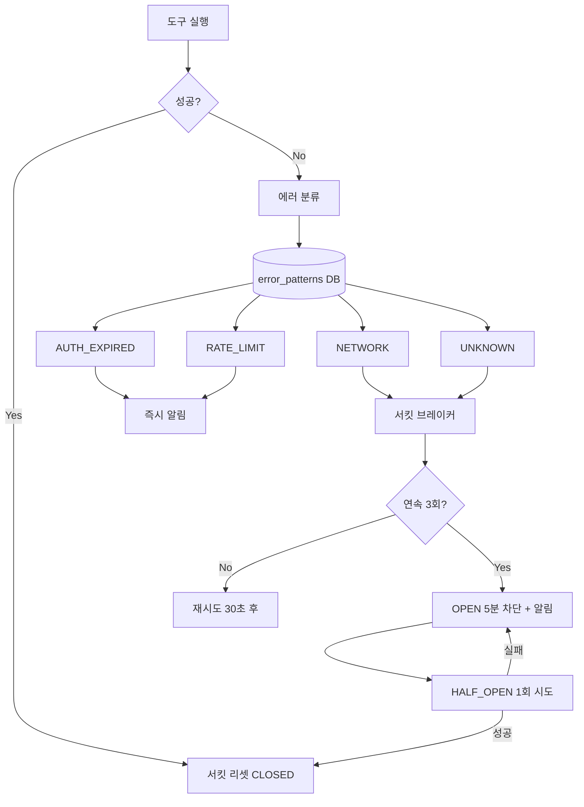

# T2-1. 기술스택 결정서

> 설계 버전: 2.5 | 최종 수정: 2026-03-29 | 관련 CR: CR-007, CR-011, CR-012

> **프로젝트**: Aimbase
> **유형**: Fullstack (BE + FE)
> **작성일**: 2026-03-10 (역설계)

---

## 조직 기술 제약

| 항목 | 내용 |
|------|------|
| 공통 라이브러리 | 없음 (독립 프로젝트) |
| 표준 기술 | Java 21, Spring Boot 3.x, PostgreSQL, React |
| 금지 기술 | 없음 |
| 참조 문서 | Spring AI 공식 문서, MCP SDK 문서 |

---

## 백엔드 기술 스택

| 영역 | 항목 | 선택 | 선택이유 | 대안검토 |
|------|------|------|---------|---------|
| 언어 | Runtime | Java 21 | Virtual Threads로 고동시성 I/O 처리, LTS급 안정성 | Kotlin (호환 가능하나 팀 기술 역량 고려) |
| 프레임워크 | BE Framework | Spring Boot 3.4.2 | 가장 성숙한 Java 에코시스템, Spring AI 공식 지원 | Quarkus (네이티브 빌드 장점이나 생태계 부족) |
| ORM | DB 접근 | Spring Data JPA + Hibernate 6.3 | 표준 JPA, JSONB 지원(Hypersistence Utils) | MyBatis (유연하나 JSONB 매핑 불편) |
| DB | 주 DB | PostgreSQL 16 | JSONB 네이티브, pgvector 확장, 멀티DB 프로비저닝 | MySQL (벡터 검색 미지원), MongoDB (트랜잭션 제한) |
| 벡터DB | 임베딩 저장 | pgvector (PostgreSQL 확장) | 별도 벡터DB 불필요, HNSW 인덱스, PostgreSQL 통합 | Pinecone (SaaS 종속), Milvus (운영 복잡) |
| 캐시 | 세션/캐시 | Redis 7 | 세션 저장, Rate Limiting 슬라이딩 윈도우, pub/sub | Memcached (pub/sub 미지원) |
| 캐시 | LLM 응답 캐시 | Redis (exact match, TTL 1h) + pgvector (semantic match, cosine≥0.95) | **CR-012**: 동일/유사 요청 반복 시 LLM 호출 절감. exact match는 Redis TTL로 빠르게, semantic match는 pgvector 코사인 유사도로 의미적 캐시 히트 | Memcached (유사도 검색 불가), 별도 벡터DB (운영 복잡도 증가) |
| 마이그레이션 | 스키마 관리 | Flyway | 버전 관리, 멀티DB 지원, Spring Boot 통합 | Liquibase (XML 기반, 설정 복잡) |
| LLM SDK | Anthropic | Anthropic Java SDK 2.12.0 | 공식 SDK, Claude 모델 직접 호출 | REST 직접 호출 (SDK가 더 안정적) |
| LLM SDK | OpenAI | OpenAI Java SDK 2.1.0 | 공식 SDK, GPT 모델 호출 | Spring AI OpenAI (추가 추상화 레이어) |
| LLM 통합 | 통합 프레임워크 | Spring AI 1.0.0 | 프로바이더 추상화, pgvector 통합 | LangChain4j (커뮤니티 주도, 안정성 부족) |
| MCP | 프로토콜 | MCP SDK 0.10.0 | 표준 MCP 프로토콜, 도구 자동 탐색 | 자체 구현 (표준 준수 부담) |
| 문서처리 | 파싱 | ~~Apache Tika 3.1.0~~ → Python Unstructured.io | **v2.0: Python 이관 (CR-002)**. 테이블/이미지/레이아웃 인식 향상 | PDFBox만 (PDF 한정) |
| 문서처리 | PDF | ~~Apache PDFBox 3.0.4~~ → Python Unstructured.io | **v2.0: Python 이관 (CR-002)** | - |
| 문서처리 | Office | ~~Apache POI 5.4.0~~ → Python Unstructured.io | **v2.0: Python 이관 (CR-002)** | - |
| 검증 | JSON | JSON Schema Validator 1.5.4 (networknt) | JSON Schema Draft 7 준수, 빠른 성능 | Everit (유지보수 중단) |
| 모니터링 | 메트릭 | Micrometer + Prometheus | Spring Boot Actuator 통합, 업계 표준 | Datadog (유료) |
| 문서화 | API | SpringDoc OpenAPI 2.8.4 | Swagger UI 자동 생성, Spring Boot 3 호환 | Springfox (Spring Boot 3 미지원) |
| 보안 | 인증 | Spring Security + JWT | 표준 보안 프레임워크, Role 기반 인가 | Keycloak (운영 부담) |
| 빌드 | 도구 | Gradle 8.x (Kotlin DSL) | 멀티모듈 지원, 빌드 성능 | Maven (XML 설정, 느린 빌드) |
| 컨테이너 | 런타임 | Eclipse Temurin JRE 21 | 경량 JRE, 프로덕션 최적화 | GraalVM (네이티브 빌드 복잡) |
| 비동기 | 동시성 | Virtual Threads (Java 21) | I/O-bound LLM 호출에 최적, 경량 스레드 | Project Reactor (복잡한 학습 곡선) |
| 메모리 | 메모리 아키텍처 | 4계층 분리 (SYSTEM_RULES / LONG_TERM / SHORT_TERM / USER_PROFILE) | **CR-012**: 계층별 토큰 할당(10%/15%/75%)으로 컨텍스트 윈도우 효율 극대화. 장기 기억과 단기 대화를 분리하여 맥락 유실 방지 | 단일 리스트 (현재, 맥락 유실), 무한 컨텍스트 모델 의존 (비용 폭발) |
| 회복성 | 회복성 패턴 | 서킷 브레이커 (CLOSED→OPEN→HALF_OPEN) + 지수 백오프 (1s→2s→4s) + Fallback Chain | **CR-012**: LLM 프로바이더 장애 시 자동 차단/복구/대체 경로 확보. 지수 백오프로 과부하 방지, Fallback Chain으로 가용성 보장 | 단순 retry (무한 반복 위험), 수동 모니터링 (실시간 대응 불가) |

---

## Python 사이드카 기술 스택 (v2.0 추가, CR-002)

> Spring 엔터프라이즈 오케스트레이션은 유지하고, AI 특화 기능만 Python으로 분리한다.
> 연동: Spring MCP Client → Python MCP Server (직접 호출, LLM 경유 불필요)

| 영역 | 항목 | 선택 | 선택이유 | 대안검토 |
|------|------|------|---------|---------|
| 언어 | Runtime | Python 3.12 | AI/ML 생태계 1등 시민, 최신 LTS | Python 3.11 (성능 차이 미미) |
| MCP 서버 | 프레임워크 | FastMCP | Python MCP 서버 표준, 데코레이터 기반 간결한 도구 등록 | mcp-python-sdk (저수준) |
| RAG 문서파싱 | 파서 | Unstructured.io | 테이블/이미지/레이아웃 인식, PDF/Office/HTML 지원 | Apache Tika (레이아웃 미인식) |
| RAG 청킹 | 프레임워크 | LlamaIndex | 시맨틱 청킹, 재귀적 청킹, 문서 구조 인식 | LangChain (청킹 기능 약함) |
| RAG 임베딩 | 로컬 모델 | sentence-transformers | 로컬 임베딩 생성, 한국어 모델(KoSimCSE) 지원 | OpenAI API만 (비용, 외부 의존) |
| RAG 검색 | 키워드 | rank_bm25 | BM25 키워드 검색, 하이브리드 결합용 | Elasticsearch (과도한 인프라) |
| RAG 리랭킹 | 모델 | cross-encoder (sentence-transformers) | 로컬 리랭킹, 비용 없음 | Cohere Rerank API (유료) |
| 평가 | RAG 평가 | RAGAS | RAG 품질 표준 평가 프레임워크 (faithfulness, relevancy 등) | 자체 구현 (표준 부재) |
| 평가 | LLM 평가 | DeepEval | 환각/유해성/편향성 탐지, 다양한 메트릭 | TruLens (커뮤니티 작음) |
| 평가 | 프롬프트 테스트 | Promptfoo | 프롬프트 A/B 비교, 회귀 테스트 | 자체 구현 (기능 부족) |
| 안전성 | PII 탐지 | Microsoft Presidio | 다국어 PII 탐지, 한국어 커스텀 recognizer 확장 | spaCy NER만 (PII 특화 아님) |
| 안전성 | 가드레일 | Guardrails AI | LLM 출력 안전성/포맷 검증 | NeMo Guardrails (NVIDIA 종속) |
| 에이전트 | 추론 체인 | LangGraph | 상태 기반 에이전트, 복잡한 추론 패턴 | AutoGen (MS 종속) |
| 패키지 관리 | 의존성 | uv + pyproject.toml | 빠른 의존성 해석, PEP 표준 준수 | pip + requirements.txt (느림) |
| 테스트 | 프레임워크 | pytest | Python 표준 테스트 프레임워크 | unittest (보일러플레이트 과다) |
| 컨테이너 | 이미지 | python:3.12-slim | 경량, 프로덕션 최적화 | python:3.12 (불필요한 패키지 포함) |

---

## 프론트엔드 기술 스택

| 영역 | 항목 | 선택 | 선택이유 | 대안검토 |
|------|------|------|---------|---------|
| 언어 | Runtime | TypeScript 5.6 | 타입 안전성, 코드 자동완성, 리팩터링 용이 | JavaScript (타입 부재) |
| 프레임워크 | UI | React 18.3.1 | 컴포넌트 기반, 거대 생태계, Virtual DOM | Vue (생태계 규모 차이), Svelte (채용 어려움) |
| 빌드 | 번들러 | Vite 5.4.10 | 빠른 HMR, ESM 기반, 간결한 설정 | webpack (느린 빌드), esbuild (플러그인 부족) |
| 라우팅 | 클라이언트 | React Router 6.27.0 | 표준 SPA 라우팅, 중첩 라우트 | TanStack Router (생태계 작음) |
| 상태관리 | 서버상태 | TanStack React Query 5.90 | 서버 상태 캐싱, 자동 갱신, staleTime 제어 | SWR (기능 부족), Redux Query (보일러플레이트 과다) |
| HTTP | 클라이언트 | Axios 1.7.7 | 인터셉터, 에러 핸들링, 타임아웃 제어 | fetch (인터셉터 부재) |
| 스타일 | CSS | CSS-in-JS (인라인) | 테마 변수 직접 참조, 별도 설정 불필요 | Tailwind (학습 비용), styled-components (번들 크기) |
| 폰트 | 디스플레이 | JetBrains Mono + DM Sans + Space Grotesk | 코드용 모노, 본문용 산세리프, 제목용 디스플레이 | - |
| 캔버스 | 노드 에디터 | @xyflow/react 12.x | React 네이티브 노드 에디터, MIT, 최대 생태계 (24k stars), n8n/Stripe 사용 | Rete.js (래퍼), JointJS (상용) |
| 레이아웃 | DAG 자동배치 | dagre 0.8.x | Kahn 위상정렬 기반 자동 레이아웃, DAG에 최적화 | elkjs (과도한 기능) |

---

## 인프라 기술 스택

| 영역 | 항목 | 선택 | 선택이유 | 대안검토 |
|------|------|------|---------|---------|
| 컨테이너 | 오케스트레이션 | Docker Compose | 로컬 개발 환경 통합, 간단한 배포 | Kubernetes (과도한 복잡도) |
| DB 이미지 | Master | postgres:16 | 공식 이미지, 안정성 | - |
| DB 이미지 | Tenant | pgvector/pgvector:pg16 | pgvector 확장 포함, 벡터 검색 지원 | - |
| 캐시 이미지 | Redis | redis:7-alpine | 경량, 헬스체크 내장 | - |
| LLM 로컬 | 옵션 | ollama/ollama | 로컬 LLM 실행, GPU 활용 | llama.cpp (통합 불편) |

---

## 주요 아키텍처 결정

### 1. Database-per-Tenant 멀티테넌시
- **결정**: 테넌트별 독립 PostgreSQL 데이터베이스
- **이유**: 완전한 데이터 격리, 테넌트별 독립 백업/복원, 성능 간섭 방지
- **트레이드오프**: DataSource 관리 복잡도 증가, 연결 풀 관리 필요

### 2. 동기 REST 우선 아키텍처
- **결정**: 이벤트 버스(Kafka 등) 미도입, REST + Virtual Threads
- **이유**: 시스템 복잡도 최소화, LLM 호출이 주요 병목(네트워크 I/O)이므로 Virtual Threads로 충분
- **트레이드오프**: 향후 대규모 비동기 처리 필요 시 이벤트 버스 도입 필요

### 3. pgvector 통합 벡터 저장소
- **결정**: 별도 벡터DB 대신 PostgreSQL pgvector 확장 사용
- **이유**: 운영 복잡도 최소화, 관계형 데이터와 벡터 데이터 동일 DB, 트랜잭션 통합
- **트레이드오프**: 대규모 벡터 데이터(수천만 건) 시 전용 벡터DB 대비 성능 한계

### 4. 모놀리식 백엔드 + 멀티모듈
- **결정**: 단일 Spring Boot 애플리케이션 (platform-core 모듈)
- **이유**: 초기 개발 속도, 배포 단순성, 모듈 간 직접 호출
- **트레이드오프**: 향후 스케일 아웃 필요 시 마이크로서비스 분리 고려

### 5. Python 사이드카 하이브리드 아키텍처 (v2.0, CR-002)
- **결정**: AI 특화 기능을 Python MCP Server로 분리하는 하이브리드 구조
- **이유**: Python AI 생태계(LangChain, RAGAS, Presidio 등)가 압도적으로 풍부. Spring은 엔터프라이즈 오케스트레이션에 강점. 각 언어의 장점을 살리는 구조.
- **연동 방식**: Spring MCP Client → Python FastMCP Server (JSON-RPC, LLM 경유 불필요)
- **트레이드오프**: 서비스 간 네트워크 호출 지연, Python 서비스 운영 관리 추가, 디버깅 복잡도 증가
- **이관 범위**: RAG 파이프라인(문서 파싱, 청킹, 임베딩, 검색), PII 탐지, 평가 시스템(신규), 가드레일(신규)
- **잔류 범위**: 멀티테넌트, 정책 엔진, 워크플로우, RBAC, 액션 시스템, 세션 관리 등 엔터프라이즈 기능 전체

### 6. 도구 선택 제어 아키텍처 (v2.4, CR-006)
- **결정**: LLM 주도 도구 선택(현행) + 앱 주도 필터링/강제 선택 2가지 메커니즘 추가
- **이유**: 도구 수 증가 시 LLM 정확도/비용 저하 방지, 고위험 도구 노출 제어, 워크플로우 스텝별 도구 강제 필요
- **방식 B (컨텍스트 필터링)**: ToolRegistry에 ToolFilterContext 기반 필터링 추가. 앱이 LLM에 노출할 도구 후보를 제한한 뒤 LLM이 그 안에서 선택
- **방식 C (강제 선택)**: LLMRequest에 toolChoice 필드 추가, 각 LLMAdapter가 프로바이더별 tool_choice 파라미터로 매핑 (auto/none/required/특정tool)
- **트레이드오프**: 필터링 로직 유지보수 추가, tool_choice 프로바이더별 차이(Ollama 미지원 등) 대응 필요
- **설계 원칙**: "모델은 제안자, 앱은 통제자" — 기존 LLM 자율 선택 구조를 유지하되 앱 레이어에서 노출 범위와 선택 전략을 제어

### 7. 구조화된 출력 아키텍처 (v2.5, CR-007)
- **결정**: 클라이언트에게 동일한 `response_format` 인터페이스를 제공하고, 내부에서 LLM 프로바이더별로 최적 방식 분기
- **이유**: 채팅 외 클라이언트(폼, RPA, 대시보드 등)가 구조화된 JSON 데이터를 필요로 함. 현재 텍스트 응답만 반환하여 AI 미들웨어로서 역할 부족
- **프로바이더별 전략**:
  - OpenAI: `response_format: { type: "json_schema", json_schema: { strict: true } }` — 토큰 레벨에서 스키마 강제
  - Gemini: `generationConfig.responseSchema` + `responseMimeType: "application/json"` — 네이티브 구조화 출력
  - Claude(Anthropic): 시스템 프롬프트에 스키마 주입 + Tool Use 역이용 (공식 structured output 미지원)
  - Ollama: `format: "json"` + 시스템 프롬프트 스키마 주입 (모델 역량에 따라 정확도 가변)
- **검증 전략**: LLM 응답 후 SchemaService.validate()로 후처리 검증. 실패 시 최대 2회 재시도
- **워크플로우 연동**: 워크플로우 정의에 `output_schema` 필드 추가, 설계 시점 스키마 바인딩 → 런타임 자동 적용. LangGraph의 TypedDict State 개념을 API 레벨로 올린 것
- **트레이드오프**: Claude/Ollama는 스키마 100% 보장 불가 (프롬프트 의존), 재시도 로직으로 보완. 프로바이더별 분기 유지보수 증가
- **설계 원칙**: "클라이언트는 어느 LLM인지 몰라도 된다" — Aimbase가 프로바이더 차이를 흡수하여 동일한 구조화 응답 보장

### 8. ClaudeCodeTool 에러 처리 아키텍처 (v2.4, CR-011)



- **에러 패턴**: Master DB `claude_code_error_patterns` 테이블, 문자열 매칭
- **서킷 브레이커**: 인메모리 상태 (CLOSED/OPEN/HALF_OPEN)
- **알림**: Aimbase 알림 모듈 연동 (SMS)

---

## FlowGuard Agent 범용 도구 아키텍처 (CR-017)

### 배포 토폴로지

```
┌────────────────────────────┐  WebSocket   ┌──────────────────────────────────┐
│  FlowGuard Backend         │──────────────│  flowguard-agent.jar (로컬 PC)    │
│  (ASSIGN_TASK 전송)         │              │                                  │
└────────────────────────────┘              │  taskType="playwright"            │
                                            │    └─ AgentPlaywrightRunner       │
┌────────────────────────────┐              │                                  │
│  Aimbase 컨테이너 (Docker)  │              │  taskType="tool"                 │
│  ├─ Claude CLI (내부 작업용) │              │    └─ ToolDispatcher             │
│  ├─ LLM 오케스트레이션      │              │        ├─ claude_execute         │
│  └─ 정책/워크플로우          │              │        ├─ file_read/write/list   │
└────────────────────────────┘              │        ├─ docker_exec/logs/ps    │
  (Aimbase는 Agent에 직접 연결하지 않음)       │        ├─ git_status/diff/log    │
                                            │        └─ shell_exec             │
                                            └──────────────────────────────────┘
```

### 기술 결정

| 항목 | 선택 | 근거 |
|------|------|------|
| 런타임 | Java 17 (기존 Agent 유지) | Spring 불필요, picocli + Jackson 경량 구조 |
| 통신 | WebSocket (기존 프로토콜 확장) | FlowGuard 서버와 이미 연결됨, 별도 포트 불필요 |
| 분기 | ASSIGN_TASK.taskType | 기존 Playwright 호환 유지, "tool"로 범용 도구 추가 |
| 설정 | agent-config.json | Spring 없이 단순 JSON 파일 |

### 보안 모델

1. **경로 제한**: PathValidator — allowedPaths 화이트리스트, 심볼릭 링크 추적 차단
2. **명령 제한**: CommandSanitizer — allowedCommands 화이트리스트, Docker 위험 플래그 차단
3. **통신 보안**: WebSocket은 FlowGuard 서버와 1:1 연결 (외부 접근 없음)
