# T3-1. 데이터 모델 정의서

> 설계 버전: 4.3 | 최종 수정: 2026-04-07 | 관련 CR: CR-002, CR-010, CR-011, CR-012, CR-013, CR-014, CR-015, CR-016, CR-018, CR-019, CR-021, CR-025, CR-029, CR-031, CR-032, CR-033, CR-034, CR-035, CR-036, CR-038

> **프로젝트**: Aimbase
> **작성일**: 2026-03-10 (역설계)

---

## Enum 정의

### ConnectionAdapter
| 값 | 설명 |
|----|------|
| openai | OpenAI API |
| anthropic | Anthropic API |
| ollama | Ollama 로컬 LLM |
| openai_compatible | OpenAI 호환 범용 shim (DeepSeek, Groq, Mistral 등) [v4.0, CR-032] |
| bedrock | AWS Bedrock [v4.0, CR-032] |
| vertex_ai | Google Vertex AI [v4.0, CR-032] |
| postgresql | PostgreSQL DB (Write용) |
| slack | Slack 메시징 |
| websocket | WebSocket 알림 |

### ConnectionType
| 값 | 설명 |
|----|------|
| llm | LLM 프로바이더 연결 |
| write | DB 쓰기 연결 |
| notify | 알림 연결 |

### ConnectionStatus
| 값 | 설명 |
|----|------|
| connected | 정상 연결 |
| disconnected | 연결 해제 |
| error | 연결 오류 |

### ConnectionGroupStrategy [v3.5, CR-015]
| 값 | 설명 |
|----|------|
| PRIORITY | 우선순위 고정 — priority 낮은 순 시도, 장애 시 다음 |
| ROUND_ROBIN | 순환 분산 — 요청마다 다음 커넥션 사용 |
| LEAST_USED | 사용량 기반 — 누적 호출 수 가장 적은 커넥션 선택 |

### ConnectionManagementMode [v3.5, CR-015]
| 값 | 설명 |
|----|------|
| PLATFORM_MANAGED | 슈퍼어드민(App DB)이 커넥션 제공, 테넌트 읽기만 |
| TENANT_MANAGED | 테넌트 자체 관리 (기존 동작) |
| HYBRID | App DB 제공 + 테넌트 자체 키 병용 |

### MCPTransport
| 값 | 설명 |
|----|------|
| stdio | 표준 입출력 |
| sse | Server-Sent Events |
| http | HTTP 통신 |

### KnowledgeSourceStatus
| 값 | 설명 |
|----|------|
| idle | 대기 |
| syncing | 동기화 중 |
| completed | 완료 |
| error | 오류 |

### WorkflowRunStatus
| 값 | 설명 |
|----|------|
| running | 실행 중 |
| pending_approval | 승인 대기 |
| completed | 완료 |
| failed | 실패 |

### ApprovalStatus
| 값 | 설명 |
|----|------|
| pending | 대기 |
| approved | 승인 |
| rejected | 거부 |

### TenantStatus
| 값 | 설명 |
|----|------|
| provisioning | 프로비저닝 중 |
| active | 활성 |
| suspended | 정지 |
| deleted | 삭제 |

### SubscriptionPlan
| 값 | 설명 |
|----|------|
| free | 무료 |
| starter | 스타터 |
| pro | 프로 |
| enterprise | 엔터프라이즈 |

### PolicyRuleType
| 값 | 설명 |
|----|------|
| DENY | 즉시 거부 |
| REQUIRE_APPROVAL | 승인 필요 |
| RATE_LIMIT | 빈도 제한 |
| TRANSFORM | 데이터 변환(PII 마스킹) |
| LOG | 감사 로깅 |
| ALLOW | 명시적 허용 |

### WorkflowStepType
| 값 | 설명 |
|----|------|
| LLM_CALL | LLM 호출 |
| TOOL_CALL | 도구 호출 |
| ACTION | 액션 실행 (Write/Notify) |
| CONDITION | 조건 분기 |
| PARALLEL | 병렬 실행 |
| HUMAN_INPUT | 승인 게이트 |
| SUB_WORKFLOW | 공용 워크플로우 참조 실행 [v3.6, CR-016] |

### AppStatus [v3.4, CR-014]
| 값 | 설명 |
|----|------|
| provisioning | 프로비저닝 중 |
| active | 활성 |
| suspended | 정지 |
| deleted | 삭제 |

### AgentAccountStatus [v3.5, CR-015]
| 값 | 설명 |
|----|------|
| active | 활성 |
| inactive | 비활성 |
| error | 오류 |

### AgentAuthType [v3.5, CR-015]
| 값 | 설명 |
|----|------|
| oauth | OAuth 인증 |
| api_key | API Key 인증 |
| token | 토큰 인증 |

### EvaluationStatus [v3.0, CR-011]
| 값 | 설명 |
|----|------|
| running | 실행 중 |
| completed | 완료 |
| failed | 실패 |

### ThinkingMode [v4.0, CR-031]
| 값 | 설명 |
|----|------|
| DISABLED | Extended Thinking 비활성 |
| ENABLED | 고정 budget (thinkingBudgetTokens 필수) |
| ADAPTIVE | 모델 자동 budget 결정 (Claude 4.6+ 전용) |

### FinishReason
| 값 | 설명 |
|----|------|
| END | 정상 종료 |
| TOOL_USE | 도구 호출 필요 |
| MAX_TOKENS | 토큰 한도 초과 |
| ERROR | 오류 |

### ActionType
| 값 | 설명 |
|----|------|
| WRITE | DB 쓰기 |
| NOTIFY | 알림 발송 |

---

## Master DB 엔티티

### tenants (테넌트)

| 필드 | 타입 | 필수 | 기본값 | 설명 |
|------|------|------|--------|------|
| id | VARCHAR(100) | ✅ | - | PK, 테넌트 ID |
| name | VARCHAR(200) | ✅ | - | 테넌트명 |
| status | VARCHAR(20) | ✅ | 'active' | 상태 (active/suspended/deleted) |
| db_host | VARCHAR(255) | ✅ | - | DB 호스트 |
| db_port | INTEGER | ✅ | 5432 | DB 포트 |
| db_name | VARCHAR(100) | ✅ | - | DB명 |
| db_username | VARCHAR(100) | ✅ | - | DB 사용자 |
| db_password_encrypted | TEXT | ✅ | - | 암호화된 DB 비밀번호 |
| admin_email | VARCHAR(255) | ❌ | - | 관리자 이메일 |
| created_at | TIMESTAMPTZ | ✅ | NOW() | 생성일시 |
| updated_at | TIMESTAMPTZ | ✅ | NOW() | 수정일시 |

- 인덱스: `idx_tenants_status` (status)

### subscriptions (구독)

| 필드 | 타입 | 필수 | 기본값 | 설명 |
|------|------|------|--------|------|
| tenant_id | VARCHAR(100) | ✅ | - | PK, FK → tenants.id |
| plan | VARCHAR(50) | ✅ | 'free' | 구독 플랜 |
| llm_monthly_token_quota | BIGINT | ✅ | 1000000 | 월 토큰 한도 |
| max_connections | INTEGER | ✅ | 5 | 최대 연결 수 |
| max_knowledge_sources | INTEGER | ✅ | 3 | 최대 지식소스 수 |
| max_workflows | INTEGER | ✅ | 10 | 최대 워크플로우 수 |
| storage_gb | INTEGER | ✅ | 1 | 스토리지 한도 (GB) |
| max_users | INTEGER | ✅ | 5 | 최대 사용자 수 |
| connection_management_mode | VARCHAR(30) | ✅ | 'TENANT_MANAGED' | 키 관리 모드 [CR-015] |
| api_rpm_limit | INTEGER | ✅ | 60 | 분당 API 요청 한도 (0=무제한) [CR-013] |
| valid_from | TIMESTAMPTZ | ✅ | NOW() | 유효 시작일 |
| valid_until | TIMESTAMPTZ | ❌ | - | 유효 종료일 |
| created_at | TIMESTAMPTZ | ✅ | NOW() | 생성일시 |
| updated_at | TIMESTAMPTZ | ✅ | NOW() | 수정일시 |

### tenant_admins (플랫폼 관리자)

| 필드 | 타입 | 필수 | 기본값 | 설명 |
|------|------|------|--------|------|
| id | VARCHAR(100) | ✅ | - | PK |
| email | VARCHAR(255) | ✅ | - | 이메일 (UNIQUE) |
| password_hash | VARCHAR(255) | ✅ | - | BCrypt 해시 |
| role | VARCHAR(50) | ✅ | 'platform_admin' | 역할 |
| is_active | BOOLEAN | ✅ | true | 활성 여부 |
| last_login_at | TIMESTAMPTZ | ❌ | - | 마지막 로그인 |
| created_at | TIMESTAMPTZ | ✅ | NOW() | 생성일시 |

### global_config (전역 설정)

| 필드 | 타입 | 필수 | 기본값 | 설명 |
|------|------|------|--------|------|
| config_key | VARCHAR(100) | ✅ | - | PK, 설정 키 |
| config_value | TEXT | ✅ | - | 설정 값 |
| is_encrypted | BOOLEAN | ✅ | false | 암호화 여부 |
| updated_by | VARCHAR(100) | ❌ | - | 수정자 |
| updated_at | TIMESTAMPTZ | ✅ | NOW() | 수정일시 |

### tenant_usage_summary (테넌트 사용량 요약)

| 필드 | 타입 | 필수 | 기본값 | 설명 |
|------|------|------|--------|------|
| id | UUID | ✅ | gen_random_uuid() | PK |
| tenant_id | VARCHAR(100) | ✅ | - | FK → tenants.id |
| year_month | VARCHAR(7) | ✅ | - | 집계 월 (YYYY-MM) |
| total_input_tokens | BIGINT | ✅ | 0 | 총 입력 토큰 |
| total_output_tokens | BIGINT | ✅ | 0 | 총 출력 토큰 |
| total_cost_usd | DECIMAL(12,4) | ✅ | 0 | 총 비용 (USD) |
| storage_used_mb | INTEGER | ✅ | 0 | 스토리지 사용량 (MB) |
| api_call_count | INTEGER | ✅ | 0 | API 호출 수 |
| created_at | TIMESTAMPTZ | ✅ | NOW() | 생성일시 |

- 인덱스: `uniq_usage_tenant_month` (tenant_id, year_month) UNIQUE

### platform_workflows (플랫폼 공용 워크플로우) [v3.6, CR-016]

| 필드 | 타입 | 필수 | 기본값 | 설명 |
|------|------|------|--------|------|
| id | VARCHAR(100) | ✅ | - | PK, 워크플로우 ID |
| name | VARCHAR(200) | ✅ | - | 워크플로우명 |
| description | TEXT | ❌ | - | 설명 |
| category | VARCHAR(50) | ❌ | - | 분류 (file_analysis, text_processing, data_transform) |
| trigger_config | JSONB | ✅ | '{}' | 트리거 설정 |
| steps | JSONB | ✅ | '[]' | 스텝 정의 목록 |
| error_handling | JSONB | ❌ | - | 에러 처리 설정 |
| output_schema | JSONB | ❌ | - | 출력 JSON Schema |
| input_schema | JSONB | ❌ | - | 입력 파라미터 스키마 |
| is_active | BOOLEAN | ✅ | true | 활성 여부 |
| created_at | TIMESTAMPTZ | ✅ | NOW() | 생성일시 |
| updated_at | TIMESTAMPTZ | ✅ | NOW() | 수정일시 |

- 인덱스: `idx_platform_workflows_category` (category), `idx_platform_workflows_active` (is_active)
- 시드 데이터: file-analysis, code-review, doc-generation, text-summarize, text-translate, data-transform

### apps (소비앱) [v3.4, CR-014]

| 필드 | 타입 | 필수 | 기본값 | 설명 |
|------|------|------|--------|------|
| id | VARCHAR(100) | ✅ | - | PK, 앱 ID |
| name | VARCHAR(200) | ✅ | - | 앱명 |
| description | TEXT | ❌ | - | 설명 |
| status | VARCHAR(20) | ✅ | 'active' | 상태 (AppStatus) |
| db_host | VARCHAR(255) | ✅ | - | App DB 호스트 |
| db_port | INTEGER | ✅ | 5432 | App DB 포트 |
| db_name | VARCHAR(100) | ✅ | - | App DB명 |
| db_username | VARCHAR(100) | ✅ | - | App DB 사용자 |
| db_password_encrypted | TEXT | ✅ | - | 암호화된 DB 비밀번호 |
| owner_email | VARCHAR(255) | ❌ | - | 소유자 이메일 |
| max_tenants | INTEGER | ✅ | 10 | 최대 하위 테넌트 수 |
| created_at | TIMESTAMPTZ | ✅ | NOW() | 생성일시 |
| updated_at | TIMESTAMPTZ | ✅ | NOW() | 수정일시 |

### app_admins (앱 관리자) [v3.4, CR-014]

| 필드 | 타입 | 필수 | 기본값 | 설명 |
|------|------|------|--------|------|
| id | UUID | ✅ | gen_random_uuid() | PK |
| app_id | VARCHAR(100) | ✅ | - | 앱 ID (→ apps.id) |
| email | VARCHAR(255) | ✅ | - | 이메일 |
| password_hash | TEXT | ✅ | - | BCrypt 해시 |
| display_name | VARCHAR(200) | ❌ | - | 표시명 |
| role | VARCHAR(20) | ✅ | 'app_admin' | 역할 |
| is_active | BOOLEAN | ✅ | true | 활성 여부 |
| last_login_at | TIMESTAMPTZ | ❌ | - | 마지막 로그인 |
| created_at | TIMESTAMPTZ | ✅ | NOW() | 생성일시 |
| updated_at | TIMESTAMPTZ | ✅ | NOW() | 수정일시 |

- 유니크 제약: `(app_id, email)`

### agent_accounts (에이전트 계정 풀) [v3.5, CR-015]

| 필드 | 타입 | 필수 | 기본값 | 설명 |
|------|------|------|--------|------|
| id | VARCHAR(100) | ✅ | - | PK |
| name | VARCHAR(200) | ✅ | - | 계정명 |
| agent_type | VARCHAR(50) | ✅ | - | 에이전트 유형 |
| auth_type | VARCHAR(20) | ✅ | - | 인증 방식 (AgentAuthType) |
| container_host | VARCHAR(255) | ✅ | - | 사이드카 호스트 |
| container_port | INTEGER | ✅ | - | 사이드카 포트 |
| status | VARCHAR(20) | ✅ | 'active' | 상태 (AgentAccountStatus) |
| priority | INTEGER | ✅ | 0 | 우선순위 |
| max_concurrent | INTEGER | ✅ | 1 | 최대 동시 실행 수 |
| config | JSONB | ✅ | '{}' | 에이전트 설정 |
| health_status | VARCHAR(20) | ❌ | - | 헬스 상태 |
| last_health_at | TIMESTAMPTZ | ❌ | - | 마지막 헬스체크 |
| created_at | TIMESTAMPTZ | ✅ | NOW() | 생성일시 |
| updated_at | TIMESTAMPTZ | ✅ | NOW() | 수정일시 |

### agent_account_assignments (에이전트 계정 할당) [v3.5, CR-015]

| 필드 | 타입 | 필수 | 기본값 | 설명 |
|------|------|------|--------|------|
| id | BIGSERIAL | ✅ | auto | PK |
| account_id | VARCHAR(100) | ✅ | - | FK → agent_accounts.id |
| tenant_id | VARCHAR(100) | ❌ | - | 테넌트 ID |
| app_id | VARCHAR(100) | ❌ | - | 앱 ID |
| assignment_type | VARCHAR(20) | ✅ | - | 할당 유형 |
| priority | INTEGER | ✅ | 0 | 우선순위 |
| is_active | BOOLEAN | ✅ | true | 활성 여부 |
| created_at | TIMESTAMPTZ | ✅ | NOW() | 생성일시 |

- 유니크 제약: `(account_id, tenant_id, app_id)`

### api_keys (플랫폼 API 키) [v3.5, CR-025]

| 필드 | 타입 | 필수 | 기본값 | 설명 |
|------|------|------|--------|------|
| id | VARCHAR(100) | ✅ | - | PK |
| name | VARCHAR(200) | ✅ | - | 키 이름 |
| key_hash | VARCHAR(200) | ✅ | - | SHA-256 해시 |
| key_prefix | VARCHAR(12) | ✅ | - | 키 접두사 (표시용) |
| tenant_id | VARCHAR(100) | ❌ | - | 테넌트 ID |
| domain_app | VARCHAR(50) | ✅ | - | 도메인 앱 구분 |
| scope | JSONB | ❌ | - | 권한 범위 |
| expires_at | TIMESTAMPTZ | ❌ | - | 만료일시 |
| last_used_at | TIMESTAMPTZ | ❌ | - | 마지막 사용일시 |
| is_active | BOOLEAN | ✅ | true | 활성 여부 |
| created_by | VARCHAR(200) | ❌ | - | 생성자 |
| created_at | TIMESTAMPTZ | ✅ | NOW() | 생성일시 |

### claude_code_error_patterns (에러 패턴) [v3.1, CR-011]

| 필드 | 타입 | 필수 | 기본값 | 설명 |
|------|------|------|--------|------|
| id | BIGSERIAL | ✅ | auto | PK |
| pattern | VARCHAR(500) | ✅ | - | 매칭 패턴 (정규식) |
| error_type | VARCHAR(50) | ✅ | - | 에러 유형 |
| action | VARCHAR(50) | ✅ | - | 처리 액션 |
| priority | INTEGER | ✅ | 0 | 우선순위 |
| description | VARCHAR(500) | ❌ | - | 설명 |
| is_active | BOOLEAN | ✅ | true | 활성 여부 |
| created_at | TIMESTAMPTZ | ✅ | NOW() | 생성일시 |
| updated_at | TIMESTAMPTZ | ✅ | NOW() | 수정일시 |

---

## Tenant DB 엔티티

### connections (연결)

| 필드 | 타입 | 필수 | 기본값 | 설명 |
|------|------|------|--------|------|
| id | VARCHAR(100) | ✅ | - | PK |
| name | VARCHAR(200) | ✅ | - | 연결명 |
| adapter | VARCHAR(50) | ✅ | - | 어댑터 유형 |
| type | VARCHAR(20) | ✅ | - | 연결 유형 (llm/write/notify) |
| config | JSONB | ✅ | '{}' | 어댑터별 설정 |
| status | VARCHAR(20) | ✅ | 'disconnected' | 연결 상태 |
| health_config | JSONB | ❌ | - | 헬스체크 설정 |
| created_at | TIMESTAMPTZ | ✅ | NOW() | 생성일시 |
| updated_at | TIMESTAMPTZ | ✅ | NOW() | 수정일시 |

- 인덱스: `idx_connections_type` (type), `idx_connections_adapter` (adapter)
- config JSONB 스키마 (adapter별) [v4.0, CR-031/CR-032]:
  - **공통**: `apiKey`, `model`, `max_tokens`
  - **anthropic**: `extended_thinking`(bool), `thinking_budget_tokens`(int), `thinking_mode`("DISABLED"/"ENABLED"/"ADAPTIVE") [CR-031]
  - **openai_compatible**: `base_url`(필수), `apiKey`, `model` [CR-032]
  - **bedrock**: `aws_region`, `aws_access_key_id`, `aws_secret_access_key`, `model_id` [CR-032]
  - **vertex_ai**: `project_id`, `location`, `service_account_key`(JSON), `model_id` [CR-032]

### connection_groups (커넥션 그룹) [v3.5, CR-015]

| 필드 | 타입 | 필수 | 기본값 | 설명 |
|------|------|------|--------|------|
| id | VARCHAR(100) | ✅ | - | PK |
| name | VARCHAR(200) | ✅ | - | 그룹명 |
| adapter | VARCHAR(50) | ✅ | - | 프로바이더 (동일 adapter만 허용) |
| strategy | VARCHAR(30) | ✅ | 'PRIORITY' | 분배 전략 |
| members | JSONB | ✅ | '[]' | 멤버 목록 [{connection_id, priority, weight}] |
| is_default | BOOLEAN | ✅ | false | 테넌트 기본 그룹 여부 |
| is_active | BOOLEAN | ✅ | true | 활성 여부 |
| created_at | TIMESTAMPTZ | ✅ | NOW() | 생성일시 |
| updated_at | TIMESTAMPTZ | ✅ | NOW() | 수정일시 |

- 인덱스: `idx_connection_groups_adapter` (adapter), `idx_connection_groups_default` (is_default)
- 제약: members 내 connection_id는 모두 동일 adapter의 connections.id 참조
- members JSONB 구조: `[{"connection_id": "conn-1", "priority": 1, "weight": 100}]`
  - priority: 낮을수록 우선 (PRIORITY 전략용)
  - weight: 가중치 (ROUND_ROBIN 가중 분배용, 기본 100)

### mcp_servers (MCP 서버)

| 필드 | 타입 | 필수 | 기본값 | 설명 |
|------|------|------|--------|------|
| id | VARCHAR(100) | ✅ | - | PK |
| name | VARCHAR(200) | ✅ | - | 서버명 |
| transport | VARCHAR(20) | ✅ | - | 전송 프로토콜 |
| config | JSONB | ✅ | '{}' | 전송별 설정 |
| auto_start | BOOLEAN | ✅ | false | 자동 시작 여부 |
| status | VARCHAR(20) | ✅ | 'disconnected' | 연결 상태 |
| tools_cache | JSONB | ❌ | - | 캐시된 도구 목록 |
| created_at | TIMESTAMPTZ | ✅ | NOW() | 생성일시 |
| updated_at | TIMESTAMPTZ | ✅ | NOW() | 수정일시 |

### schemas (스키마)

| 필드 | 타입 | 필수 | 기본값 | 설명 |
|------|------|------|--------|------|
| id | VARCHAR(100) | ✅ | - | 복합PK (id) |
| version | INTEGER | ✅ | - | 복합PK (version) |
| domain | VARCHAR(50) | ❌ | - | 도메인 태그 |
| description | TEXT | ❌ | - | 설명 |
| json_schema | JSONB | ✅ | - | JSON Schema 정의 |
| created_at | TIMESTAMPTZ | ✅ | NOW() | 생성일시 |

- PK: (id, version)

### policies (정책)

| 필드 | 타입 | 필수 | 기본값 | 설명 |
|------|------|------|--------|------|
| id | VARCHAR(100) | ✅ | - | PK |
| name | VARCHAR(200) | ✅ | - | 정책명 |
| domain | VARCHAR(50) | ❌ | - | 도메인 |
| priority | INTEGER | ✅ | 0 | 우선순위 (높을수록 먼저) |
| is_active | BOOLEAN | ✅ | true | 활성 여부 |
| match_rules | JSONB | ✅ | '{}' | 매칭 규칙 {intents[], adapters[]} |
| rules | JSONB | ✅ | '[]' | 규칙 목록 [{type, condition, message, config}] |
| created_at | TIMESTAMPTZ | ✅ | NOW() | 생성일시 |
| updated_at | TIMESTAMPTZ | ✅ | NOW() | 수정일시 |

- 인덱스: `idx_policies_domain`, `idx_policies_priority`, `idx_policies_active`

### prompts (프롬프트)

| 필드 | 타입 | 필수 | 기본값 | 설명 |
|------|------|------|--------|------|
| id | VARCHAR(100) | ✅ | - | 복합PK (id) |
| version | INTEGER | ✅ | - | 복합PK (version) |
| domain | VARCHAR(50) | ❌ | - | 도메인 |
| type | VARCHAR(30) | ✅ | - | 유형 (system/user/assistant) |
| template | TEXT | ✅ | - | 템플릿 ({{변수}} 구문) |
| variables | JSONB | ❌ | '[]' | 변수 정의 |
| is_active | BOOLEAN | ✅ | true | 활성 버전 여부 |
| ab_test | JSONB | ❌ | - | A/B 테스트 설정 |
| created_at | TIMESTAMPTZ | ✅ | NOW() | 생성일시 |

- PK: (id, version)

### routing_config (라우팅 설정)

| 필드 | 타입 | 필수 | 기본값 | 설명 |
|------|------|------|--------|------|
| id | VARCHAR(100) | ✅ | - | PK |
| strategy | VARCHAR(50) | ✅ | - | 전략 (round-robin/cost-optimized/latency) |
| rules | JSONB | ✅ | '[]' | 규칙 [{condition, targetModel}] |
| fallback_chain | JSONB | ❌ | '[]' | 폴백 모델 목록 |
| is_active | BOOLEAN | ✅ | true | 활성 여부 |
| created_at | TIMESTAMPTZ | ✅ | NOW() | 생성일시 |
| updated_at | TIMESTAMPTZ | ✅ | NOW() | 수정일시 |

### workflows (워크플로우)

| 필드 | 타입 | 필수 | 기본값 | 설명 |
|------|------|------|--------|------|
| id | VARCHAR(100) | ✅ | - | PK |
| name | VARCHAR(200) | ✅ | - | 워크플로우명 |
| domain | VARCHAR(50) | ❌ | - | 도메인 |
| trigger_config | JSONB | ❌ | '{}' | 트리거 설정 |
| steps | JSONB | ✅ | '[]' | 스텝 정의 [{id, type, config, dependsOn[], timeoutMs}] |
| error_handling | JSONB | ❌ | '{}' | 에러 처리 {retryMaxAttempts, retryDelayMs} |
| is_active | BOOLEAN | ✅ | true | 활성 여부 |
| created_at | TIMESTAMPTZ | ✅ | NOW() | 생성일시 |
| updated_at | TIMESTAMPTZ | ✅ | NOW() | 수정일시 |

- 인덱스: `idx_workflows_domain`, `idx_workflows_active`

### workflow_runs (워크플로우 실행)

| 필드 | 타입 | 필수 | 기본값 | 설명 |
|------|------|------|--------|------|
| id | UUID | ✅ | gen_random_uuid() | PK |
| workflow_id | VARCHAR(100) | ✅ | - | FK → workflows.id |
| session_id | VARCHAR(100) | ❌ | - | 세션 ID |
| status | VARCHAR(20) | ✅ | 'running' | 실행 상태 |
| current_step | VARCHAR(100) | ❌ | - | 현재 스텝 |
| step_results | JSONB | ❌ | '{}' | 스텝별 결과 |
| input_data | JSONB | ❌ | - | 입력 데이터 |
| error | JSONB | ❌ | - | 오류 상세 |
| started_at | TIMESTAMPTZ | ✅ | NOW() | 시작일시 |
| completed_at | TIMESTAMPTZ | ❌ | - | 완료일시 |

- 인덱스: `idx_workflow_runs_workflow_id`, `idx_workflow_runs_session_id`, `idx_workflow_runs_status`, `idx_workflow_runs_started`

### users (사용자)

| 필드 | 타입 | 필수 | 기본값 | 설명 |
|------|------|------|--------|------|
| id | VARCHAR(100) | ✅ | - | PK (UUID) |
| email | VARCHAR(200) | ✅ | - | 이메일 (UNIQUE) |
| name | VARCHAR(100) | ✅ | - | 이름 |
| password_hash | VARCHAR(255) | ❌ | - | BCrypt 해시 |
| role_id | VARCHAR(50) | ❌ | - | FK → roles.id |
| api_key_hash | VARCHAR(200) | ❌ | - | API 키 해시 |
| is_active | BOOLEAN | ✅ | true | 활성 여부 |
| created_at | TIMESTAMPTZ | ✅ | NOW() | 생성일시 |

- 인덱스: `idx_users_email`, `idx_users_active`

### roles (역할)

| 필드 | 타입 | 필수 | 기본값 | 설명 |
|------|------|------|--------|------|
| id | VARCHAR(50) | ✅ | - | PK |
| name | VARCHAR(100) | ✅ | - | 역할명 |
| permissions | JSONB | ✅ | '{}' | 권한 {resource: [permissions]} |
| created_at | TIMESTAMPTZ | ✅ | NOW() | 생성일시 |

- 초기 데이터: admin (전체 권한), viewer (읽기 전용)

### knowledge_sources (지식소스)

| 필드 | 타입 | 필수 | 기본값 | 설명 |
|------|------|------|--------|------|
| id | VARCHAR(100) | ✅ | - | PK |
| name | VARCHAR(200) | ✅ | - | 소스명 |
| type | VARCHAR(30) | ✅ | - | 유형 (file/web/database/api) |
| config | JSONB | ✅ | '{}' | 소스별 설정 |
| chunking_config | JSONB | ❌ | - | 청킹 설정 {strategy, size, overlap} |
| embedding_config | JSONB | ❌ | - | 임베딩 설정 {model, dimensions} |
| sync_config | JSONB | ❌ | - | 동기화 설정 |
| status | VARCHAR(20) | ✅ | 'idle' | 상태 |
| document_count | INTEGER | ✅ | 0 | 문서 수 |
| chunk_count | INTEGER | ✅ | 0 | 청크 수 |
| last_synced_at | TIMESTAMPTZ | ❌ | - | 마지막 동기화 |
| created_at | TIMESTAMPTZ | ✅ | NOW() | 생성일시 |
| updated_at | TIMESTAMPTZ | ✅ | NOW() | 수정일시 |

- 인덱스: `idx_knowledge_sources_type`, `idx_knowledge_sources_status`

### embeddings (임베딩)

| 필드 | 타입 | 필수 | 기본값 | 설명 |
|------|------|------|--------|------|
| id | UUID | ✅ | gen_random_uuid() | PK |
| source_id | VARCHAR(100) | ✅ | - | FK → knowledge_sources.id |
| document_id | VARCHAR(200) | ✅ | - | 문서 ID |
| chunk_index | INTEGER | ✅ | - | 청크 인덱스 |
| content | TEXT | ✅ | - | 청크 텍스트 |
| embedding | vector(1536) | ✅ | - | 임베딩 벡터 (pgvector) |
| metadata | JSONB | ❌ | '{}' | 메타데이터 |
| created_at | TIMESTAMPTZ | ✅ | NOW() | 생성일시 |

- 인덱스: `idx_embeddings_source_id`, `idx_embeddings_document_id`, `idx_embeddings_hnsw` (HNSW, vector_cosine_ops)

### retrieval_config (검색 설정)

| 필드 | 타입 | 필수 | 기본값 | 설명 |
|------|------|------|--------|------|
| id | VARCHAR(100) | ✅ | - | PK |
| name | VARCHAR(200) | ✅ | - | 설정명 |
| top_k | INTEGER | ✅ | 5 | 검색 결과 수 |
| similarity_threshold | DECIMAL(5,4) | ✅ | 0.7 | 유사도 임계값 |
| max_context_tokens | INTEGER | ❌ | - | 최대 컨텍스트 토큰 |
| search_type | VARCHAR(20) | ✅ | 'hybrid' | 검색 유형 |
| source_filters | JSONB | ❌ | '[]' | 소스 필터 |
| query_processing | JSONB | ❌ | '{}' | 쿼리 전처리 |
| context_template | TEXT | ❌ | - | 컨텍스트 템플릿 |
| created_at | TIMESTAMPTZ | ✅ | NOW() | 생성일시 |
| updated_at | TIMESTAMPTZ | ✅ | NOW() | 수정일시 |

### conversation_sessions (대화 세션) [v3.0, CR-010 / v3.2, CR-012]

| 필드 | 타입 | 필수 | 기본값 | 설명 |
|------|------|------|--------|------|
| id | UUID | ✅ | gen_random_uuid() | PK |
| session_id | VARCHAR(100) | ✅ | - | 세션 ID (UNIQUE) |
| user_id | VARCHAR(100) | ❌ | - | 사용자 ID |
| title | VARCHAR(500) | ❌ | - | 대화 제목 |
| model | VARCHAR(100) | ❌ | - | 모델명 |
| message_count | INT | ✅ | 0 | 메시지 수 |
| total_tokens | BIGINT | ✅ | 0 | 총 토큰 수 |
| summary_text | TEXT | ❌ | - | 대화 요약 텍스트 (CR-012) |
| last_summary_at | TIMESTAMPTZ | ❌ | - | 마지막 요약 시점 (CR-012) |
| scope_type | VARCHAR(20) | ❌ | 'chat' | 세션 유형 (chat, agent, workflow) [v4.0, CR-029] |
| runtime_kind | VARCHAR(20) | ❌ | - | 런타임 종류 (direct, sidecar, mcp) [v4.0, CR-029] |
| workspace_ref | VARCHAR(500) | ❌ | - | 작업 디렉토리/워크스페이스 경로 [v4.0, CR-029] |
| persistent_session | BOOLEAN | ❌ | FALSE | 영속 세션 여부 [v4.0, CR-029] |
| summary_version | INT | ❌ | 0 | 요약 버전 (갱신 횟수) [v4.0, CR-029] |
| context_recipe_id | VARCHAR(100) | ❌ | - | FK → context_recipes.id [v4.0, CR-029] |
| last_tool_chain | JSONB | ❌ | - | 마지막 도구 호출 체인 스냅샷 [v4.0, CR-029] |
| app_id | VARCHAR(100) | ❌ | - | 도메인 앱 ID [v4.0, CR-029] |
| project_id | VARCHAR(100) | ❌ | - | 프로젝트 ID [v4.0, CR-029] |
| parent_session_id | VARCHAR(100) | ❌ | - | 부모 세션 ID (서브세션 연결) [v4.0, CR-029] |
| created_at | TIMESTAMPTZ | ✅ | NOW() | 생성일시 |
| updated_at | TIMESTAMPTZ | ✅ | NOW() | 수정일시 |

- 인덱스: `idx_conv_sessions_user` (user_id)
- 인덱스: `idx_conv_sessions_scope` (scope_type) [v4.0, CR-029]
- 인덱스: `idx_conv_sessions_app` (app_id) [v4.0, CR-029]
- 인덱스: `idx_conv_sessions_parent` (parent_session_id) [v4.0, CR-029]

### conversation_messages (대화 메시지) [v3.0, CR-010]

| 필드 | 타입 | 필수 | 기본값 | 설명 |
|------|------|------|--------|------|
| id | UUID | ✅ | gen_random_uuid() | PK |
| session_id | VARCHAR(100) | ✅ | - | FK → conversation_sessions.session_id (CASCADE) |
| role | VARCHAR(20) | ✅ | - | 역할 (user/assistant/system) |
| content | TEXT | ✅ | - | 메시지 내용 |
| tokens | INT | ✅ | 0 | 토큰 수 |
| model | VARCHAR(100) | ❌ | - | 모델명 |
| created_at | TIMESTAMPTZ | ✅ | NOW() | 생성일시 |

- 인덱스: `idx_conv_messages_session` (session_id)

### response_cache (LLM 응답 캐시) [v3.2, CR-012]

| 필드 | 타입 | 필수 | 기본값 | 설명 |
|------|------|------|--------|------|
| id | UUID | ✅ | gen_random_uuid() | PK |
| query_hash | VARCHAR(64) | ✅ | - | SHA-256(model+system_prompt_hash+user_message) |
| query_text | TEXT | ✅ | - | 원본 사용자 메시지 |
| query_embedding | vector(1536) | ❌ | - | 의미적 캐시용 임베딩 |
| model | VARCHAR(100) | ✅ | - | 모델명 |
| system_prompt_hash | VARCHAR(64) | ❌ | - | 시스템 프롬프트 해시 |
| response | TEXT | ✅ | - | 캐시된 LLM 응답 |
| input_tokens | INT | ✅ | 0 | 입력 토큰 수 |
| output_tokens | INT | ✅ | 0 | 출력 토큰 수 |
| hit_count | INT | ✅ | 0 | 캐시 히트 횟수 |
| ttl_seconds | INT | ✅ | 3600 | TTL (초) |
| created_at | TIMESTAMPTZ | ✅ | NOW() | 생성일시 |
| last_hit_at | TIMESTAMPTZ | ❌ | - | 마지막 히트 시점 |
| expires_at | TIMESTAMPTZ | ❌ | - | 만료 시점 |

- 인덱스: `uniq_response_cache_query_model` (query_hash, model) UNIQUE, `idx_response_cache_embedding_hnsw` (HNSW, query_embedding vector_cosine_ops)

### conversation_memories (메모리 계층) [v3.2, CR-012]

| 필드 | 타입 | 필수 | 기본값 | 설명 |
|------|------|------|--------|------|
| id | UUID | ✅ | gen_random_uuid() | PK |
| session_id | VARCHAR(100) | ❌ | - | 세션 ID (단기 기억용) |
| user_id | VARCHAR(100) | ❌ | - | 사용자 ID (장기/프로필용) |
| memory_type | VARCHAR(30) | ✅ | - | SYSTEM_RULES, LONG_TERM, SHORT_TERM, USER_PROFILE |
| content | TEXT | ✅ | - | 메모리 내용 |
| embedding | vector(1536) | ❌ | - | 유사도 검색용 임베딩 |
| metadata | JSONB | ❌ | '{}' | 추가 메타데이터 |
| expires_at | TIMESTAMPTZ | ❌ | - | 만료 시점 |
| created_at | TIMESTAMPTZ | ✅ | NOW() | 생성일시 |
| updated_at | TIMESTAMPTZ | ✅ | NOW() | 수정일시 |

- 인덱스: `idx_memories_session` (session_id), `idx_memories_user` (user_id), `idx_memories_type` (memory_type), `idx_memories_embedding_hnsw` (HNSW, embedding vector_cosine_ops)

### subagent_runs (서브에이전트 실행) [v4.0, CR-030/CR-031/CR-033/CR-034]

| 필드 | 타입 | 필수 | 기본값 | 설명 |
|------|------|------|--------|------|
| id | VARCHAR(100) | ✅ | - | PK (runId) |
| parent_session_id | VARCHAR(100) | ✅ | - | 부모 세션 ID |
| child_session_id | VARCHAR(100) | ✅ | - | 자식 세션 ID |
| agent_type | VARCHAR(50) | ❌ | 'general-purpose' | 에이전트 유형 (GENERAL 등) [CR-034] |
| status | VARCHAR(20) | ✅ | 'running' | running/completed/failed/cancelled |
| prompt | TEXT | ❌ | - | 에이전트 프롬프트 |
| output | TEXT | ❌ | - | 실행 결과 텍스트 |
| structured_output | JSONB | ❌ | - | 구조화된 출력 |
| worktree_path | VARCHAR(500) | ❌ | - | worktree 경로 (격리 실행 시) |
| branch_name | VARCHAR(200) | ❌ | - | worktree 브랜치명 |
| progress_summary | VARCHAR(500) | ❌ | - | 진행 요약 (30초 주기 갱신) [CR-031] |
| preferred_connection_id | VARCHAR(100) | ❌ | - | 지정 커넥션 ID [CR-032] |
| preferred_model | VARCHAR(100) | ❌ | - | 지정 모델명 [CR-032] |
| task_description | TEXT | ❌ | - | Task 도구 설명 [CR-033] |
| priority | VARCHAR(20) | ❌ | 'medium' | 우선순위 [CR-033] |
| large_output | JSONB | ❌ | - | 대용량 출력 저장 [CR-033] |
| timeout_ms | BIGINT | ❌ | 300000 | 타임아웃 (ms) |
| started_at | TIMESTAMPTZ | ✅ | NOW() | 시작일시 |
| completed_at | TIMESTAMPTZ | ❌ | - | 완료일시 |

- 인덱스: `idx_subagent_runs_parent` (parent_session_id), `idx_subagent_runs_status` (status), `idx_subagent_runs_agent_type` (agent_type) [CR-034]

### traces (LLM 트레이스) [v3.0, CR-010]

| 필드 | 타입 | 필수 | 기본값 | 설명 |
|------|------|------|--------|------|
| id | UUID | ✅ | gen_random_uuid() | PK |
| trace_id | VARCHAR(100) | ✅ | - | 트레이스 ID |
| session_id | VARCHAR(100) | ❌ | - | 세션 ID |
| model | VARCHAR(100) | ❌ | - | 모델명 |
| messages_in | JSONB | ❌ | - | 입력 메시지 |
| response | JSONB | ❌ | - | LLM 응답 |
| input_tokens | INTEGER | ✅ | 0 | 입력 토큰 수 |
| output_tokens | INTEGER | ✅ | 0 | 출력 토큰 수 |
| latency_ms | INTEGER | ✅ | 0 | 지연시간 (ms) |
| cost_usd | DECIMAL(10,6) | ✅ | 0 | 비용 (USD) |
| metadata | JSONB | ❌ | '{}' | 추가 메타데이터 |
| created_at | TIMESTAMPTZ | ✅ | NOW() | 생성일시 |

### model_pricing (모델 단가) [v3.0, CR-010]

| 필드 | 타입 | 필수 | 기본값 | 설명 |
|------|------|------|--------|------|
| id | UUID | ✅ | gen_random_uuid() | PK |
| model_name | VARCHAR(100) | ✅ | - | 모델명 (UNIQUE) |
| provider | VARCHAR(50) | ✅ | - | 프로바이더 |
| input_price_per_1k | DECIMAL(10,6) | ✅ | - | 입력 1K 토큰당 단가 |
| output_price_per_1k | DECIMAL(10,6) | ✅ | - | 출력 1K 토큰당 단가 |
| currency | VARCHAR(10) | ✅ | 'USD' | 통화 |
| is_active | BOOLEAN | ✅ | true | 활성 여부 |
| created_at | TIMESTAMPTZ | ✅ | NOW() | 생성일시 |
| updated_at | TIMESTAMPTZ | ✅ | NOW() | 수정일시 |

- 인덱스: `uniq_model_pricing_name` (model_name) UNIQUE

### document_templates (문서 템플릿) [v3.6, CR-018/019]

| 필드 | 타입 | 필수 | 기본값 | 설명 |
|------|------|------|--------|------|
| id | VARCHAR(100) | ✅ | - | PK |
| name | VARCHAR(200) | ✅ | - | 템플릿명 |
| description | TEXT | ❌ | - | 설명 |
| format | VARCHAR(10) | ✅ | - | 출력 형식 (pdf/docx/md/html) |
| template_type | VARCHAR(20) | ✅ | - | 타입 (code/file) |
| code_template | TEXT | ❌ | - | 코드 기반 템플릿 |
| file_path | VARCHAR(500) | ❌ | - | 파일 기반 템플릿 경로 |
| variables | JSONB | ✅ | '[]' | 변수 정의 [{name, type, required, default}] |
| preview_base64 | TEXT | ❌ | - | 미리보기 이미지 (Base64) |
| tags | JSONB | ❌ | '[]' | 태그 목록 |
| created_by | VARCHAR(100) | ❌ | - | 생성자 |
| created_at | TIMESTAMPTZ | ✅ | NOW() | 생성일시 |
| updated_at | TIMESTAMPTZ | ✅ | NOW() | 수정일시 |

### rag_evaluations (RAG 평가) [v3.0, CR-011]

| 필드 | 타입 | 필수 | 기본값 | 설명 |
|------|------|------|--------|------|
| id | UUID | ✅ | gen_random_uuid() | PK |
| source_id | VARCHAR(100) | ✅ | - | 지식소스 ID |
| evaluation_type | VARCHAR(50) | ✅ | - | 평가 유형 |
| metrics | JSONB | ✅ | '{}' | 평가 메트릭 결과 |
| config | JSONB | ✅ | '{}' | 평가 설정 |
| test_set | JSONB | ❌ | - | 테스트 세트 (Q&A 쌍) |
| mode | VARCHAR(20) | ✅ | 'auto' | 모드 (auto/manual) |
| sample_count | INTEGER | ✅ | 0 | 샘플 수 |
| status | VARCHAR(20) | ✅ | 'running' | 상태 (EvaluationStatus) |
| error_message | TEXT | ❌ | - | 오류 메시지 |
| created_at | TIMESTAMPTZ | ✅ | NOW() | 생성일시 |
| completed_at | TIMESTAMPTZ | ❌ | - | 완료일시 |

### projects (프로젝트) [v3.6, CR-021]

| 필드 | 타입 | 필수 | 기본값 | 설명 |
|------|------|------|--------|------|
| id | VARCHAR(100) | ✅ | - | PK |
| name | VARCHAR(200) | ✅ | - | 프로젝트명 |
| description | TEXT | ❌ | - | 설명 |
| created_by | VARCHAR(100) | ❌ | - | 생성자 (→ users.id) |
| is_active | BOOLEAN | ✅ | true | 활성 여부 |
| created_at | TIMESTAMPTZ | ✅ | NOW() | 생성일시 |
| updated_at | TIMESTAMPTZ | ✅ | NOW() | 수정일시 |

### project_members (프로젝트 멤버) [v3.6, CR-021]

| 필드 | 타입 | 필수 | 기본값 | 설명 |
|------|------|------|--------|------|
| id | UUID | ✅ | gen_random_uuid() | PK |
| project_id | VARCHAR(100) | ✅ | - | FK → projects.id |
| user_id | VARCHAR(100) | ✅ | - | FK → users.id |
| role | VARCHAR(20) | ✅ | 'member' | 역할 (owner/admin/member/viewer) |
| created_at | TIMESTAMPTZ | ✅ | NOW() | 생성일시 |

- 유니크 제약: `uq_project_members (project_id, user_id)`

### project_resources (프로젝트 리소스 할당) [v3.6, CR-021]

| 필드 | 타입 | 필수 | 기본값 | 설명 |
|------|------|------|--------|------|
| id | UUID | ✅ | gen_random_uuid() | PK |
| project_id | VARCHAR(100) | ✅ | - | FK → projects.id |
| resource_type | VARCHAR(50) | ✅ | - | 리소스 유형 (workflow/knowledge_source/prompt/schema) |
| resource_id | VARCHAR(100) | ✅ | - | 리소스 ID |
| created_at | TIMESTAMPTZ | ✅ | NOW() | 생성일시 |

- 유니크 제약: `uq_project_resources (project_id, resource_type, resource_id)`

### tool_execution_log (도구 실행 이력) [v4.0, CR-029]

| 필드 | 타입 | 필수 | 기본값 | 설명 |
|------|------|------|--------|------|
| id | UUID | ✅ | gen_random_uuid() | PK |
| session_id | VARCHAR(100) | ❌ | - | FK → conversation_sessions.session_id |
| workflow_run_id | VARCHAR(100) | ❌ | - | 워크플로우 실행 ID |
| step_id | VARCHAR(100) | ❌ | - | 워크플로우 스텝 ID |
| turn_number | INT | ❌ | - | 대화 턴 번호 |
| sequence_in_turn | INT | ❌ | - | 턴 내 실행 순서 |
| tool_id | VARCHAR(100) | ❌ | - | 도구 ID |
| tool_name | VARCHAR(200) | ✅ | - | 도구 이름 |
| input_summary | VARCHAR(500) | ❌ | - | 입력 요약 |
| input_full | JSONB | ❌ | - | 전체 입력 파라미터 |
| output_summary | VARCHAR(500) | ❌ | - | 출력 요약 |
| output_full | TEXT | ❌ | - | 전체 출력 텍스트 |
| success | BOOLEAN | ✅ | - | 성공 여부 |
| duration_ms | BIGINT | ❌ | - | 실행 시간(ms) |
| artifacts | JSONB | ❌ | - | 생성된 아티팩트 목록 |
| side_effects | JSONB | ❌ | - | 부수 효과 (파일 변경, DB 쓰기 등) |
| context_snapshot | JSONB | ❌ | - | 실행 시점 컨텍스트 스냅샷 |
| runtime_kind | VARCHAR(20) | ❌ | - | 런타임 종류 (direct, sidecar, mcp) |
| created_at | TIMESTAMPTZ | ✅ | NOW() | 생성일시 |

- 인덱스: `idx_tool_exec_session` (session_id)
- 인덱스: `idx_tool_exec_workflow` (workflow_run_id)
- 인덱스: `idx_tool_exec_name` (tool_name)

### context_recipes (컨텍스트 레시피) [v4.0, CR-029]

| 필드 | 타입 | 필수 | 기본값 | 설명 |
|------|------|------|--------|------|
| id | VARCHAR(100) | ✅ | - | PK |
| name | VARCHAR(200) | ✅ | - | 레시피 이름 |
| description | TEXT | ❌ | - | 설명 |
| recipe | JSONB | ✅ | - | 레시피 정의 (컨텍스트 조합 규칙) |
| domain_app | VARCHAR(100) | ❌ | - | 도메인 앱 구분 |
| scope_type | VARCHAR(20) | ❌ | - | 적용 세션 유형 (chat, agent, workflow) |
| priority | INT | ❌ | 0 | 우선순위 |
| active | BOOLEAN | ✅ | TRUE | 활성 여부 |
| created_by | VARCHAR(100) | ❌ | - | 생성자 |
| created_at | TIMESTAMPTZ | ✅ | NOW() | 생성일시 |
| updated_at | TIMESTAMPTZ | ✅ | NOW() | 수정일시 |

- 인덱스: `idx_ctx_recipes_domain` (domain_app)
- 인덱스: `idx_ctx_recipes_scope` (scope_type)

### domain_app_config (도메인 앱 설정) [v4.0, CR-029]

| 필드 | 타입 | 필수 | 기본값 | 설명 |
|------|------|------|--------|------|
| id | VARCHAR(100) | ✅ | - | PK |
| domain_app | VARCHAR(100) | ✅ | - | 도메인 앱 식별자 (UNIQUE) |
| default_context_recipe_id | VARCHAR(100) | ❌ | - | FK → context_recipes.id |
| default_tool_allowlist | JSONB | ❌ | - | 기본 도구 허용 목록 |
| default_tool_denylist | JSONB | ❌ | - | 기본 도구 거부 목록 |
| default_policy_preset | JSONB | ❌ | - | 기본 정책 프리셋 |
| default_session_scope | VARCHAR(20) | ❌ | - | 기본 세션 유형 |
| default_runtime | VARCHAR(20) | ❌ | - | 기본 런타임 종류 |
| mcp_server_ids | JSONB | ❌ | - | 연결된 MCP 서버 ID 목록 |
| config | JSONB | ❌ | - | 추가 설정 |
| created_at | TIMESTAMPTZ | ✅ | NOW() | 생성일시 |
| updated_at | TIMESTAMPTZ | ✅ | NOW() | 수정일시 |

- 유니크 제약: `uq_domain_app (domain_app)`

### tool_patches (도구 패치 이력) [v4.0, CR-029]

| 필드 | 타입 | 필수 | 기본값 | 설명 |
|------|------|------|--------|------|
| id | UUID | ✅ | gen_random_uuid() | PK |
| session_id | VARCHAR(100) | ❌ | - | FK → conversation_sessions.session_id |
| file_path | VARCHAR(1000) | ✅ | - | 대상 파일 경로 |
| old_content | TEXT | ❌ | - | 변경 전 내용 |
| new_content | TEXT | ❌ | - | 변경 후 내용 |
| diff_text | TEXT | ❌ | - | diff 텍스트 |
| status | VARCHAR(20) | ✅ | 'pending' | 상태 (pending, approved, rejected, applied) |
| created_by | VARCHAR(100) | ❌ | - | 생성자 (도구/에이전트 ID) |
| approved_by | VARCHAR(100) | ❌ | - | 승인자 |
| created_at | TIMESTAMPTZ | ✅ | NOW() | 생성일시 |
| expires_at | TIMESTAMPTZ | ❌ | - | 만료일시 |

- 인덱스: `idx_tool_patches_session` (session_id)
- 인덱스: `idx_tool_patches_status` (status)

### 기타 테넌트 테이블

- **action_logs**: id(UUID), session_id, action_type, adapter_id, status, duration_ms, metadata(JSONB), created_at
- **audit_logs**: id(UUID), event, user_id, session_id, policy_decision, details(JSONB), created_at
- **usage_logs**: id(UUID), user_id, session_id, model, input_tokens, output_tokens, cost_usd, created_at
- **pending_approvals**: id(UUID), action_log_id, policy_id, approval_channel, approvers(JSONB), status, approved_by, reason, requested_at, resolved_at, timeout_at
- **ingestion_logs**: id(UUID), source_id, document_id, status, chunk_count, error, started_at, completed_at

---

## 엔티티 관계

```mermaid
erDiagram
    %% Master DB
    tenants ||--o| subscriptions : has
    tenants ||--o{ tenant_usage_summary : tracks
    apps ||--o{ app_admins : has_admins
    apps ||--o{ tenants : owns
    agent_accounts ||--o{ agent_account_assignments : assigned

    %% Tenant DB
    connection_groups ||--o{ connections : groups
    users }o--|| roles : has_role
    workflows ||--o{ workflow_runs : executes
    workflow_runs ||--o{ pending_approvals : creates
    knowledge_sources ||--o{ embeddings : contains
    knowledge_sources ||--o{ ingestion_logs : logs
    knowledge_sources ||--o{ rag_evaluations : evaluates
    policies ||--o{ pending_approvals : triggers
    conversation_sessions ||--o{ conversation_messages : contains
    conversation_sessions ||--o{ conversation_memories : references
    conversation_sessions ||--o{ tool_execution_log : logs_tools
    conversation_sessions ||--o{ tool_patches : has_patches
    conversation_sessions ||--o{ session_briefs : has_briefs
    conversation_sessions ||--o{ plans : has_plans
    conversation_sessions ||--o{ todos : has_todos
    conversation_sessions ||--o{ agent_messages : has_messages
    context_recipes ||--o{ conversation_sessions : applied_to
    context_recipes ||--o{ domain_app_config : default_recipe
    projects ||--o{ project_members : has_members
    projects ||--o{ project_resources : has_resources
```

---

### session_briefs (Tenant DB) [v6.4, CR-038]

| 컬럼 | 타입 | NULL | 기본값 | 설명 |
|------|------|------|--------|------|
| id | UUID | PK | gen_random_uuid() | 브리핑 ID |
| session_id | VARCHAR(255) | NOT NULL | - | 대상 세션 ID |
| summary | TEXT | NOT NULL | - | 요약 텍스트 |
| key_decisions | JSONB | NULL | '[]' | 핵심 결정사항 배열 |
| pending_items | JSONB | NULL | '[]' | 미완료 항목 배열 |
| message_count | INT | NOT NULL | 0 | 요약에 사용된 메시지 수 |
| model_used | VARCHAR(100) | NULL | - | 요약에 사용된 LLM 모델 |
| created_at | TIMESTAMP | NOT NULL | now() | 생성 시각 |

**인덱스**: `idx_session_briefs_session_id` (session_id)

---

### prompt_templates (Tenant DB) [v6.5, CR-036]

| 컬럼 | 타입 | NULL | 기본값 | 설명 |
|------|------|------|--------|------|
| key | VARCHAR(100) | PK (복합) | - | 프롬프트 키 (category.subcategory.identifier) |
| version | INTEGER | PK (복합) | 1 | 버전 번호 |
| category | VARCHAR(50) | NOT NULL | - | 카테고리 (core/tool/agent/rag/workflow/evaluation/service/config) |
| name | VARCHAR(200) | NOT NULL | - | 프롬프트 이름 |
| description | TEXT | NULL | - | 설명 |
| template | TEXT | NOT NULL | - | 프롬프트 템플릿 ({{변수}} 치환) |
| variables | JSONB | NULL | '[]' | 변수 정의 [{name,type,required,default,description}] |
| language | VARCHAR(10) | NOT NULL | 'en' | 언어 코드 |
| is_active | BOOLEAN | NOT NULL | true | 활성 여부 |
| is_system | BOOLEAN | NOT NULL | false | 시스템 프롬프트 (삭제 불가) |
| created_by | VARCHAR(100) | NULL | - | 생성자 |
| created_at | TIMESTAMPTZ | NOT NULL | NOW() | 생성일시 |
| updated_at | TIMESTAMPTZ | NOT NULL | NOW() | 수정일시 |

**복합키**: (key, version)
**인덱스**: `idx_pt_category` (category), `idx_pt_active` (is_active)

---

### scheduled_jobs (Master DB) [v4.3, CR-035]

| 필드 | 타입 | 필수 | 기본값 | 설명 |
|------|------|------|--------|------|
| id | VARCHAR(100) | ✅ | - | PK |
| name | VARCHAR(200) | ✅ | - | 작업명 |
| cron_expression | VARCHAR(100) | ✅ | - | Cron 표현식 |
| target_type | VARCHAR(20) | ✅ | - | 대상 유형 (WORKFLOW / TOOL) |
| target_id | VARCHAR(100) | ✅ | - | 대상 ID (워크플로우 또는 도구) |
| input_payload | JSONB | ❌ | '{}' | 실행 시 입력 페이로드 |
| tenant_id | VARCHAR(100) | ✅ | - | 테넌트 ID |
| is_active | BOOLEAN | ✅ | true | 활성 여부 |
| last_run_at | TIMESTAMPTZ | ❌ | - | 마지막 실행 시각 |
| next_run_at | TIMESTAMPTZ | ❌ | - | 다음 실행 예정 시각 |
| last_run_status | VARCHAR(20) | ❌ | - | 마지막 실행 상태 (SUCCESS / FAILED / RUNNING) |
| failure_count | INT | ✅ | 0 | 연속 실패 횟수 |
| created_at | TIMESTAMPTZ | ✅ | NOW() | 생성일시 |
| updated_at | TIMESTAMPTZ | ✅ | NOW() | 수정일시 |

- 인덱스: `idx_scheduled_jobs_tenant` (tenant_id), `idx_scheduled_jobs_active` (is_active, partial: is_active = true)

---

### skills (Tenant DB) [v4.3, CR-035]

| 필드 | 타입 | 필수 | 기본값 | 설명 |
|------|------|------|--------|------|
| id | VARCHAR(100) | ✅ | - | PK |
| name | VARCHAR(200) | ✅ | - | 스킬명 |
| description | TEXT | ❌ | - | 설명 |
| system_prompt | TEXT | ✅ | - | 시스템 프롬프트 |
| tools | JSONB | ❌ | '[]' | 허용 도구 이름 목록 |
| output_schema | JSONB | ❌ | - | 출력 JSON Schema (선택) |
| tags | JSONB | ❌ | '[]' | 분류 태그 |
| is_active | BOOLEAN | ✅ | true | 활성 여부 |
| created_at | TIMESTAMPTZ | ✅ | NOW() | 생성일시 |
| updated_at | TIMESTAMPTZ | ✅ | NOW() | 수정일시 |

- 인덱스: `idx_skills_active` (is_active, partial: is_active = true)

---

### plans (Tenant DB) [v4.3, CR-033]

| 필드 | 타입 | 필수 | 기본값 | 설명 |
|------|------|------|--------|------|
| id | UUID | ✅ | gen_random_uuid() | PK |
| session_id | VARCHAR(255) | ✅ | - | 세션 ID |
| title | VARCHAR(500) | ✅ | - | 계획 제목 |
| status | VARCHAR(50) | ✅ | 'PLANNING' | 상태 (PLANNING / IN_PROGRESS / COMPLETED / FAILED) |
| goals | JSONB | ✅ | '[]' | 목표 목록 |
| steps | JSONB | ✅ | '[]' | 실행 단계 목록 |
| constraints | JSONB | ❌ | '[]' | 제약 조건 |
| verification_result | JSONB | ❌ | - | 검증 결과 |
| created_at | TIMESTAMP | ✅ | NOW() | 생성일시 |
| updated_at | TIMESTAMP | ✅ | NOW() | 수정일시 |

- 인덱스: `idx_plans_session_id` (session_id), `idx_plans_status` (status)

---

### todos (Tenant DB) [v4.3, CR-033]

| 필드 | 타입 | 필수 | 기본값 | 설명 |
|------|------|------|--------|------|
| id | UUID | ✅ | gen_random_uuid() | PK |
| session_id | VARCHAR(255) | ✅ | - | 세션 ID |
| content | TEXT | ✅ | - | 할일 내용 |
| active_form | TEXT | ❌ | - | 능동형 표현 |
| status | VARCHAR(50) | ✅ | 'pending' | 상태 (pending / in_progress / completed) |
| order_index | INT | ✅ | 0 | 정렬 순서 |
| created_at | TIMESTAMP | ✅ | NOW() | 생성일시 |
| updated_at | TIMESTAMP | ✅ | NOW() | 수정일시 |

- 인덱스: `idx_todos_session_id` (session_id)

---

### agent_messages (Tenant DB) [v4.3, CR-034]

| 필드 | 타입 | 필수 | 기본값 | 설명 |
|------|------|------|--------|------|
| id | UUID | ✅ | gen_random_uuid() | PK |
| session_id | VARCHAR(100) | ✅ | - | 부모(오케스트레이터) 세션 ID |
| from_agent_id | VARCHAR(100) | ✅ | - | 발신 에이전트 (세션 ID 또는 "orchestrator") |
| to_agent_id | VARCHAR(100) | ✅ | - | 수신 에이전트 (세션 ID, 에이전트명, "*" = broadcast) |
| message_type | VARCHAR(30) | ✅ | 'TEXT' | 메시지 유형 (TEXT / COMMAND / RESULT / ERROR) |
| content | TEXT | ✅ | - | 메시지 본문 |
| metadata | JSONB | ❌ | - | 추가 메타 (priority, tags 등) |
| is_read | BOOLEAN | ✅ | FALSE | 수신 확인 여부 |
| created_at | TIMESTAMPTZ | ✅ | NOW() | 생성일시 |

- 인덱스: `idx_agent_messages_session` (session_id), `idx_agent_messages_to_agent` (to_agent_id, is_read), `idx_agent_messages_from_agent` (from_agent_id)

---

## 작성 가이드

1. **JSONB 필드**: 동적 설정은 JSONB 사용. 필드 구조는 코드에서 정의.
2. **복합키**: schemas(id, version), prompts(id, version)는 복합 PK
3. **인덱스**: 자주 조회되는 필드에 인덱스 생성 (status, type, domain 등)
4. **HNSW**: embeddings 테이블에 HNSW 인덱스 (vector_cosine_ops)
5. **pgvector**: vector(1536) 타입은 text-embedding-3-small 차원에 맞춤
