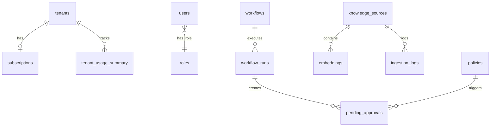

# T3-1. 데이터 모델 정의서

> 설계 버전: 2.6 | 최종 수정: 2026-03-28 | 관련 CR: CR-002, CR-006, CR-007, CR-012, CR-015, CR-016, CR-017, CR-020, CR-021, CR-025

> **프로젝트**: Aimbase
> **작성일**: 2026-03-10 (역설계)

---

## Enum 정의

### ConnectionAdapter
| 값 | 설명 |
|----|------|
| openai | OpenAI API |
| anthropic | Anthropic API |
| ollama | Ollama 로컬 LLM |
| postgresql | PostgreSQL DB (Write용) |
| slack | Slack 메시징 |
| websocket | WebSocket 알림 |

### ConnectionType
| 값 | 설명 |
|----|------|
| llm | LLM 프로바이더 연결 |
| write | DB 쓰기 연결 |
| notify | 알림 연결 |

### ConnectionStatus
| 값 | 설명 |
|----|------|
| connected | 정상 연결 |
| disconnected | 연결 해제 |
| error | 연결 오류 |

### MCPTransport
| 값 | 설명 |
|----|------|
| stdio | 표준 입출력 |
| sse | Server-Sent Events |
| http | HTTP 통신 |

### KnowledgeSourceStatus
| 값 | 설명 |
|----|------|
| idle | 대기 |
| syncing | 동기화 중 |
| completed | 완료 |
| error | 오류 |

### WorkflowRunStatus
| 값 | 설명 |
|----|------|
| running | 실행 중 |
| pending_approval | 승인 대기 |
| completed | 완료 |
| failed | 실패 |

### ApprovalStatus
| 값 | 설명 |
|----|------|
| pending | 대기 |
| approved | 승인 |
| rejected | 거부 |

### TenantStatus
| 값 | 설명 |
|----|------|
| provisioning | 프로비저닝 중 |
| active | 활성 |
| suspended | 정지 |
| deleted | 삭제 |

### SubscriptionPlan
| 값 | 설명 |
|----|------|
| free | 무료 |
| starter | 스타터 |
| pro | 프로 |
| enterprise | 엔터프라이즈 |

### PolicyRuleType (v3.3, CR-015 보강)
| 값 | 설명 | config JSON 스키마 |
|----|------|-----------------|
| DENY | 즉시 거부 | - |
| REQUIRE_APPROVAL | 승인 필요 | - |
| RATE_LIMIT | 빈도 제한 | `{type: "rate_limit", max_requests_per_hour, max_requests_per_minute}` |
| TRANSFORM | 데이터 변환(PII 마스킹) | - |
| LOG | 감사 로깅 | - |
| ALLOW | 명시적 허용 | - |
| CONTENT_FILTER | 콘텐츠 필터링 (CR-015) | `{type: "content_filter", keywords[], patterns[], action}` |
| COST_LIMIT | 비용 한도 (CR-015) | `{type: "cost_limit", daily_limit, monthly_limit, currency}` |
| TOKEN_LIMIT | 토큰 제한 (CR-015) | `{type: "token_limit", max_input_tokens, max_output_tokens, max_total_tokens}` |
| MODEL_FILTER | 모델 필터 (CR-015) | `{type: "model_filter", allowed_models[], blocked_models[]}` |
| TIME_RESTRICTION | 시간대 제한 (CR-015) | `{type: "time_restriction", allowed_hours, allowed_days[], timezone}` |

### WorkflowStepType (v3.5, CR-017 보강)
| 값 | 설명 | config 구조 |
|----|------|-----------|
| LLM_CALL | LLM 호출 | `{connection_id, model, system_prompt, response_schema?}` |
| TOOL_CALL | 도구 호출 | `{tool_name, input, mcp_server_id?}` |
| ACTION | 액션 실행 (Write/Notify) | `{type, adapter, destination, payload}` — payload에서 `{{stepId.output}}` 변수 치환 |
| CONDITION | 조건 분기 | `{expression, true_step, false_step}` |
| PARALLEL | 병렬 실행 | `{step_ids[]}` |
| HUMAN_INPUT | 승인 게이트 | `{approval_channel, approvers[], timeout_ms}` |

### ToolChoiceMode (v2.4, CR-006)
| 값 | 설명 |
|----|------|
| auto | LLM이 자유롭게 도구 선택 (기본값) |
| none | 도구 호출 금지 |
| required | 반드시 도구 호출 |
| specific | 특정 도구 강제 선택 (tool_name 필수) |

### FinishReason
| 값 | 설명 |
|----|------|
| END | 정상 종료 |
| TOOL_USE | 도구 호출 필요 |
| MAX_TOKENS | 토큰 한도 초과 |
| ERROR | 오류 |

### ActionType
| 값 | 설명 |
|----|------|
| WRITE | DB 쓰기 |
| NOTIFY | 알림 발송 |

---

## Master DB 엔티티

### tenants (테넌트)

| 필드 | 타입 | 필수 | 기본값 | 설명 |
|------|------|------|--------|------|
| id | VARCHAR(100) | ✅ | - | PK, 테넌트 ID |
| name | VARCHAR(200) | ✅ | - | 테넌트명 |
| status | VARCHAR(20) | ✅ | 'active' | 상태 (active/suspended/deleted) |
| db_host | VARCHAR(255) | ✅ | - | DB 호스트 |
| db_port | INTEGER | ✅ | 5432 | DB 포트 |
| db_name | VARCHAR(100) | ✅ | - | DB명 |
| db_username | VARCHAR(100) | ✅ | - | DB 사용자 |
| db_password_encrypted | TEXT | ✅ | - | 암호화된 DB 비밀번호 |
| admin_email | VARCHAR(255) | ❌ | - | 관리자 이메일 |
| created_at | TIMESTAMPTZ | ✅ | NOW() | 생성일시 |
| updated_at | TIMESTAMPTZ | ✅ | NOW() | 수정일시 |

- 인덱스: `idx_tenants_status` (status)

### subscriptions (구독)

| 필드 | 타입 | 필수 | 기본값 | 설명 |
|------|------|------|--------|------|
| tenant_id | VARCHAR(100) | ✅ | - | PK, FK → tenants.id |
| plan | VARCHAR(50) | ✅ | 'free' | 구독 플랜 |
| llm_monthly_token_quota | BIGINT | ✅ | 1000000 | 월 토큰 한도 |
| max_connections | INTEGER | ✅ | 5 | 최대 연결 수 |
| max_knowledge_sources | INTEGER | ✅ | 3 | 최대 지식소스 수 |
| max_workflows | INTEGER | ✅ | 10 | 최대 워크플로우 수 |
| storage_gb | INTEGER | ✅ | 1 | 스토리지 한도 (GB) |
| max_users | INTEGER | ✅ | 5 | 최대 사용자 수 |
| valid_from | TIMESTAMPTZ | ✅ | NOW() | 유효 시작일 |
| valid_until | TIMESTAMPTZ | ❌ | - | 유효 종료일 |
| created_at | TIMESTAMPTZ | ✅ | NOW() | 생성일시 |
| updated_at | TIMESTAMPTZ | ✅ | NOW() | 수정일시 |

### tenant_admins (플랫폼 관리자)

| 필드 | 타입 | 필수 | 기본값 | 설명 |
|------|------|------|--------|------|
| id | VARCHAR(100) | ✅ | - | PK |
| email | VARCHAR(255) | ✅ | - | 이메일 (UNIQUE) |
| password_hash | VARCHAR(255) | ✅ | - | BCrypt 해시 |
| role | VARCHAR(50) | ✅ | 'platform_admin' | 역할 |
| is_active | BOOLEAN | ✅ | true | 활성 여부 |
| last_login_at | TIMESTAMPTZ | ❌ | - | 마지막 로그인 |
| created_at | TIMESTAMPTZ | ✅ | NOW() | 생성일시 |

### global_config (전역 설정)

| 필드 | 타입 | 필수 | 기본값 | 설명 |
|------|------|------|--------|------|
| config_key | VARCHAR(100) | ✅ | - | PK, 설정 키 |
| config_value | TEXT | ✅ | - | 설정 값 |
| is_encrypted | BOOLEAN | ✅ | false | 암호화 여부 |
| updated_by | VARCHAR(100) | ❌ | - | 수정자 |
| updated_at | TIMESTAMPTZ | ✅ | NOW() | 수정일시 |

### tenant_usage_summary (테넌트 사용량 요약)

| 필드 | 타입 | 필수 | 기본값 | 설명 |
|------|------|------|--------|------|
| id | UUID | ✅ | gen_random_uuid() | PK |
| tenant_id | VARCHAR(100) | ✅ | - | FK → tenants.id |
| year_month | VARCHAR(7) | ✅ | - | 집계 월 (YYYY-MM) |
| total_input_tokens | BIGINT | ✅ | 0 | 총 입력 토큰 |
| total_output_tokens | BIGINT | ✅ | 0 | 총 출력 토큰 |
| total_cost_usd | DECIMAL(12,4) | ✅ | 0 | 총 비용 (USD) |
| storage_used_mb | INTEGER | ✅ | 0 | 스토리지 사용량 (MB) |
| api_call_count | INTEGER | ✅ | 0 | API 호출 수 |
| created_at | TIMESTAMPTZ | ✅ | NOW() | 생성일시 |

- 인덱스: `uniq_usage_tenant_month` (tenant_id, year_month) UNIQUE

---

## Tenant DB 엔티티

### connections (연결)

| 필드 | 타입 | 필수 | 기본값 | 설명 |
|------|------|------|--------|------|
| id | VARCHAR(100) | ✅ | - | PK |
| name | VARCHAR(200) | ✅ | - | 연결명 |
| adapter | VARCHAR(50) | ✅ | - | 어댑터 유형 |
| type | VARCHAR(20) | ✅ | - | 연결 유형 (llm/write/notify) |
| config | JSONB | ✅ | '{}' | 어댑터별 설정 |
| status | VARCHAR(20) | ✅ | 'disconnected' | 연결 상태 |
| health_config | JSONB | ❌ | - | 헬스체크 설정 |
| created_at | TIMESTAMPTZ | ✅ | NOW() | 생성일시 |
| updated_at | TIMESTAMPTZ | ✅ | NOW() | 수정일시 |

- 인덱스: `idx_connections_type` (type), `idx_connections_adapter` (adapter)

### mcp_servers (MCP 서버)

| 필드 | 타입 | 필수 | 기본값 | 설명 |
|------|------|------|--------|------|
| id | VARCHAR(100) | ✅ | - | PK |
| name | VARCHAR(200) | ✅ | - | 서버명 |
| transport | VARCHAR(20) | ✅ | - | 전송 프로토콜 |
| config | JSONB | ✅ | '{}' | 전송별 설정 |
| auto_start | BOOLEAN | ✅ | false | 자동 시작 여부 |
| status | VARCHAR(20) | ✅ | 'disconnected' | 연결 상태 |
| tools_cache | JSONB | ❌ | - | 캐시된 도구 목록 |
| created_at | TIMESTAMPTZ | ✅ | NOW() | 생성일시 |
| updated_at | TIMESTAMPTZ | ✅ | NOW() | 수정일시 |

### schemas (스키마)

| 필드 | 타입 | 필수 | 기본값 | 설명 |
|------|------|------|--------|------|
| id | VARCHAR(100) | ✅ | - | 복합PK (id) |
| version | INTEGER | ✅ | - | 복합PK (version) |
| domain | VARCHAR(50) | ❌ | - | 도메인 태그 |
| description | TEXT | ❌ | - | 설명 |
| json_schema | JSONB | ✅ | - | JSON Schema 정의 |
| created_at | TIMESTAMPTZ | ✅ | NOW() | 생성일시 |

- PK: (id, version)

### policies (정책)

| 필드 | 타입 | 필수 | 기본값 | 설명 |
|------|------|------|--------|------|
| id | VARCHAR(100) | ✅ | - | PK |
| name | VARCHAR(200) | ✅ | - | 정책명 |
| domain | VARCHAR(50) | ❌ | - | 도메인 |
| priority | INTEGER | ✅ | 0 | 우선순위 (높을수록 먼저) |
| is_active | BOOLEAN | ✅ | true | 활성 여부 |
| match_rules | JSONB | ✅ | '{}' | 매칭 규칙 {intents[], adapters[]} |
| rules | JSONB | ✅ | '[]' | 규칙 목록 [{type, condition, message, config}] |
| created_at | TIMESTAMPTZ | ✅ | NOW() | 생성일시 |
| updated_at | TIMESTAMPTZ | ✅ | NOW() | 수정일시 |

- 인덱스: `idx_policies_domain`, `idx_policies_priority`, `idx_policies_active`

### prompts (프롬프트)

| 필드 | 타입 | 필수 | 기본값 | 설명 |
|------|------|------|--------|------|
| id | VARCHAR(100) | ✅ | - | 복합PK (id) |
| version | INTEGER | ✅ | - | 복합PK (version) |
| domain | VARCHAR(50) | ❌ | - | 도메인 |
| type | VARCHAR(30) | ✅ | - | 유형 (system/user/assistant) |
| template | TEXT | ✅ | - | 템플릿 ({{변수}} 구문) |
| variables | JSONB | ❌ | '[]' | 변수 정의 |
| is_active | BOOLEAN | ✅ | true | 활성 버전 여부 |
| ab_test | JSONB | ❌ | - | A/B 테스트 설정 |
| created_at | TIMESTAMPTZ | ✅ | NOW() | 생성일시 |

- PK: (id, version)

### routing_config (라우팅 설정)

| 필드 | 타입 | 필수 | 기본값 | 설명 |
|------|------|------|--------|------|
| id | VARCHAR(100) | ✅ | - | PK |
| strategy | VARCHAR(50) | ✅ | - | 전략 (round-robin/cost-optimized/latency) |
| rules | JSONB | ✅ | '[]' | 규칙 [{condition, targetModel}] |
| fallback_chain | JSONB | ❌ | '[]' | 폴백 모델 목록 |
| is_active | BOOLEAN | ✅ | true | 활성 여부 |
| created_at | TIMESTAMPTZ | ✅ | NOW() | 생성일시 |
| updated_at | TIMESTAMPTZ | ✅ | NOW() | 수정일시 |

### workflows (워크플로우)

| 필드 | 타입 | 필수 | 기본값 | 설명 |
|------|------|------|--------|------|
| id | VARCHAR(100) | ✅ | - | PK |
| name | VARCHAR(200) | ✅ | - | 워크플로우명 |
| domain | VARCHAR(50) | ❌ | - | 도메인 |
| trigger_config | JSONB | ❌ | '{}' | 트리거 설정 |
| steps | JSONB | ✅ | '[]' | 스텝 정의 [{id, name, type, config, dependsOn(@JsonAlias("dependencies")), onSuccess, onFailure, timeoutMs}] (CR-017) |
| output_schema | JSONB | ❌ | - | 출력 스키마 {schema_id, version} 또는 {inline: {JSON Schema}} (CR-007) |
| error_handling | JSONB | ❌ | '{}' | 에러 처리 {retryMaxAttempts, retryDelayMs} |
| is_active | BOOLEAN | ✅ | true | 활성 여부 |
| created_at | TIMESTAMPTZ | ✅ | NOW() | 생성일시 |
| updated_at | TIMESTAMPTZ | ✅ | NOW() | 수정일시 |

- 인덱스: `idx_workflows_domain`, `idx_workflows_active`

### workflow_runs (워크플로우 실행)

| 필드 | 타입 | 필수 | 기본값 | 설명 |
|------|------|------|--------|------|
| id | UUID | ✅ | gen_random_uuid() | PK |
| workflow_id | VARCHAR(100) | ✅ | - | FK → workflows.id |
| session_id | VARCHAR(100) | ❌ | - | 세션 ID |
| status | VARCHAR(20) | ✅ | 'running' | 실행 상태 |
| current_step | VARCHAR(100) | ❌ | - | 현재 스텝 |
| step_results | JSONB | ❌ | '{}' | 스텝별 결과 |
| input_data | JSONB | ❌ | - | 입력 데이터 |
| error | JSONB | ❌ | - | 오류 상세 |
| started_at | TIMESTAMPTZ | ✅ | NOW() | 시작일시 |
| completed_at | TIMESTAMPTZ | ❌ | - | 완료일시 |

- 인덱스: `idx_workflow_runs_workflow_id`, `idx_workflow_runs_session_id`, `idx_workflow_runs_status`, `idx_workflow_runs_started`

### users (사용자)

| 필드 | 타입 | 필수 | 기본값 | 설명 |
|------|------|------|--------|------|
| id | VARCHAR(100) | ✅ | - | PK (UUID) |
| email | VARCHAR(200) | ✅ | - | 이메일 (UNIQUE) |
| name | VARCHAR(100) | ✅ | - | 이름 |
| password_hash | VARCHAR(255) | ❌ | - | BCrypt 해시 |
| role_id | VARCHAR(50) | ❌ | - | FK → roles.id |
| api_key_hash | VARCHAR(200) | ❌ | - | API 키 해시 |
| is_active | BOOLEAN | ✅ | true | 활성 여부 |
| created_at | TIMESTAMPTZ | ✅ | NOW() | 생성일시 |

- 인덱스: `idx_users_email`, `idx_users_active`

### roles (역할)

| 필드 | 타입 | 필수 | 기본값 | 설명 |
|------|------|------|--------|------|
| id | VARCHAR(50) | ✅ | - | PK |
| name | VARCHAR(100) | ✅ | - | 역할명 |
| permissions | JSONB | ✅ | '{}' | 권한 {resource: [permissions]} |
| created_at | TIMESTAMPTZ | ✅ | NOW() | 생성일시 |

- 초기 데이터: admin (전체 권한), viewer (읽기 전용)

### knowledge_sources (지식소스)

| 필드 | 타입 | 필수 | 기본값 | 설명 |
|------|------|------|--------|------|
| id | VARCHAR(100) | ✅ | - | PK |
| name | VARCHAR(200) | ✅ | - | 소스명 |
| type | VARCHAR(30) | ✅ | - | 유형 (file/web/database/api) |
| config | JSONB | ✅ | '{}' | 소스별 설정 |
| chunking_config | JSONB | ❌ | - | 청킹 설정 {strategy, size, overlap} |
| embedding_config | JSONB | ❌ | - | 임베딩 설정 {model, dimensions} |
| sync_config | JSONB | ❌ | - | 동기화 설정 |
| status | VARCHAR(20) | ✅ | 'idle' | 상태 |
| document_count | INTEGER | ✅ | 0 | 문서 수 |
| chunk_count | INTEGER | ✅ | 0 | 청크 수 |
| last_synced_at | TIMESTAMPTZ | ❌ | - | 마지막 동기화 |
| created_at | TIMESTAMPTZ | ✅ | NOW() | 생성일시 |
| updated_at | TIMESTAMPTZ | ✅ | NOW() | 수정일시 |

- 인덱스: `idx_knowledge_sources_type`, `idx_knowledge_sources_status`

### embeddings (임베딩)

| 필드 | 타입 | 필수 | 기본값 | 설명 |
|------|------|------|--------|------|
| id | UUID | ✅ | gen_random_uuid() | PK |
| source_id | VARCHAR(100) | ✅ | - | FK → knowledge_sources.id |
| document_id | VARCHAR(200) | ✅ | - | 문서 ID |
| chunk_index | INTEGER | ✅ | - | 청크 인덱스 |
| content | TEXT | ✅ | - | 청크 텍스트 |
| embedding | vector | ✅ | - | 임베딩 벡터 (pgvector, 차원 가변: BGE-M3 1024d, KoSimCSE 768d, OpenAI 1536d) |
| metadata | JSONB | ❌ | '{}' | 메타데이터 |
| created_at | TIMESTAMPTZ | ✅ | NOW() | 생성일시 |

- 인덱스: `idx_embeddings_source_id`, `idx_embeddings_document_id`, `idx_embeddings_hnsw` (HNSW, vector_cosine_ops)

### retrieval_config (검색 설정)

| 필드 | 타입 | 필수 | 기본값 | 설명 |
|------|------|------|--------|------|
| id | VARCHAR(100) | ✅ | - | PK |
| name | VARCHAR(200) | ✅ | - | 설정명 |
| top_k | INTEGER | ✅ | 5 | 검색 결과 수 |
| similarity_threshold | DECIMAL(5,4) | ✅ | 0.7 | 유사도 임계값 |
| max_context_tokens | INTEGER | ❌ | - | 최대 컨텍스트 토큰 |
| search_type | VARCHAR(20) | ✅ | 'hybrid' | 검색 유형 |
| source_filters | JSONB | ❌ | '[]' | 소스 필터 |
| query_processing | JSONB | ❌ | '{}' | 쿼리 전처리 |
| context_template | TEXT | ❌ | - | 컨텍스트 템플릿 |
| created_at | TIMESTAMPTZ | ✅ | NOW() | 생성일시 |
| updated_at | TIMESTAMPTZ | ✅ | NOW() | 수정일시 |

### 기타 테넌트 테이블

- **rag_evaluations**: id(UUID PK), source_id(FK), query(text), answer(text), faithfulness(numeric), context_relevancy(numeric), answer_relevancy(numeric), context_precision(numeric nullable), context_recall(numeric nullable), overall_score(numeric), mode(varchar(20) default 'fast' — 'fast'=RAGAS only, 'accurate'=RAGAS+LLM Judge, CR-016), evaluated_at(timestamptz), created_at
- **action_logs**: id(UUID), session_id, action_type, adapter_id, status, duration_ms, metadata(JSONB), created_at
- **audit_logs**: id(UUID), event, user_id, session_id, policy_decision, details(JSONB), created_at
- **usage_logs**: id(UUID), user_id, session_id, model, input_tokens, output_tokens, cost_usd, created_at
- **pending_approvals**: id(UUID), action_log_id, policy_id, approval_channel, approvers(JSONB), status, approved_by, reason, requested_at, resolved_at, timeout_at
- **ingestion_logs**: id(UUID), source_id, document_id, status, chunk_count, error, started_at, completed_at

---

## 엔티티 관계

---

### projects 테이블 [CR-021]

> 회사(Tenant) 내 프로젝트 정의. 리소스 스코핑 단위.

| 컬럼 | 타입 | 제약 | 설명 |
|------|------|------|------|
| id | VARCHAR(100) | PK | 프로젝트 식별자 (UUID 또는 slug) |
| name | VARCHAR(200) | NOT NULL | 프로젝트 이름 |
| description | TEXT | | 프로젝트 설명 |
| is_active | BOOLEAN | DEFAULT true | 활성 여부 |
| created_at | TIMESTAMPTZ | DEFAULT now() | 생성일시 |
| updated_at | TIMESTAMPTZ | DEFAULT now() | 수정일시 |

- 인덱스: `idx_projects_active` (is_active)

### project_members 테이블 [CR-021]

> 사용자 ↔ 프로젝트 N:M 매핑. 프로젝트별 역할 부여.

| 컬럼 | 타입 | 제약 | 설명 |
|------|------|------|------|
| id | UUID | PK, DEFAULT gen_random_uuid() | |
| project_id | VARCHAR(100) | FK → projects.id, NOT NULL | 프로젝트 |
| user_id | UUID | FK → users.id, NOT NULL | 사용자 |
| role | VARCHAR(20) | NOT NULL, DEFAULT 'viewer' | admin / editor / viewer |
| created_at | TIMESTAMPTZ | DEFAULT now() | |

- 유니크: `uq_project_members` (project_id, user_id)
- 인덱스: `idx_project_members_user` (user_id)

### project_resources 테이블 [CR-021]

> 프로젝트 ↔ 리소스(Knowledge Source, Prompt, Schema) N:M 매핑.

| 컬럼 | 타입 | 제약 | 설명 |
|------|------|------|------|
| id | UUID | PK, DEFAULT gen_random_uuid() | |
| project_id | VARCHAR(100) | FK → projects.id, NOT NULL | 프로젝트 |
| resource_type | VARCHAR(50) | NOT NULL | knowledge_source / prompt / schema |
| resource_id | VARCHAR(100) | NOT NULL | 대상 리소스 ID |
| created_at | TIMESTAMPTZ | DEFAULT now() | |

- 유니크: `uq_project_resources` (project_id, resource_type, resource_id)
- 인덱스: `idx_project_resources_type` (resource_type, resource_id)

### workflows 테이블 변경 [CR-021]

> project_id 컬럼 추가 (nullable). null이면 회사 공유, 있으면 프로젝트 전용.

| 추가 컬럼 | 타입 | 제약 | 설명 |
|-----------|------|------|------|
| project_id | VARCHAR(100) | FK → projects.id, NULLABLE | 소속 프로젝트 |

- 인덱스: `idx_workflows_project` (project_id)

### api_keys 테이블 (신규) [CR-025]

> 시스템 연동용 API Key를 독립 관리. users.api_key_hash에서 분리.

| 필드 | 타입 | 필수 | 기본값 | 설명 |
|------|------|------|--------|------|
| id | VARCHAR(100) | ✅ | - | PK (UUID) |
| name | VARCHAR(200) | ✅ | - | 용도 라벨 (예: "ChatPilot 연동용") |
| key_hash | VARCHAR(200) | ✅ | - | SHA-256 해시 (plat-{uuid}의 해시) |
| key_prefix | VARCHAR(12) | ✅ | - | 키 앞 8자 (목록 표시용) |
| scope | JSONB | ❌ | null | 허용 API 범위 (null=전체) |
| user_id | VARCHAR(100) | ❌ | - | FK → users.id (생성한 사용자) |
| expires_at | TIMESTAMPTZ | ❌ | null | 만료일시 (null=무기한) |
| last_used_at | TIMESTAMPTZ | ❌ | null | 마지막 사용일시 |
| is_active | BOOLEAN | ✅ | true | 활성 여부 |
| created_by | VARCHAR(100) | ❌ | - | 생성자 ID |
| created_at | TIMESTAMPTZ | ✅ | NOW() | 생성일시 |

- 인덱스: `idx_api_keys_hash` (key_hash, UNIQUE), `idx_api_keys_active` (is_active)
- 마이그레이션: `V32__create_api_keys_table.sql`

### user_tenant_map 테이블 (신규) [CR-027]

> Master DB. 사용자 email → tenant_id 매핑. 로그인 시 X-Tenant-Id 없이 테넌트 자동 resolve.

| 필드 | 타입 | 필수 | 기본값 | 설명 |
|------|------|------|--------|------|
| id | UUID | ✅ | gen_random_uuid() | PK |
| email | VARCHAR(255) | ✅ | - | 사용자 이메일 (UNIQUE) |
| tenant_id | VARCHAR(100) | ✅ | - | FK → tenants.id |
| created_at | TIMESTAMPTZ | ✅ | NOW() | 생성일시 |

- 인덱스: `idx_user_tenant_map_email` (email, UNIQUE), `idx_user_tenant_map_tenant` (tenant_id)
- 마이그레이션: `V4__create_user_tenant_map.sql` (Master DB)
- 동기화: 테넌트 프로비저닝 시 admin 매핑 자동 등록, UserController.create()/delete() 시 동기화

---

## 작성 가이드

1. **JSONB 필드**: 동적 설정은 JSONB 사용. 필드 구조는 코드에서 정의.
2. **복합키**: schemas(id, version), prompts(id, version)는 복합 PK
3. **인덱스**: 자주 조회되는 필드에 인덱스 생성 (status, type, domain 등)
4. **HNSW**: embeddings 테이블에 HNSW 인덱스 (vector_cosine_ops)
5. **pgvector**: vector 타입은 차원 미지정 (모델에 따라 가변: BGE-M3 1024d, KoSimCSE 768d, OpenAI 1536d). 환경변수 `DEFAULT_EMBED_MODEL`로 모델 교체 가능
6. **ToolFilterContext** (CR-006): record(allowedTools, excludeTools, tags) — ChatCompletionRequest의 tool_filter 필드로 전달, ToolRegistry.getToolDefs(filter) 호출 시 사용
7. **정책 규칙 스키마** (CR-015): policies.rules JSONB 배열 내 각 규칙 객체에 `type` 필드 필수. type별 config 구조는 PolicyRuleType enum 참조
8. **워크플로우 스텝 구조** (CR-017): workflows.steps JSONB 배열 내 각 스텝은 `{id, name, type, config, dependsOn, onSuccess, onFailure, timeoutMs}` 구조. ACTION type의 config.payload에서 `{{stepId.output}}` 변수 치환 지원
