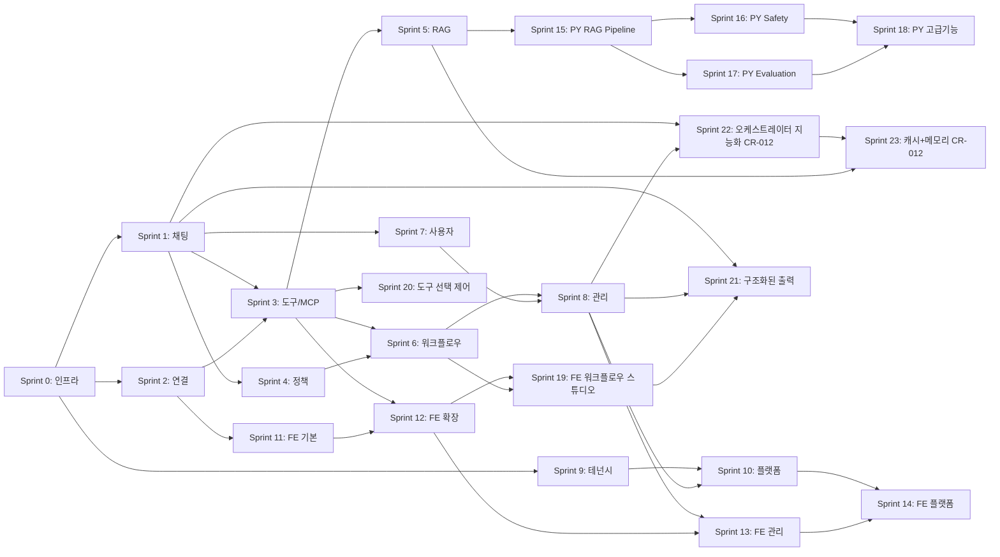
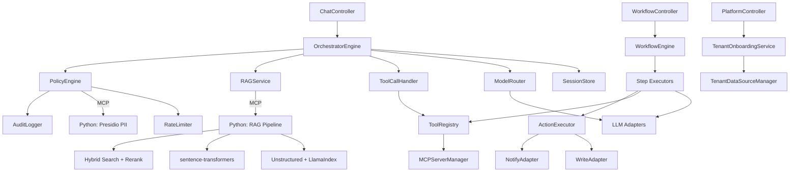
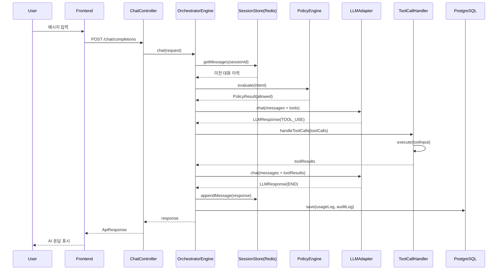

# T3-6. 실행 지시서 (Execution Specification)

> 설계 버전: 4.0 | 최종 수정: 2026-04-08 | 관련 CR: CR-009, CR-010, CR-011, CR-012, CR-031, CR-032, CR-033

> **프로젝트**: Aimbase
> **유형**: Fullstack (BE + FE)
> **작성일**: 2026-03-10 (역설계)

---

## 0. 프로젝트 개요

멀티테넌트 LLM 오케스트레이션 플랫폼. 여러 LLM 프로바이더(Anthropic, OpenAI, Ollama)를 통합하고, 정책 엔진(DENY/APPROVAL/RATE_LIMIT/TRANSFORM), DAG 기반 워크플로우, RAG(pgvector), MCP 도구 통합, RBAC 접근 제어를 제공한다. Database-per-Tenant 멀티테넌시로 조직 간 완전한 데이터 격리를 보장한다.

| 항목 | 내용 |
|------|------|
| 유형 | Fullstack (Spring Boot BE + React FE) |
| 모듈 수 | 16개 |
| 기능 수 | 95개 (MVP 66개) |
| 비즈니스 규칙 수 | 24개 |
| 정책 수 | 16개 |
| 핵심 결정 | Database-per-Tenant, 동기 REST + Virtual Threads, pgvector 통합 |
| 연관 서비스 | Anthropic API, OpenAI API, Ollama, Slack API, PostgreSQL, Redis |

---

## 1. 산출물 맵

### T1: 요구사항 분석

| T번호 | 산출물명 | 파일명 | 요약 |
|--------|---------|--------|------|
| T1-1 | 기능요구사항 명세서 | T1-1_기능요구사항_명세서.md | 95개 기능, 16모듈, MVP 66개 |
| T1-2 | 모듈 요약 대시보드 | T1-2_모듈_요약.md | 16개 모듈 현황 |
| T1-3 | 비즈니스 규칙 정의서 | T1-3_비즈니스_규칙.md | 24개 불변 규칙 |
| T1-4 | 정책 정의서 | T1-4_정책_정의.md | 16개 변경 가능 정책 |
| T1-5 | FSM 상태 정의서 | T1-5_FSM_상태_정의.md | 7개 엔티티 상태 머신 |
| T1-6 | 이벤트 계약서 | T1-6_이벤트_계약.md | 23개 이벤트 |
| T1-7 | Sprint 구조도 | T1-7_Sprint_구조도.md | 15개 Sprint (BE 10 + FE 4 + 인프라 1) |
| T1-8 | 시스템 가이드 | T1-8_시스템_가이드.md | 비개발자용 안내서 |

### T2: 아키텍처 설계

| T번호 | 산출물명 | 파일명 | 요약 |
|--------|---------|--------|------|
| T2-1 | 기술스택 결정서 | T2-1_기술스택_결정서.md | Java 21 + Spring Boot 3.4 + React 18 |
| T2-2 | CLAUDE.md 템플릿 | T2-2_CLAUDE_md_템플릿.md | 프로젝트 규칙/컨벤션 |

### T3: 상세 설계

| T번호 | 산출물명 | 파일명 | 요약 |
|--------|---------|--------|------|
| T3-1 | 데이터 모델 정의서 | T3-1_데이터_모델.md | Master 5 + Tenant 17 엔티티 |
| T3-2 | API 설계서 | T3-2_API_설계.md | 70+ REST 엔드포인트 |
| T3-3 | 화면/컴포넌트 구조서 | T3-3_화면_컴포넌트_구조.md | 13페이지 + 8 공통 컴포넌트 |
| T3-4 | 화면 상호작용 명세서 | T3-4_화면_상호작용.md | 6개 복잡 페이지 상호작용 |
| T3-5 | 단위테스트 명세서 | T3-5_단위테스트_명세.md | 60+ 테스트 케이스 |
| T3-6 | 실행 지시서 | T3-6_실행_지시서.md | 본 문서 |

### T4: 구현 이후

| T번호 | 산출물명 | 파일명 | 요약 |
|--------|---------|--------|------|
| T4-1 | 검증 체크리스트 | T4-1_검증_체크리스트.md | Sprint별 검증 항목 |
| T4-2 | 수동 인수테스트 | T4-2_수동_인수테스트.md | UAT 시나리오 |
| T4-3 | 오픈 점검 체크리스트 | T4-3_오픈_점검_체크리스트.md | 배포 전 점검 |
| T4-4 | 스모크 테스트 | T4-4_스모크_테스트.md | 배포 후 생존 확인 |
| T4-5 | 변경 이력 | T4-5_변경_이력.md | CR 추적 |
| T4-6 | 설치 메뉴얼 | T4-6_설치_메뉴얼.md | 개발환경 구축 |
| T4-7 | 운영 메뉴얼 | T4-7_운영_메뉴얼.md | 운영/장애 대응 |
| T4-8 | 데모 시나리오 | T4-8_데모_시나리오.md | Sprint 리뷰 시나리오 |

---

## 2. 기술 스택 요약

### Backend

| 영역 | 선택 |
|------|------|
| 언어 | Java 21 (Virtual Threads) |
| 프레임워크 | Spring Boot 3.4.2 |
| ORM | Spring Data JPA + Hibernate 6.3 |
| DB | PostgreSQL 16 + pgvector |
| 캐시 | Redis 7 |
| 마이그레이션 | Flyway |
| LLM SDK | Anthropic 2.12.0, OpenAI 2.1.0, Spring AI 1.0.0 |
| MCP | MCP SDK 0.10.0 |
| 빌드 | Gradle 8.x (Kotlin DSL) |

### Frontend

| 영역 | 선택 |
|------|------|
| 언어 | TypeScript 5.6 |
| UI | React 18.3.1 |
| 빌드 | Vite 5.4.10 |
| 상태관리 | TanStack React Query 5.90 |
| 라우팅 | React Router 6.27 |
| HTTP | Axios 1.7.7 |

---

## 3. 모듈 총괄

| 모듈 | 기능수 | 책임 | 외부연동 |
|------|--------|------|---------|
| 채팅 | 2 | LLM 채팅 (동기/스트리밍) | Anthropic, OpenAI, Ollama |
| 연결 | 6 | 외부 서비스 연결 관리 | 각 프로바이더 |
| MCP | 6 | MCP 서버/도구 관리 | MCP 서버 |
| 스키마 | 5 | JSON 스키마 관리/검증 | - |
| 정책 | 7 | 정책 규칙 관리/평가 | Redis (Rate Limit) |
| 프롬프트 | 6 | 프롬프트 템플릿 관리 | - |
| 라우팅 | 5 | 모델 라우팅 규칙 | - |
| 워크플로우 | 9 | DAG 워크플로우 실행 | - |
| RAG | 12 | 지식소스/벡터 검색 | OpenAI (임베딩) |
| 관리 | 7 | 대시보드/승인 관리 | - |
| 사용자 | 6 | 사용자 CRUD | - |
| 역할 | 5 | RBAC 역할 관리 | - |
| 모니터링 | 2 | 성능/비용 모니터링 | Prometheus |
| 플랫폼관리 | 10 | 테넌트/구독 관리 | PostgreSQL Admin |
| 오케스트레이터 | 8 | 요청 오케스트레이션, 도구 필터링/강제선택, 구조화 출력 | Redis |
| 액션 | 3 | Write/Notify 실행 | PostgreSQL, Slack |

---

## 4. 데이터 모델 요약

Master DB에 5개 테이블(tenants, subscriptions, tenant_admins, global_config, tenant_usage_summary), Tenant DB에 17개 테이블(connections, mcp_servers, schemas, policies, prompts, routing_config, workflows, workflow_runs, users, roles, knowledge_sources, embeddings, retrieval_config, action_logs, audit_logs, usage_logs, pending_approvals, ingestion_logs). JSONB를 적극 활용하여 동적 설정을 저장하며, pgvector의 vector(1536) 타입으로 임베딩 벡터를 관리한다.

---

## 5. Sprint별 참조 가이드

### Sprint 0: 인프라 세팅

- **목표**: 프로젝트 기반 구축
- **작업 수**: 8

| 순서 | 파일 | 참조 범위 |
|------|------|----------|
| 1 | T2-1_기술스택_결정서.md | 전체 |
| 2 | T3-1_데이터_모델.md | 전체 (Flyway 마이그레이션 설계) |
| 3 | T2-2_CLAUDE_md_템플릿.md | 프로젝트 구조, 네이밍 규칙 |

### Sprint 1: 핵심 채팅 (BE)

- **목표**: LLM 채팅 핵심 기능 구현
- **작업 수**: 7

| 순서 | 파일 | 참조 범위 |
|------|------|----------|
| 1 | T1-1_기능요구사항_명세서.md | PRD-001, PRD-002, PRD-089~091 |
| 2 | T1-3_비즈니스_규칙.md | BIZ-001~004, BIZ-016~017 |
| 3 | T3-2_API_설계.md | Chat 섹션 |
| 4 | T3-5_단위테스트_명세.md | Sprint 1 섹션 |

### Sprint 2: 연결 관리 (BE)

- **목표**: 외부 서비스 연결 CRUD
- **작업 수**: 6

| 순서 | 파일 | 참조 범위 |
|------|------|----------|
| 1 | T1-1_기능요구사항_명세서.md | PRD-003~008 |
| 2 | T1-5_FSM_상태_정의.md | Connection FSM |
| 3 | T3-1_데이터_모델.md | connections 테이블 |
| 4 | T3-2_API_설계.md | Connections 섹션 |

### Sprint 3: 도구 & MCP (BE)

- **목표**: 도구 호출 루프 + MCP 통합
- **작업 수**: 7

| 순서 | 파일 | 참조 범위 |
|------|------|----------|
| 1 | T1-1_기능요구사항_명세서.md | PRD-009~014, PRD-092 |
| 2 | T1-3_비즈니스_규칙.md | BIZ-001, BIZ-017, BIZ-022 |
| 3 | T1-5_FSM_상태_정의.md | MCPServer FSM |
| 4 | T3-5_단위테스트_명세.md | Sprint 3 섹션 |

### Sprint 4: 정책 엔진 (BE)

- **목표**: 정책 CRUD + PolicyEngine + 감사 로깅
- **작업 수**: 7

| 순서 | 파일 | 참조 범위 |
|------|------|----------|
| 1 | T1-1_기능요구사항_명세서.md | PRD-020~026, PRD-095 |
| 2 | T1-3_비즈니스_규칙.md | BIZ-005~007, BIZ-020 |
| 3 | T1-4_정책_정의.md | POL-007 |
| 4 | T3-5_단위테스트_명세.md | Sprint 4 섹션 |

### Sprint 5: RAG (BE)

- **목표**: 인제스션 파이프라인 + 벡터 검색
- **작업 수**: 7

| 순서 | 파일 | 참조 범위 |
|------|------|----------|
| 1 | T1-1_기능요구사항_명세서.md | PRD-047~058 |
| 2 | T1-3_비즈니스_규칙.md | BIZ-012~013 |
| 3 | T1-5_FSM_상태_정의.md | KnowledgeSource FSM |
| 4 | T3-5_단위테스트_명세.md | Sprint 5 섹션 |

### Sprint 6: 워크플로우 (BE)

- **목표**: DAG 워크플로우 엔진 + 액션 실행
- **작업 수**: 8

| 순서 | 파일 | 참조 범위 |
|------|------|----------|
| 1 | T1-1_기능요구사항_명세서.md | PRD-038~046, PRD-093~094 |
| 2 | T1-3_비즈니스_규칙.md | BIZ-009~011, BIZ-023 |
| 3 | T1-5_FSM_상태_정의.md | WorkflowRun FSM, PendingApproval FSM |
| 4 | T3-5_단위테스트_명세.md | Sprint 6 섹션 |

### Sprint 7~10: 사용자/관리/테넌시/플랫폼 (BE)

| 순서 | 파일 | 참조 범위 |
|------|------|----------|
| 1 | T1-1_기능요구사항_명세서.md | PRD-059~088 |
| 2 | T1-3_비즈니스_규칙.md | BIZ-008, BIZ-014~015, BIZ-024 |
| 3 | T1-5_FSM_상태_정의.md | Tenant FSM, User FSM |
| 4 | T3-5_단위테스트_명세.md | Sprint 9 섹션 |

### Sprint 11~14: 프론트엔드

| 순서 | 파일 | 참조 범위 |
|------|------|----------|
| 1 | T3-3_화면_컴포넌트_구조.md | 전체 |
| 2 | T3-4_화면_상호작용.md | 해당 Sprint 페이지 |
| 3 | T3-2_API_설계.md | 해당 API 섹션 |
| 4 | T2-2_CLAUDE_md_템플릿.md | FE 아키텍처 규칙 |

---

## 5-A. 구현 세션 분리 전략

### 옵션 A: Sprint 단위 BE/FE 분리 (권장)
- BE Sprint 0~10 먼저 완료
- FE Sprint 11~14 순차 진행
- FE는 BE API 완성 후 진행하므로 Mock 불필요

### BE 세션 지시
1. CLAUDE.md 읽기
2. T3-6 (본 문서) Sprint별 참조 가이드 확인
3. 해당 Sprint의 참조 파일 순서대로 읽기
4. 구현 → 테스트 → 다음 Sprint

### FE 세션 지시
1. CLAUDE.md 읽기
2. T3-3 화면 구조 확인
3. T3-4 상호작용 명세 확인
4. API 프록시 설정 (Vite → localhost:8080)
5. 구현 → 다음 페이지

---

### Python 사이드카 세션 지시 (v2.0, CR-002)

**Sprint 15: RAG Pipeline**
1. CLAUDE.md 읽기
2. T2-1 Python 사이드카 기술 스택 확인
3. T1-1 PY-001~PY-005, PRD-052, PRD-053 확인
4. T3-2 MCP Server 1 API 확인
5. T3-5 TC-PY-RAG-001~007 테스트 케이스 확인
6. Python 프로젝트 세팅 (uv + FastMCP) → MCP Tool 구현 → pytest 테스트
7. Spring MCP Client 연동 테스트 (기존 IngestionPipeline/VectorSearcher → MCP 호출로 전환)

**Sprint 16: Safety**
1. T1-1 PY-009, PRD-095 확인
2. T3-2 MCP Server 3 API 확인
3. T3-5 TC-PY-SAFE-001~004 테스트 케이스 확인
4. Presidio + 한국어 커스텀 recognizer 구현 → Spring PolicyEngine 연동

**Sprint 17: Evaluation**
1. T1-1 PY-006~PY-008 확인
2. T3-2 MCP Server 2 API 확인
3. T3-5 TC-PY-EVAL-001~003 테스트 케이스 확인
4. RAGAS + DeepEval 구현 → 대시보드 연동

---

## 6. 핵심 아키텍처 원칙 (Quick Reference)

1. **Database-per-Tenant**: 테넌트별 독립 DB, TenantRoutingDataSource로 라우팅
2. **동기 REST + Virtual Threads**: 이벤트 버스 미사용, I/O-bound LLM 호출을 Virtual Threads로 처리
3. **통합 메시지 모델**: UnifiedMessage로 프로바이더 간 메시지 형식 통일
4. **정책 우선 제어**: 모든 액션/LLM 호출 전 PolicyEngine 평가 필수
5. **감사 로깅 의무화**: 주요 이벤트 AuditLogger로 기록
6. **JSONB 활용**: 동적 설정(config, rules, steps)은 JSONB로 유연하게 관리
7. **Python 사이드카 하이브리드**: AI 특화 기능은 Python MCP Server, 엔터프라이즈 오케스트레이션은 Spring (CR-002)
8. **구조화된 출력**: response_format으로 LLM 응답을 JSON Schema 강제, 프로바이더별 최적 방식 분기 (CR-007)
9. **오케스트레이터 지능화**: GenericCircuitBreaker + FallbackChain + IntentClassifier로 스마트 라우팅, 대화 요약으로 컨텍스트 관리 (CR-012)
10. **응답 캐시 + 메모리 계층**: Exact/Semantic 캐시로 중복 LLM 호출 제거, 4계층 메모리로 장기 컨텍스트 유지 (CR-012)

---

## 7. Sprint 의존관계 다이어그램



---

### Sprint 19: FE 워크플로우 스튜디오 [v2.3, CR-005]

| 순서 | 파일 | 참조 범위 |
|------|------|----------|
| 1 | T1-1_기능요구사항_명세서.md | FE-001~FE-005 |
| 2 | T2-1_기술스택_결정서.md | FE 기술 스택 (@xyflow/react, dagre) |
| 3 | T3-2_API_설계.md | 워크플로우 API 섹션 (변경 없음, 기존 CRUD 활용) |
| 4 | T4-1_검증_체크리스트.md | Sprint 19 검증 항목 |

**세션 지시**:
1. CLAUDE.md 읽기
2. `npm install @xyflow/react dagre @types/dagre` 설치
3. FE-001: WorkflowStudio 페이지 + Canvas 컴포넌트 (React Flow)
4. FE-002: NodePalette (좌측 사이드바, 드래그 소스)
5. FE-003: ConfigPanel (우측 패널, 노드 선택 시 config 편집)
6. FE-004: flowToWorkflow / workflowToFlow 유틸 (양방향 변환)
7. FE-005: 실행 시각화 (폴링 + 노드 상태 표시)
8. 라우팅: App.tsx에 /workflows/new, /workflows/:id/edit 추가
9. 기존 Workflows.tsx에 "편집" 버튼 → 스튜디오 진입 링크 추가

### Sprint 20: 도구 선택 제어 (BE) [v2.4, CR-006]

- **목표**: LLM에 노출할 도구를 앱이 제어하는 2가지 메커니즘 구현
- **의존**: Sprint 3 (도구 & MCP)

| 순서 | 파일 | 참조 범위 |
|------|------|----------|
| 1 | T1-1_기능요구사항_명세서.md | PRD-092(확장), PRD-096, PRD-097 |
| 2 | T2-1_기술스택_결정서.md | 아키텍처 결정 #6 (도구 선택 제어) |
| 3 | T4-1_검증_체크리스트.md | Sprint 20 검증 항목 |

**세션 지시**:
1. CLAUDE.md 읽기
2. PRD-096 구현: ToolFilterContext 레코드 생성 → ToolRegistry.getToolDefs(filter) 오버로드 → ToolCallHandler에서 필터 전달
3. PRD-097 구현: LLMRequest에 toolChoice 필드 추가 → AnthropicAdapter/OpenAIAdapter/OllamaAdapter에서 provider별 tool_choice 매핑
4. OrchestratorEngine.chat()에서 ChatRequest의 toolFilter/toolChoice를 ToolCallHandler에 전달
5. 단위테스트: ToolRegistryTest(필터링), ToolCallHandlerTest(toolChoice)

### Sprint 21: 구조화된 출력 (BE + FE) [v2.5, CR-007]

- **목표**: LLM 응답을 JSON Schema 기반 구조화된 포맷으로 반환하는 기능 구현
- **의존**: Sprint 1 (채팅), Sprint 8 (스키마), Sprint 19 (워크플로우 스튜디오)

| 순서 | 파일 | 참조 범위 |
|------|------|----------|
| 1 | T1-1_기능요구사항_명세서.md | PRD-098~PRD-101, PRD-001(확장), PRD-019(확장), PRD-043(확장) |
| 2 | T2-1_기술스택_결정서.md | 아키텍처 결정 #7 (구조화된 출력) |
| 3 | T3-2_API_설계.md | Chat 구조화 출력 섹션, Workflow output_schema 섹션 |
| 4 | T3-3_화면_컴포넌트_구조.md | WorkflowStudio 스키마 편집 UI |
| 5 | T4-1_검증_체크리스트.md | Sprint 21 검증 항목 |

**세션 지시**:

**BE Phase 1 — 핵심 구조화 출력 (PRD-098, PRD-099)**:
1. CLAUDE.md 읽기
2. ContentBlock sealed interface에 `Structured(String schema, Map<String, Object> data)` 레코드 추가
3. ChatCompletionRequest에 `response_format` 필드 추가 (ResponseFormat DTO)
4. OrchestratorEngine.chat()에서 response_format 존재 시 분기:
   - schema_ref 타입: SchemaService에서 스키마 조회 → JSON Schema 추출
   - json_schema 타입: 인라인 스키마 직접 사용
5. LLMRequest에 `responseSchema(JsonNode)` 필드 추가
6. 각 LLMAdapter 구조화 출력 구현:
   - AnthropicAdapter: 시스템 프롬프트 스키마 주입 + Tool Use 역이용
   - OpenAIAdapter: response_format json_schema + strict:true
   - OllamaAdapter: format:"json" + 시스템 프롬프트 스키마 주입
7. LLM 응답 후 SchemaService.validate()로 검증, 실패 시 최대 2회 재시도
8. toChatCompletionResponse에서 structured 타입 분기 반환

**BE Phase 2 — 워크플로우 연동 (PRD-100)**:
1. Flyway 마이그레이션: workflows 테이블에 `output_schema JSONB` 컬럼 추가
2. WorkflowEntity에 outputSchema 필드 추가 (Hypersistence JsonType)
3. WorkflowEngine: 마지막 LLM_CALL 스텝 실행 시 outputSchema → response_format 자동 주입
4. 단위테스트: OrchestratorEngineTest (구조화 출력), WorkflowEngineTest (output_schema 주입)

**FE Phase (PRD-101)**:
1. ConfigPanel LLM 노드에 "응답 포맷" 옵션 추가 (없음/스키마 선택/인라인)
2. 워크플로우 속성 패널에 "출력 스키마" 탭 추가
3. 스키마 드롭다운: useSchemas() 훅으로 GET /schemas 조회
4. 인라인 JSON Schema 에디터 (textarea + JSON 문법 검증)
5. flowToWorkflow 유틸에 outputSchema 필드 포함

### Sprint 22: Python 알파 Phase 1 + 스토리지/인증 [v3.0, CR-009/010]

- **목표**: Python 독립 기능(문서파싱, NER강화) + 스토리지 추상화 + JWT/RBAC 인증
- **의존**: Sprint 15~18 (Python 사이드카), Sprint 7 (사용자/역할)

| 순서 | 파일 | 참조 범위 |
|------|------|----------|
| 1 | T1-1_기능요구사항_명세서.md | PY-013, PY-018, PRD-106~108, PRD-114~115 |
| 2 | T3-2_API_설계.md | Auth 섹션, MCP Server 알파 도구 |
| 3 | T4-1_검증_체크리스트.md | Sprint 22 검증 항목 |

**Python 세션 지시**:
1. PY-013 문서파싱: `src/rag_pipeline/tools/parser.py` 구현 (이미 작성됨) → `server.py`에 `parse_document` 도구 등록
2. PY-018 한국어 NER 강화: 4개 recognizer 구현 (kr_passport, kr_business_number, kr_driver_license, kr_address) → `engine.py`에 등록
3. 테스트: `tests/test_parser.py`, `tests/test_safety_recognizers_alpha.py`

**Java 세션 지시**:
1. B10 스토리지: `StorageService` 인터페이스 + `LocalStorageService` (@Profile("!s3")) + `S3StorageService` (@Profile("s3"))
2. B3 인증: `JwtProvider`, `JwtAuthenticationFilter`, `ApiKeyAuthenticationFilter`, `UserPrincipal`, `AuthController`
3. Flyway V19: users 테이블에 password_hash, refresh_token_hash, last_login_at 추가
4. `SecurityConfig.java` 수정: 역할 기반 접근 제어 적용
5. `build.gradle.kts`: jjwt-api 의존성 추가

### Sprint 23: Python 알파 Phase 2 + 파일업로드/대화히스토리 [v3.0, CR-009/010] ✅ 완료

- **목표**: 핵심 RAG 강화(압축, 벤치마크, 드리프트) + 파일 업로드 + 대화 히스토리 DB 저장 + CR-006 완성
- **의존**: Sprint 22 (스토리지, 인증)

| 순서 | 파일 | 참조 범위 |
|------|------|----------|
| 1 | T1-1_기능요구사항_명세서.md | PY-015, PY-020, PY-021, PRD-096~097, PRD-102~105 |
| 2 | T3-2_API_설계.md | 파일업로드, 대화히스토리 섹션 |

**Python 세션 지시**:
1. PY-015 컨텍스트 압축: `src/rag_pipeline/tools/compressor.py` → `server.py`에 `compress_context` 등록
2. PY-020 벤치마크 자동 생성: `src/evaluation/engine.py`에 `generate_benchmark()` 추가 → `evaluation/server.py`에 도구 등록
3. PY-021 드리프트 감지: `src/evaluation/drift_detector.py` → `evaluation/server.py`에 도구 등록
4. 테스트: `tests/test_compressor.py`, `tests/test_drift_detector.py`

**Java 세션 지시**:
1. B1 파일업로드: `KnowledgeController`에 `POST /{id}/upload` 추가, StorageService 연동
2. B2 대화히스토리: Flyway V20 (conversation_sessions + conversation_messages), Entity/Repository, `ConversationController`, `SessionStore` 듀얼 저장
3. B4 CR-006 완성: `OllamaAdapter` toolChoice "none" 시 tools 제외

### Sprint 24: Python 알파 Phase 3 + 멀티모달/트레이싱/구조화출력 완성 [v3.0, CR-009/010] ✅ 완료

- **목표**: 고급 RAG+Safety(Self-RAG, 독성, LLM콜백) + 멀티모달 API + LLM 트레이싱 + CR-007 완성
- **의존**: Sprint 23

| 순서 | 파일 | 참조 범위 |
|------|------|----------|
| 1 | T1-1_기능요구사항_명세서.md | PY-014, PY-019, PY-022, PRD-098~101, PRD-111~113 |
| 2 | T3-2_API_설계.md | 멀티모달, 트레이싱 |

**Python 세션 지시**:
1. PY-014 Self-RAG: `src/rag_pipeline/tools/self_rag.py` → `server.py`에 `self_rag_search` 등록
2. PY-019 독성 분류 강화: `src/safety/toxic_references.py` + `guardrails.py` 임베딩 기반 분류 추가
3. PY-022 LLM 콜백: `src/agent/reasoning.py`에 `_call_llm()` HTTP 콜백 함수 추가
4. 테스트: `tests/test_self_rag.py`

**Java 세션 지시**:
1. B5 CR-007 완성: `WorkflowEngine` outputSchema 자동 주입, `LlmCallStepExecutor` response_schema 연동
2. B7 멀티모달: `ChatController.MessageDto` content Object 변환, 3개 어댑터 이미지 매핑
3. B8 트레이싱: Flyway V21 (traces), `TraceEntity`, `TraceService`, `OrchestratorEngine` 연동

### Sprint 25: Python 알파 Phase 4 + 비용대시보드/검색설정 [v3.0, CR-009/010] ✅ 완료

- **목표**: 인프라 의존 기능(멀티모달 임베딩, 웹스크래핑) + 비용 대시보드 + 검색 설정 연결
- **의존**: Sprint 24

| 순서 | 파일 | 참조 범위 |
|------|------|----------|
| 1 | T1-1_기능요구사항_명세서.md | PY-016, PY-017, PRD-055~058, PRD-109~110 |

**Python 세션 지시**:
1. PY-016 멀티모달 임베딩: `src/rag_pipeline/tools/multimodal_embedder.py` (CLIP) → `server.py`에 등록
2. PY-017 웹 스크래핑: `src/rag_pipeline/tools/scraper.py` (Playwright optional) → `server.py`에 등록
3. `pyproject.toml` optional-dependencies 추가 (multimodal, scraping)
4. 테스트: `tests/test_multimodal_embedder.py`, `tests/test_scraper.py`

**Java 세션 지시**:
1. B6 비용 대시보드: Flyway V22 (model_pricing + 시드), `ModelPricingEntity`, `AdminController` 비용 API
2. B9 검색 설정: VectorSearcher ↔ RetrievalConfig 실참조 연결 확인
3. FE: `Monitoring.tsx`에 recharts 차트 추가, `useAdmin.ts` 비용 훅

### Sprint 22: 오케스트레이터 지능화 (Gap 5 + Gap 2 + Gap 1) [CR-012] ✅ 완료

- **목표**: 서킷 브레이커 범용화, 폴백 체인, 인텐트 기반 스마트 라우팅, 대화 요약/컨텍스트 관리
- **완료일**: 2026-03-29
- **의존**: Sprint 1 (핵심 채팅), Sprint 8 (라우팅 설정)

| 순서 | 파일 | 참조 범위 |
|------|------|----------|
| 1 | T1-1_기능요구사항_명세서.md | PRD-122~PRD-127 |
| 2 | T2-1_기술스택_결정서.md | 아키텍처 결정 (서킷 브레이커, 라우팅) |
| 3 | T4-1_검증_체크리스트.md | Sprint 22 (CR-012) 검증 항목 |

**세션 지시**:
1. CLAUDE.md 읽기
2. PRD-123: GenericCircuitBreaker 추출 — ClaudeCodeCircuitBreaker에서 범용 서킷 브레이커 로직 추출, ClaudeCodeCircuitBreaker는 이를 상속하도록 리팩터링
3. PRD-122: FallbackChainExecutor 구현 — 모델 A 실패 시 B 자동 전환, 지수 백오프 적용
4. PRD-124: IntentClassifier 구현 — 규칙 기반 요청 복잡도 분류 (SIMPLE/MODERATE/COMPLEX)
5. PRD-125: ModelRouter.route() 확장 — routing_config 참조 + IntentClassifier 연동
6. PRD-126: ConversationSummarizer 구현 — Haiku 호출로 대화 요약 생성
7. PRD-127: ContextWindowManager 확장 — 70% 토큰 도달 시 요약 트리거
8. Flyway V23 마이그레이션: conversation_sessions에 summary_text 컬럼 추가
9. 단위테스트: GenericCircuitBreakerTest, FallbackChainExecutorTest, IntentClassifierTest, ConversationSummarizerTest

### Sprint 23: 캐시 + 메모리 아키텍처 (Gap 3 + Gap 4) [CR-012] ✅ 완료

- **목표**: 응답 캐시(Exact/Semantic), 계층별 메모리 서비스 구현
- **의존**: Sprint 22 (CR-012), Sprint 5 (RAG/pgvector)

| 순서 | 파일 | 참조 범위 |
|------|------|----------|
| 1 | T1-1_기능요구사항_명세서.md | PRD-128~PRD-131 |
| 2 | T3-2_API_설계.md | 캐시/메모리 API 섹션 |
| 3 | T4-1_검증_체크리스트.md | Sprint 23 (CR-012) 검증 항목 |

**세션 지시**:
1. CLAUDE.md 읽기
2. PRD-128: ResponseCacheService (Exact Match) — SHA-256 해시 기반 Redis 캐시 구현
3. PRD-129: ResponseCacheService (Semantic Match) — 임베딩 유사도 기반 pgvector 캐시 구현
4. PRD-130: MemoryService + MemoryLayer — 계층별 메모리 저장/검색/주입 (SYSTEM_RULES, LONG_TERM, SHORT_TERM, USER_PROFILE)
5. PRD-131: MemoryController — 메모리 CRUD API (POST/GET/DELETE, 계층별 필터링)
6. Flyway V24 마이그레이션: response_cache 테이블 생성
7. Flyway V25 마이그레이션: conversation_memories 테이블 생성
8. OrchestratorEngine.chat() 확장: 캐시 조회 → 메모리 주입 → LLM 호출 → 캐시 저장
9. 단위테스트: ResponseCacheServiceTest, MemoryServiceTest, MemoryControllerTest

### Sprint 22: ClaudeCodeTool 안정화 및 확장 [CR-011] ✅ 완료

**목표**: ClaudeCodeTool의 프로덕션 안정화, CLI 옵션 동적 전달, 에러 처리 체계 구축

| 순서 | 작업 | PRD | 난이도 | 산출물 | 상태 |
|------|------|-----|--------|--------|------|
| 1 | CLI 옵션 동적 전달 (cli_options 맵 방식) | PRD-116 | Medium | ClaudeCodeTool.java 리팩토링 | ✅ |
| 2 | 도구 파라미터 스키마 개선 | PRD-121 | Low | inputSchema 업데이트 | ✅ |
| 3 | 에러 패턴 DB 테이블 + Flyway 마이그레이션 | PRD-117 | Medium | V5 마이그레이션, Entity, Repository | ✅ |
| 4 | 에러 분류 서비스 | PRD-117 | Medium | ErrorClassificationService.java | ✅ |
| 5 | 서킷 브레이커 구현 | PRD-118 | High | ClaudeCodeCircuitBreaker.java | ✅ |
| 6 | 알림 모듈 연동 | PRD-119 | Medium | ClaudeCodeNotificationService.java | ✅ |
| 7 | Permission/세션 관리 지원 | PRD-120 | Medium | session_persistence, permission_mode | ✅ |
| 8 | 에러 패턴 관리 API | PRD-117 | Low | ClaudeCodePlatformController.java | ✅ |
| 9 | 서킷 브레이커 상태/리셋 API | PRD-118 | Low | ClaudeCodePlatformController.java | ✅ |
| 10 | 단위테스트 + Docker 통합 검증 | - | Medium | 24개 PASSED, API 5건 검증 | ✅ |

**의존성**: 알림 모듈 기존 구현 활용
**선행 조건**: Docker 환경에서 Claude Code CLI OAuth 인증 완료
**완료일**: 2026-03-29 | **추가 수정**: JwtAuthenticationFilter platform 경로 인증 버그 수정

---

## 8. 설계 리뷰 시트

### 8-1. 모듈 관계도



### 8-2. 데이터 흐름도



### 8-3. 화면-API 매핑 요약

| 화면 | 주요 API | 비고 |
|------|---------|------|
| Dashboard | GET /admin/dashboard, /action-logs, /approvals, /usage | 자동 갱신 (5~30s) |
| Connections | CRUD /connections, POST /connections/{id}/test | 헬스체크 |
| MCPServers | CRUD /mcp-servers, POST /{id}/discover | 도구 탐색 |
| Schemas | CRUD /schemas, POST /{id}/{v}/validate | 검증 |
| Policies | CRUD /policies, POST /simulate | 시뮬레이션 |
| Prompts | CRUD /prompts, POST /{id}/{v}/test | 렌더링 테스트 |
| Workflows | CRUD /workflows, POST /{id}/run | 실행 |
| Knowledge | CRUD /knowledge-sources, POST /{id}/sync, POST /search | 인제스션 + 검색 |
| Auth | CRUD /users + /roles, POST /{id}/api-key | API 키 |
| Monitoring | GET /models, /admin/usage | 읽기 전용 |
| Tenants | CRUD /platform/tenants + suspend/activate | Super Admin |
| Subscriptions | GET/PUT /platform/subscriptions | Super Admin |
| PlatformMonitoring | GET /platform/usage | Super Admin |

### 8-4. 리뷰 체크리스트

- [ ] 모든 FSM 상태 전환이 화이트리스트 기반인가?
- [ ] 정책 평가가 모든 액션/LLM 호출 경로에 적용되는가?
- [ ] 멀티테넌트 격리가 API/DB/Session 레벨에서 보장되는가?
- [ ] 도구 호출 루프 최대 5회 제한이 적용되는가?
- [ ] 감사 로그가 주요 이벤트에 모두 기록되는가?
- [ ] API 응답이 ApiResponse 래퍼로 통일되는가?
- [ ] JSONB 필드 스키마가 코드와 일관성 있는가?
- [ ] pgvector HNSW 인덱스가 임베딩 테이블에 적용되는가?
- [ ] FE 자동 갱신 간격이 UX에 적절한가?
- [ ] Super Admin 경로가 Master DB에만 접근하는가?

---

## Sprint 28: FlowGuard Agent 범용 도구 확장 (CR-017)

> 기존 flowguard-agent.jar에 범용 도구를 추가. 코드 위치: `flowguard/agent/`

### 28-1. 유틸리티 (PRD-163) ✅

| # | 작업 | 산출물 |
|---|------|--------|
| 1 | PathValidator (allowedPaths 검증, 심볼릭 링크 차단) | `util/PathValidator.java` |
| 2 | CommandSanitizer (명령 화이트리스트, Docker 플래그 차단) | `util/CommandSanitizer.java` |
| 3 | ProcessRunner (외부 프로세스 실행, 타임아웃) | `util/ProcessRunner.java` |
| 4 | AgentConfig (agent-config.json 로드) | `AgentConfig.java` |

### 28-2. 도구 실행기 (PRD-164~166) ✅

| # | 작업 | 산출물 |
|---|------|--------|
| 1 | FileSystemTool (file_read/write/list/search) | `tool/FileSystemTool.java` |
| 2 | DockerTool (docker_ps/logs/exec) | `tool/DockerTool.java` |
| 3 | GitTool (git_status/diff/log) | `tool/GitTool.java` |
| 4 | ShellTool (shell_exec, 화이트리스트) | `tool/ShellTool.java` |
| 5 | ClaudeCliTool (claude_execute) | `tool/ClaudeCliTool.java` |
| 6 | ToolDispatcher (toolName → 실행기 라우팅) | `tool/ToolDispatcher.java` |

### 28-3. 프로토콜 확장 (PRD-163) ✅

| # | 작업 | 산출물 |
|---|------|--------|
| 1 | FlowGuardAgent에 AgentConfig + ToolDispatcher 초기화 | `FlowGuardAgent.java` 수정 |
| 2 | AgentWebSocketClient에 taskType 분기 추가 | `AgentWebSocketClient.java` 수정 |
| 3 | `--config` CLI 옵션 추가 | picocli @Option |

### 28-4. 남은 작업

| # | 작업 | 상태 |
|---|------|------|
| 1 | FlowGuard Backend에서 범용 도구 ASSIGN_TASK 전송 지원 | 미구현 |
| 2 | agent-config.json 샘플 파일 | 미구현 |
| 3 | 단위 테스트 (PathValidator, CommandSanitizer) | 미구현 |
| 4 | shadowJar 재빌드 + 배포 | 미구현 |

---

## Sprint 42: 성능/퀄리티 메커니즘 (CR-031)

> openclaude 갭 분석 기반. LLM 출력 품질 + 운영 비용에 직접 영향.
> 원본: `docs/origins/원본_요구사항_성능퀄리티_프로바이더확장_20260407.md`

### 42-1. Post-Compact Recovery (PRD-211) — Phase 1

| # | 작업 | 산출물 |
|---|------|--------|
| 1 | PostCompactRecoveryService 클래스 생성 | `session/PostCompactRecoveryService.java` |
| 2 | ToolExecutionLog에서 최근 참조 파일 top-5 추출 쿼리 | `repository/ToolExecutionLogRepository.java` — findRecentFileReferences(sessionId, limit) |
| 3 | LONG_TERM 메모리 재로드 → system message 갱신 | MemoryService.getLongTermMemories() 호출 |
| 4 | MCP 도구 스키마 재주입 | ToolRegistry.getActiveTools() → 스키마 추출 |
| 5 | ContextWindowManager.trimWithState() 후 복구 호출 삽입 | `session/ContextWindowManager.java` 수정 — Level 2~4 압축 후 PostCompactRecoveryService.recover() 호출 |
| 6 | 토큰 예산 제어 (파일당 5K, 전체 50K) | PostCompactRecoveryService 내부 TOKEN_BUDGET 상수 |
| 7 | PostCompactRecoveryCompleted 이벤트 발행 | AuditLogger 기록 |

**핵심 코드 흐름:**
```
ContextWindowManager.trimWithState()
  → Level 2~4 실행 후 compactionLevel != SNIP 이면:
    → PostCompactRecoveryService.recover(sessionId, trimmedMessages)
      1. ToolExecutionLogRepository.findRecentFileReferences(sessionId, 5)
      2. 각 파일 → FileReadTool 재실행 (5K 토큰 상한)
      3. MemoryService.getMemories(userId, LONG_TERM) → 요약 메시지 생성
      4. ToolRegistry.getActiveToolSchemas() → 도구 요약 메시지
      5. 복구된 메시지를 trimmedMessages 앞에 삽입
      6. AuditLogger에 PostCompactRecoveryCompleted 기록
```

### 42-2. MICRO_COMPACT 0비용 최적화 (PRD-212) — Phase 2

| # | 작업 | 산출물 |
|---|------|--------|
| 1 | ContextWindowManager.tryMicroCompact() 수정 — 마커 대체 로직 | `session/ContextWindowManager.java` 수정 |
| 2 | 최근 N개 tool result 보존 로직 (기본 3개) | 메시지 역순 탐색, TOOL_RESULT role 카운트 |
| 3 | 마커 포맷: `[Tool result cleared — {toolName} at {timestamp}]` | 기존 full content → 마커 대체 |
| 4 | 캐시 히트 로직: content hash → 요약 캐시 조회 | ResponseCacheService에 summary 캐시 키 추가 |
| 5 | Haiku 요약을 캐시 미적중 시 폴백으로 유지 | 기존 ConversationSummarizer.microSummarize() 호출 |

**핵심 코드 흐름:**
```
ContextWindowManager.tryMicroCompact(messages)
  → 기존: 하위 1/3 → Haiku microSummarize()
  → 변경:
    1. messages를 역순 탐색, TOOL_RESULT 3개는 보존
    2. 나머지 TOOL_RESULT → "[Tool result cleared — {toolName}]" 마커
    3. 여전히 사용률 > microCompactRatio 이면:
       a. content hash로 ResponseCacheService 조회
       b. 캐시 미스 → ConversationSummarizer.microSummarize() → 결과 캐시 저장
```

### 42-3. Extract Memories 자동화 (PRD-213) — Phase 3

| # | 작업 | 산출물 |
|---|------|--------|
| 1 | MemoryAutoExtractService 클래스 생성 | `session/MemoryAutoExtractService.java` |
| 2 | 메모리 추출 프롬프트 정의 (4가지 타입) | 상수 EXTRACT_PROMPT |
| 3 | Haiku 비동기 호출 (Virtual Thread) | Thread.startVirtualThread() |
| 4 | 중복 체크: 기존 LONG_TERM 메모리 cosine similarity | ConversationMemoryRepository + pgvector 쿼리 |
| 5 | 중복 시 기존 메모리 content 업데이트 | ConversationMemoryRepository.save() |
| 6 | OrchestratorEngine SESSION_END 훅에 트리거 삽입 | `orchestrator/OrchestratorEngine.java` 수정 |
| 7 | 턴 카운트 throttle (5턴 이상만) | SessionStore에서 메시지 수 조회 |
| 8 | MemoryAutoExtracted 이벤트 발행 | AuditLogger 기록 |

**핵심 코드 흐름:**
```
OrchestratorEngine.chat() → 응답 반환 후:
  → SESSION_END 훅 실행
  → MemoryAutoExtractService.extractIfEligible(sessionId, userId)
    1. SessionStore.getMessages(sessionId).size() < 10 → 스킵 (5턴 = 10메시지)
    2. Thread.startVirtualThread(() -> {
         messages = SessionStore.getMessages(sessionId)
         LLMAdapter haiku = adapterRegistry.getAdapter("anthropic")
         extracted = haiku.chat(EXTRACT_PROMPT + messages)
         for (memory : parsed(extracted)):
           existing = memoryRepo.findSimilar(userId, memory.embedding, 0.9)
           if existing → update content
           else → save new LONG_TERM memory
         auditLogger.log(MemoryAutoExtracted)
       })
```

### 42-4. Adaptive Thinking (PRD-214) — Phase 4

| # | 작업 | 산출물 |
|---|------|--------|
| 1 | ThinkingMode enum 생성 | `llm/model/ThinkingMode.java` — DISABLED, ENABLED, ADAPTIVE |
| 2 | ModelConfig record에 thinkingMode 필드 추가 | `llm/model/ModelConfig.java` 수정 |
| 3 | AnthropicAdapter thinking 파라미터 분기 | `llm/adapter/AnthropicAdapter.java` 수정 |
| 4 | ConnectionAdapterFactory.resolveModelConfig()에서 thinking_mode 파싱 | `llm/ConnectionAdapterFactory.java` 수정 |
| 5 | 미지원 모델 폴백 (ADAPTIVE → ENABLED) | AnthropicAdapter 내부 모델명 체크 |

**핵심 코드:**
```java
// ModelConfig
public record ModelConfig(
    Double temperature, Integer maxTokens, Double topP,
    List<String> stopSequences,
    Boolean extendedThinking,      // 기존 (하위 호환)
    Integer thinkingBudgetTokens,  // 기존
    ThinkingMode thinkingMode      // 신규 CR-031
)

// AnthropicAdapter — thinking 파라미터 빌드
if (config.thinkingMode() == ThinkingMode.ADAPTIVE) {
    builder.thinking(ThinkingConfigParam.ofEnabled(
        ThinkingConfigParam.Enabled.builder()
            .type(ThinkingConfigParam.Enabled.Type.ENABLED)
            .budgetTokens(0L)  // adaptive는 Anthropic API에서 자동 결정
            .build()));
    // 실제 API: {"type": "adaptive"} — SDK 지원 시 전환
} else if (config.thinkingMode() == ThinkingMode.ENABLED) {
    builder.thinking(ThinkingConfigParam.ofEnabled(...budgetTokens...));
}
```

### 42-5. Tool Result 지능형 축약 (PRD-215) — Phase 5

| # | 작업 | 산출물 |
|---|------|--------|
| 1 | ToolResultCompactor 인터페이스 생성 | `tool/compact/ToolResultCompactor.java` |
| 2 | FileReadCompactor — 헤더 + 핵심 섹션 보존 | `tool/compact/FileReadCompactor.java` |
| 3 | GrepCompactor — 매칭 라인 + 컨텍스트, 중복 제거 | `tool/compact/GrepCompactor.java` |
| 4 | BashCompactor — 마지막 50줄 + exit code | `tool/compact/BashCompactor.java` |
| 5 | DefaultCompactor — 기존 truncate 폴백 | `tool/compact/DefaultCompactor.java` |
| 6 | ToolCallHandler에서 결과 저장 시 compact_output 생성 | `tool/ToolCallHandler.java` 수정 |
| 7 | ToolExecutionLogEntity에 compact_output 필드 추가 | `domain/ToolExecutionLogEntity.java` 수정 |

### 42-6. Agent 진행 요약 (PRD-216) — Phase 6

| # | 작업 | 산출물 |
|---|------|--------|
| 1 | SubagentProgressReporter 클래스 생성 | `agent/SubagentProgressReporter.java` |
| 2 | ScheduledExecutorService 30초 주기 스케줄 | SubagentRunner.run() 내부 |
| 3 | 최근 도구 호출 기반 요약 생성 (Haiku) | ToolExecutionLogRepository 최근 3개 조회 |
| 4 | SubagentRunEntity.progressSummary 필드 갱신 | SubagentRunRepository.save() |
| 5 | SSE 엔드포인트 추가 (`GET /api/v1/subagents/{id}/progress`) | SubagentController 수정 |

### 42-검증 체크리스트

- [ ] 압축 후 최근 파일 5개 + 메모리 재주입이 50K 토큰 내에서 동작하는가?
- [ ] MICRO_COMPACT가 Haiku 호출 없이 마커 대체로 동작하는가?
- [ ] 5턴 이상 대화 종료 시 LONG_TERM 메모리가 자동 생성되는가?
- [ ] 중복 메모리(cosine ≥ 0.9)가 업데이트로 처리되는가?
- [ ] ADAPTIVE thinking이 Claude 4.6+ 모델에서 정상 동작하는가?
- [ ] 미지원 모델에서 ENABLED로 폴백되는가?
- [ ] 도구별 축약 전략이 올바른 compactor를 선택하는가?
- [ ] 에이전트 진행 요약이 30초 주기로 갱신되는가?

---

## Sprint 43: 프로바이더 확장 (CR-032)

> Aimbase LLM 어댑터 계층을 확장하여 엔터프라이즈 프로바이더(Bedrock, Vertex AI) + OpenAI 호환 shim을 지원.
> 원본: `docs/origins/원본_요구사항_성능퀄리티_프로바이더확장_20260407.md`

### 43-1. OpenAI 호환 범용 shim (PRD-217) — Phase 1

| # | 작업 | 산출물 |
|---|------|--------|
| 1 | OpenAICompatibleAdapter 클래스 생성 | `llm/adapter/OpenAICompatibleAdapter.java` |
| 2 | LLMAdapter 인터페이스 구현 (chat, chatStream, transformToolDefs, parseToolCalls) | 기존 OpenAIAdapter 기반, base_url 동적 설정 |
| 3 | ConnectionAdapterFactory.createAdapter()에 "openai_compatible" 분기 추가 | `llm/ConnectionAdapterFactory.java` 수정 |
| 4 | normalizeAdapterType()에 "openai_compatible" / "deepseek" / "groq" / "mistral" 매핑 추가 | `llm/ConnectionAdapterFactory.java` 수정 |
| 5 | ping()에 openai_compatible 분기 추가 | `llm/ConnectionAdapterFactory.java` 수정 |
| 6 | LLMAdapterRegistry에 자동 등록 | 기존 @PostConstruct 패턴 활용 |

**핵심 코드:**
```java
// OpenAICompatibleAdapter
public class OpenAICompatibleAdapter implements LLMAdapter {
    private final OpenAIClient client;
    private final String model;
    private final String provider;

    public OpenAICompatibleAdapter(String baseUrl, String apiKey, String model, String provider) {
        this.client = OpenAIOkHttpClient.builder()
                .baseUrl(baseUrl)
                .apiKey(apiKey)
                .build();
        this.model = model;
        this.provider = provider;
    }
    // chat(), chatStream() → OpenAIAdapter와 동일 구조, model 동적 지정
}

// ConnectionAdapterFactory.createAdapter()
case "openai_compatible" -> {
    String baseUrl = (String) conn.getConfig().get("base_url");
    if (baseUrl == null) throw new ResponseStatusException(BAD_REQUEST, "base_url required");
    yield new OpenAICompatibleAdapter(baseUrl, apiKey,
            resolveModelId(conn, "default"), "openai_compatible");
}
```

### 43-2. AWS Bedrock 어댑터 (PRD-218) — Phase 2

| # | 작업 | 산출물 |
|---|------|--------|
| 1 | Gradle 의존성 추가: `software.amazon.awssdk:bedrockruntime` | `build.gradle.kts` 수정 |
| 2 | BedrockAdapter 클래스 생성 | `llm/adapter/BedrockAdapter.java` |
| 3 | Converse API 기반 chat() 구현 | UnifiedMessage → ConverseRequest 변환 |
| 4 | ConverseStream API 기반 chatStream() 구현 | 스트리밍 응답 → LLMStreamChunk 변환 |
| 5 | transformToolDefs() — Bedrock Tool 스키마 변환 | UnifiedToolDef → Bedrock ToolSpecification |
| 6 | parseToolCalls() — Bedrock ToolUse 파싱 | ConverseResponse → ToolCall 리스트 |
| 7 | ConnectionAdapterFactory에 "bedrock" 분기 추가 | `llm/ConnectionAdapterFactory.java` 수정 |
| 8 | ping() Bedrock 분기 추가 (Converse maxTokens=1) | `llm/ConnectionAdapterFactory.java` 수정 |

**핵심 코드:**
```java
// BedrockAdapter
public class BedrockAdapter implements LLMAdapter {
    private final BedrockRuntimeClient client;
    private final String modelId;

    public BedrockAdapter(String region, String accessKey, String secretKey, String modelId) {
        this.client = BedrockRuntimeClient.builder()
                .region(Region.of(region))
                .credentialsProvider(StaticCredentialsProvider.create(
                        AwsBasicCredentials.create(accessKey, secretKey)))
                .build();
        this.modelId = modelId;
    }

    @Override
    public CompletableFuture<LLMResponse> chat(LLMRequest request) {
        ConverseRequest converseReq = buildConverseRequest(request);
        ConverseResponse resp = client.converse(converseReq);
        return CompletableFuture.completedFuture(toUnifiedResponse(resp));
    }
}
```

### 43-3. Google Vertex AI 어댑터 (PRD-219) — Phase 3

| # | 작업 | 산출물 |
|---|------|--------|
| 1 | Gradle 의존성 추가: `com.google.cloud:google-cloud-vertexai` | `build.gradle.kts` 수정 |
| 2 | VertexAIAdapter 클래스 생성 | `llm/adapter/VertexAIAdapter.java` |
| 3 | Vertex AI GenerativeModel API 기반 chat() 구현 | UnifiedMessage → Content 변환 |
| 4 | 스트리밍 응답 chatStream() 구현 | generateContentStream() |
| 5 | Tool 스키마 변환 (FunctionDeclaration) | UnifiedToolDef → FunctionDeclaration |
| 6 | ConnectionAdapterFactory에 "vertex_ai" 분기 추가 | `llm/ConnectionAdapterFactory.java` 수정 |
| 7 | service_account_key JSON 파싱 + ServiceAccountCredentials 생성 | 보안 처리 |

### 43-4. 에이전트별 프로바이더 라우팅 (PRD-220) — Phase 4

| # | 작업 | 산출물 |
|---|------|--------|
| 1 | SubagentRequest에 preferredConnectionId/preferredModel 필드 추가 | `agent/SubagentRequest.java` 수정 |
| 2 | SubagentRunner.executeAgent()에서 preferredConnectionId 우선 사용 | `agent/SubagentRunner.java` 수정 |
| 3 | OrchestratorEngine.chat()에서 overrideConnectionId 파라미터 처리 | `orchestrator/OrchestratorEngine.java` 수정 |
| 4 | WorkflowEngine AGENT_CALL 스텝에서 connection_id config 전달 | `workflow/step/AgentCallStepExecutor.java` 수정 |
| 5 | SubagentRunEntity에 preferred_connection_id 저장 | 이미 T3-1에 정의됨 |

**핵심 코드:**
```java
// SubagentRunner.executeAgent()
private SubagentResult executeAgent(SubagentContext ctx) {
    ChatRequest.Builder reqBuilder = ChatRequest.builder()
            .sessionId(ctx.childSessionId())
            .messages(List.of(userMsg))
            .actionsEnabled(true);

    // CR-032: 에이전트별 라우팅
    if (ctx.request().preferredConnectionId() != null) {
        reqBuilder.connectionId(ctx.request().preferredConnectionId());
    }
    if (ctx.request().preferredModel() != null) {
        reqBuilder.model(ctx.request().preferredModel());
    }

    ChatResponse resp = orchestratorEngine.chat(reqBuilder.build());
    // ...
}
```

### 43-5. FE Connection 생성 폼 확장 (PRD-221) — Phase 5

| # | 작업 | 산출물 |
|---|------|--------|
| 1 | adapter 옵션 목록에 openai_compatible, bedrock, vertex_ai 추가 | `pages/connections/ConnectionForm.tsx` 수정 |
| 2 | adapter별 동적 config 필드 렌더링 | ADAPTER_CONFIG_SCHEMA 상수 정의 |
| 3 | openai_compatible: base_url(필수) + apiKey + model 필드 | 조건부 렌더링 |
| 4 | bedrock: aws_region + aws_access_key_id + aws_secret_access_key + model_id | 조건부 렌더링 |
| 5 | vertex_ai: project_id + location + service_account_key(textarea) + model_id | 조건부 렌더링 |
| 6 | 비밀 필드 마스킹 (type="password") | 기존 패턴 활용 |

### 43-6. ConnectionAdapterFactory 통합 정리 — Phase 6

| # | 작업 | 산출물 |
|---|------|--------|
| 1 | normalizeAdapterType() 확장 — deepseek/groq/mistral → openai_compatible | `llm/ConnectionAdapterFactory.java` |
| 2 | createAdapter() switch 6분기 (anthropic/openai/ollama/openai_compatible/bedrock/vertex_ai) | `llm/ConnectionAdapterFactory.java` |
| 3 | ping() switch 확장 (6개 분기) | `llm/ConnectionAdapterFactory.java` |
| 4 | Ollama Adapter를 OpenAICompatibleAdapter로 통합 검토 (선택적) | 기존 Ollama 동작 유지 or 통합 |

### 43-검증 체크리스트

- [ ] OpenAI 호환 shim으로 DeepSeek/Groq API 채팅 성공하는가?
- [ ] Bedrock Claude 모델로 채팅 + 도구 호출이 동작하는가?
- [ ] Vertex AI Gemini 모델로 채팅이 동작하는가?
- [ ] preferredConnectionId 지정 시 해당 커넥션으로 에이전트가 실행되는가?
- [ ] FE Connection 생성 폼에서 adapter별 동적 필드가 렌더링되는가?
- [ ] 기존 anthropic/openai/ollama 동작이 깨지지 않는가?
- [ ] 새 adapter 커넥션의 헬스체크(ping)가 정상 동작하는가?

---

## Sprint 44: 에이전트 구조적 사고 체계 (BE + FE) [CR-033]

> **목표**: LLM 에이전트의 구조적 사고를 지원하는 Plan Mode + Todo + Task 도구 10종 + FE 대시보드
> **Flyway**: V42 (Tenant DB)
> **Phase 수**: 6

### 44-1. Plan 도메인 + EnterPlanModeTool + ExitPlanModeTool (PRD-222, PRD-223) — Phase 1

| # | 작업 | 산출물 |
|---|------|--------|
| 1 | PlanEntity JPA 엔티티 생성 | `domain/PlanEntity.java` |
| 2 | PlanStatus enum 생성 (PLANNING/EXECUTING/VERIFYING/COMPLETED/ABANDONED) | `domain/PlanStatus.java` |
| 3 | PlanRepository 생성 | `repository/tenant/PlanRepository.java` |
| 4 | PlanService 생성 — CRUD + FSM 상태 전이 검증 | `agent/PlanService.java` |
| 5 | EnterPlanModeTool 구현 (EnhancedToolExecutor) | `tool/builtin/EnterPlanModeTool.java` |
| 6 | ExitPlanModeTool 구현 (EnhancedToolExecutor) | `tool/builtin/ExitPlanModeTool.java` |
| 7 | SessionStore에 planModeActive 플래그 관리 메서드 추가 | `session/SessionStore.java` 수정 |
| 8 | ToolCallHandler에 planModeActive 검사 로직 추가 — 쓰기 도구 차단 | `tool/ToolCallHandler.java` 수정 |
| 9 | Flyway V42 마이그레이션 — plans 테이블 + todos 테이블 + subagent_runs 확장 | `V42__cr033_plan_todo_task.sql` |

**핵심 스키마:**
```sql
-- plans 테이블
CREATE TABLE plans (
    id              UUID PRIMARY KEY DEFAULT gen_random_uuid(),
    session_id      VARCHAR(255) NOT NULL,
    title           VARCHAR(500) NOT NULL,
    status          VARCHAR(50) NOT NULL DEFAULT 'PLANNING',
    goals           JSONB NOT NULL DEFAULT '[]',
    steps           JSONB NOT NULL DEFAULT '[]',
    constraints     JSONB DEFAULT '[]',
    verification_result JSONB,
    created_at      TIMESTAMP NOT NULL DEFAULT now(),
    updated_at      TIMESTAMP NOT NULL DEFAULT now()
);
CREATE INDEX idx_plans_session_id ON plans(session_id);
CREATE INDEX idx_plans_status ON plans(status);

-- todos 테이블
CREATE TABLE todos (
    id              UUID PRIMARY KEY DEFAULT gen_random_uuid(),
    session_id      VARCHAR(255) NOT NULL,
    content         TEXT NOT NULL,
    active_form     TEXT,
    status          VARCHAR(50) NOT NULL DEFAULT 'pending',
    order_index     INT NOT NULL DEFAULT 0,
    created_at      TIMESTAMP NOT NULL DEFAULT now(),
    updated_at      TIMESTAMP NOT NULL DEFAULT now()
);
CREATE INDEX idx_todos_session_id ON todos(session_id);

-- subagent_runs 확장
ALTER TABLE subagent_runs ADD COLUMN IF NOT EXISTS task_description TEXT;
ALTER TABLE subagent_runs ADD COLUMN IF NOT EXISTS priority VARCHAR(20) DEFAULT 'medium';
ALTER TABLE subagent_runs ADD COLUMN IF NOT EXISTS large_output JSONB;
```

**핵심 코드:**
```java
// EnterPlanModeTool.java
@Component
public class EnterPlanModeTool implements EnhancedToolExecutor {

    private final PlanService planService;
    private final SessionStore sessionStore;

    @Override
    public ToolContractMeta getContractMeta() {
        return new ToolContractMeta(
            "enter_plan_mode", "1.0", ToolScope.NATIVE,
            PermissionLevel.RESTRICTED_WRITE,
            List.of("planning", "agent-thinking"),
            false, false, false, true,
            RetryPolicy.NONE, List.of("planning")
        );
    }

    @Override
    public ToolResult execute(Map<String, Object> input, ToolContext ctx) {
        // BIZ-053: 세션당 활성 Plan 1개 제한
        if (planService.hasActivePlan(ctx.sessionId())) {
            return ToolResult.denied("Active plan already exists in this session");
        }

        String title = (String) input.get("title");
        List<String> goals = (List<String>) input.get("goals");
        List<String> constraints = (List<String>) input.getOrDefault("constraints", List.of());

        PlanEntity plan = planService.createPlan(ctx.sessionId(), title, goals, constraints);

        // BIZ-052: planModeActive 설정 → readOnlyMode 활성화
        sessionStore.setPlanModeActive(ctx.sessionId(), true);

        return ToolResult.ok(Map.of(
            "plan_id", plan.getId().toString(),
            "status", "PLANNING",
            "message", "Plan mode activated. Only read-only tools are available."
        ));
    }
}
```

```java
// ToolCallHandler.java — planModeActive 검사 추가
// 기존 도구 실행 전 검사 위치에 삽입:
if (sessionStore.isPlanModeActive(sessionId)) {
    ToolContractMeta meta = getToolMeta(toolCall.name());
    if (meta != null && !meta.readOnly()) {
        return ToolResult.denied("Plan mode: read-only tools only. Use exit_plan_mode to enable writes.");
    }
}
```

### 44-2. VerifyPlanExecutionTool + Plan FSM (PRD-224) — Phase 2

| # | 작업 | 산출물 |
|---|------|--------|
| 1 | VerifyPlanExecutionTool 구현 | `tool/builtin/VerifyPlanExecutionTool.java` |
| 2 | PlanService.verify() — step별 결과 매칭 + 완료율 산출 | `agent/PlanService.java` 수정 |
| 3 | PlanStateMachine — FSM 전이 검증 헬퍼 | `agent/PlanStateMachine.java` |
| 4 | PlanService.abandon() — 계획 포기 처리 | `agent/PlanService.java` 수정 |
| 5 | PlanService.replan() — 재계획 (EXECUTING→PLANNING 전이) | `agent/PlanService.java` 수정 |

**핵심 코드:**
```java
// PlanStateMachine.java
public class PlanStateMachine {
    private static final Map<PlanStatus, Set<PlanStatus>> TRANSITIONS = Map.of(
        PlanStatus.PLANNING, Set.of(PlanStatus.EXECUTING, PlanStatus.ABANDONED),
        PlanStatus.EXECUTING, Set.of(PlanStatus.VERIFYING, PlanStatus.PLANNING),
        PlanStatus.VERIFYING, Set.of(PlanStatus.COMPLETED, PlanStatus.EXECUTING)
    );

    public static void validateTransition(PlanStatus from, PlanStatus to) {
        if (!TRANSITIONS.getOrDefault(from, Set.of()).contains(to)) {
            throw new IllegalStateException(
                "Invalid plan transition: " + from + " → " + to);
        }
    }
}
```

### 44-3. TodoWriteTool + 세션 체크리스트 (PRD-225) — Phase 3

| # | 작업 | 산출물 |
|---|------|--------|
| 1 | TodoEntity JPA 엔티티 생성 | `domain/TodoEntity.java` |
| 2 | TodoRepository 생성 | `repository/tenant/TodoRepository.java` |
| 3 | TodoService — 전체 교체 로직 + Redis 캐시 | `agent/TodoService.java` |
| 4 | TodoWriteTool 구현 (EnhancedToolExecutor) | `tool/builtin/TodoWriteTool.java` |
| 5 | SessionStore에 todos Redis 캐시 메서드 추가 | `session/SessionStore.java` 수정 |

**핵심 코드:**
```java
// TodoWriteTool.java
@Override
public ToolResult execute(Map<String, Object> input, ToolContext ctx) {
    List<Map<String, Object>> todosInput = (List<Map<String, Object>>) input.get("todos");

    // BIZ-055: 전체 교체
    List<TodoEntity> saved = todoService.replaceAll(ctx.sessionId(), todosInput);

    long completed = saved.stream().filter(t -> "completed".equals(t.getStatus())).count();
    String summary = completed + "/" + saved.size() + " completed";

    return ToolResult.ok(Map.of(
        "todos", saved.stream().map(TodoEntity::toMap).toList(),
        "summary", summary
    ));
}
```

### 44-4. Task Create/Get/List (PRD-226) — Phase 4

| # | 작업 | 산출물 |
|---|------|--------|
| 1 | TaskCreateTool 구현 — SubagentRunner.runInBackground() 래핑 | `tool/builtin/TaskCreateTool.java` |
| 2 | TaskGetTool 구현 — SubagentRunEntity 조회 | `tool/builtin/TaskGetTool.java` |
| 3 | TaskListTool 구현 — 세션별 SubagentRunEntity 목록 | `tool/builtin/TaskListTool.java` |
| 4 | SubagentRunRepository에 세션 기반 조회 메서드 추가 | `repository/tenant/SubagentRunRepository.java` 수정 |
| 5 | SubagentRunEntity에 task_description/priority/large_output 필드 추가 | `domain/SubagentRunEntity.java` 수정 |

**핵심 코드:**
```java
// TaskCreateTool.java
@Override
public ToolResult execute(Map<String, Object> input, ToolContext ctx) {
    // BIZ-056: 동시 실행 태스크 5개 제한
    long runningCount = subagentRunRepository.countBySessionIdAndStatus(
        ctx.sessionId(), "RUNNING");
    if (runningCount >= 5) {
        return ToolResult.denied("Maximum 5 concurrent tasks per session");
    }

    SubagentRequest request = SubagentRequest.builder()
        .prompt((String) input.get("prompt"))
        .model((String) input.get("model"))
        .isolation("worktree".equals(input.get("isolation"))
            ? SubagentRequest.Isolation.WORKTREE
            : SubagentRequest.Isolation.NONE)
        .build();

    SubagentResult result = subagentRunner.runInBackground(ctx.sessionId(), request);

    // task_description 저장
    subagentRunRepository.updateTaskDescription(
        result.runId(), (String) input.get("description"));

    return ToolResult.ok(Map.of(
        "task_id", result.runId(),
        "status", "running"
    ));
}
```

### 44-5. Task Update/Output/Stop (PRD-227) — Phase 5

| # | 작업 | 산출물 |
|---|------|--------|
| 1 | TaskUpdateTool 구현 | `tool/builtin/TaskUpdateTool.java` |
| 2 | TaskOutputTool 구현 — large_output JSONB 저장 | `tool/builtin/TaskOutputTool.java` |
| 3 | TaskStopTool 구현 — SubagentRunner.cancel() 호출 | `tool/builtin/TaskStopTool.java` |
| 4 | SubagentRunner에 cancel(runId) 메서드 추가 | `agent/SubagentRunner.java` 수정 |

**핵심 코드:**
```java
// TaskOutputTool.java — 대용량 출력 컨텍스트 윈도우 외부 저장
@Override
public ToolResult execute(Map<String, Object> input, ToolContext ctx) {
    String taskId = (String) input.get("task_id");
    String output = (String) input.get("output");

    SubagentRunEntity entity = subagentRunRepository.findById(UUID.fromString(taskId))
        .orElseThrow(() -> new IllegalArgumentException("Task not found: " + taskId));

    // large_output JSONB에 저장 (컨텍스트 윈도우에서 제거)
    entity.setLargeOutput(Map.of(
        "content", output,
        "stored_at", Instant.now().toString(),
        "size_bytes", output.getBytes().length
    ));
    subagentRunRepository.save(entity);

    return ToolResult.ok(Map.of(
        "task_id", taskId,
        "output_size_bytes", output.getBytes().length,
        "stored", true
    ));
}
```

### 44-6. FE Plan/Todo/Task 대시보드 (FE-015) — Phase 6

| # | 작업 | 산출물 |
|---|------|--------|
| 1 | SessionPlanController — REST API 3개 (plan/todos/tasks) | `api/SessionPlanController.java` |
| 2 | usePlan, useTodos, useTasks 커스텀 훅 | `frontend/src/hooks/usePlan.ts` 등 |
| 3 | PlanPanel 컴포넌트 — goals/steps 시각화 + 완료율 | `frontend/src/components/session/PlanPanel.tsx` |
| 4 | TodoPanel 컴포넌트 — 체크리스트 + 상태 색상 | `frontend/src/components/session/TodoPanel.tsx` |
| 5 | TaskPanel 컴포넌트 — 태스크 목록 + 상태 뱃지 | `frontend/src/components/session/TaskPanel.tsx` |
| 6 | SessionDetail 페이지에 3개 탭 패널 통합 | `frontend/src/pages/sessions/SessionDetail.tsx` 수정 |
| 7 | API 클라이언트 함수 추가 | `frontend/src/api/sessions.ts` 수정 |

**컴포넌트 구조:**
```
SessionDetail.tsx
├── 기존 메시지 패널
└── Tabs
    ├── PlanPanel (goals → steps → completion bar)
    ├── TodoPanel (checklist with status colors)
    └── TaskPanel (task cards with status badges)
```

### 44-검증 체크리스트

- [ ] EnterPlanModeTool 호출 후 쓰기 도구(SafeEditTool, PatchApplyTool 등)가 차단되는가?
- [ ] ExitPlanModeTool 호출 후 쓰기 도구가 재활성화되는가?
- [ ] 세션당 Plan 1개 제한이 동작하는가? (BIZ-053)
- [ ] Plan FSM 전이 규칙이 지켜지는가? (PLANNING→EXECUTING→VERIFYING→COMPLETED)
- [ ] VerifyPlanExecution에서 완료율 100% 시 COMPLETED로 전이되는가?
- [ ] TodoWriteTool에서 todos 전체 교체가 정상 동작하는가?
- [ ] Todo가 Redis 캐시 + DB 양쪽에 저장되는가?
- [ ] TaskCreate 시 SubagentRunner 백그라운드 실행이 시작되는가?
- [ ] 동시 태스크 5개 제한이 동작하는가? (BIZ-056)
- [ ] TaskOutput에서 large_output가 DB에 저장되고 컨텍스트에서 제거되는가?
- [ ] TaskStop에서 실행 중 태스크가 취소되는가?
- [ ] FE 세션 상세에서 Plan/Todo/Task 3개 탭이 렌더링되는가?
- [ ] 기존 도구 및 서브에이전트 동작이 깨지지 않는가?
