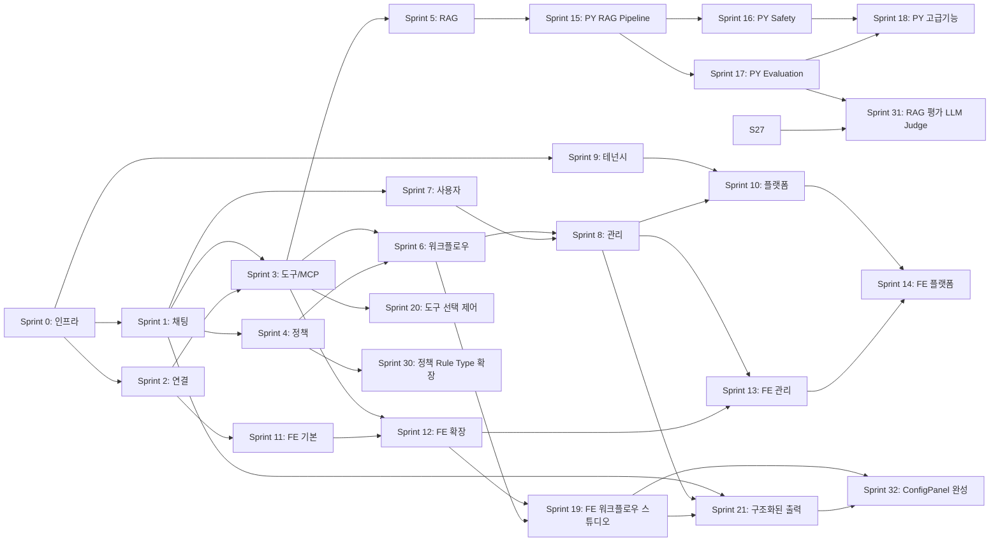
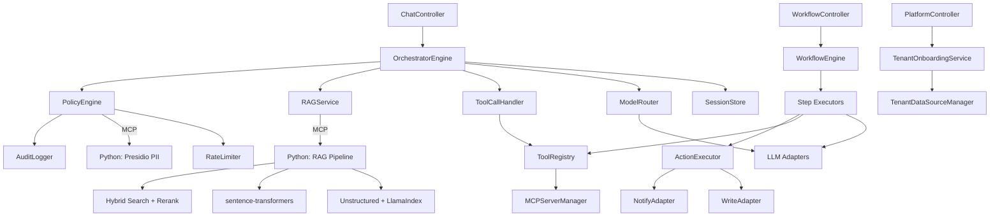
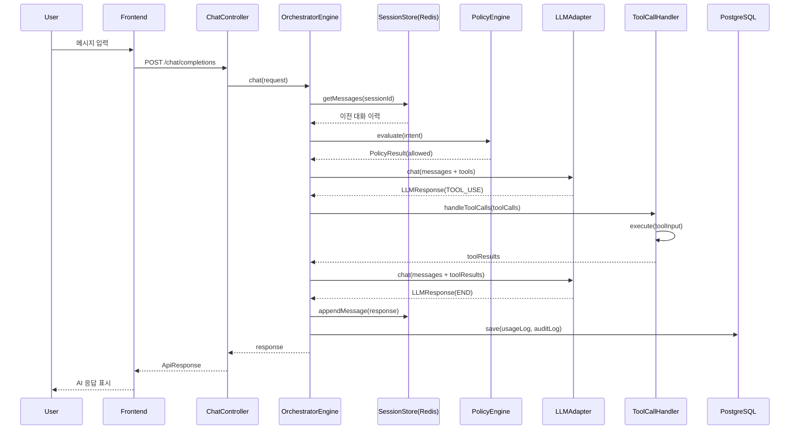

# T3-6. 실행 지시서 (Execution Specification)

> 설계 버전: 3.0 | 최종 수정: 2026-03-28 | 관련 CR: CR-006, CR-007, CR-009, CR-010, CR-011, CR-012, CR-015, CR-016, CR-017, CR-019, CR-020, CR-021, CR-025

> **프로젝트**: Aimbase
> **유형**: Fullstack (BE + FE)
> **작성일**: 2026-03-10 (역설계)

---

## 0. 프로젝트 개요

멀티테넌트 LLM 오케스트레이션 플랫폼. 여러 LLM 프로바이더(Anthropic, OpenAI, Ollama)를 통합하고, 정책 엔진(DENY/APPROVAL/RATE_LIMIT/TRANSFORM), DAG 기반 워크플로우, RAG(pgvector), MCP 도구 통합, RBAC 접근 제어를 제공한다. Database-per-Tenant 멀티테넌시로 조직 간 완전한 데이터 격리를 보장한다.

| 항목 | 내용 |
|------|------|
| 유형 | Fullstack (Spring Boot BE + React FE) |
| 모듈 수 | 16개 |
| 기능 수 | 95개 (MVP 66개) |
| 비즈니스 규칙 수 | 24개 |
| 정책 수 | 16개 |
| 핵심 결정 | Database-per-Tenant, 동기 REST + Virtual Threads, pgvector 통합 |
| 연관 서비스 | Anthropic API, OpenAI API, Ollama, Slack API, PostgreSQL, Redis |

---

## 1. 산출물 맵

### T1: 요구사항 분석

| T번호 | 산출물명 | 파일명 | 요약 |
|--------|---------|--------|------|
| T1-1 | 기능요구사항 명세서 | T1-1_기능요구사항_명세서.md | 95개 기능, 16모듈, MVP 66개 |
| T1-2 | 모듈 요약 대시보드 | T1-2_모듈_요약.md | 16개 모듈 현황 |
| T1-3 | 비즈니스 규칙 정의서 | T1-3_비즈니스_규칙.md | 24개 불변 규칙 |
| T1-4 | 정책 정의서 | T1-4_정책_정의.md | 16개 변경 가능 정책 |
| T1-5 | FSM 상태 정의서 | T1-5_FSM_상태_정의.md | 7개 엔티티 상태 머신 |
| T1-6 | 이벤트 계약서 | T1-6_이벤트_계약.md | 23개 이벤트 |
| T1-7 | Sprint 구조도 | T1-7_Sprint_구조도.md | 15개 Sprint (BE 10 + FE 4 + 인프라 1) |
| T1-8 | 시스템 가이드 | T1-8_시스템_가이드.md | 비개발자용 안내서 |

### T2: 아키텍처 설계

| T번호 | 산출물명 | 파일명 | 요약 |
|--------|---------|--------|------|
| T2-1 | 기술스택 결정서 | T2-1_기술스택_결정서.md | Java 21 + Spring Boot 3.4 + React 18 |
| T2-2 | CLAUDE.md 템플릿 | T2-2_CLAUDE_md_템플릿.md | 프로젝트 규칙/컨벤션 |

### T3: 상세 설계

| T번호 | 산출물명 | 파일명 | 요약 |
|--------|---------|--------|------|
| T3-1 | 데이터 모델 정의서 | T3-1_데이터_모델.md | Master 5 + Tenant 17 엔티티 |
| T3-2 | API 설계서 | T3-2_API_설계.md | 70+ REST 엔드포인트 |
| T3-3 | 화면/컴포넌트 구조서 | T3-3_화면_컴포넌트_구조.md | 13페이지 + 8 공통 컴포넌트 |
| T3-4 | 화면 상호작용 명세서 | T3-4_화면_상호작용.md | 6개 복잡 페이지 상호작용 |
| T3-5 | 단위테스트 명세서 | T3-5_단위테스트_명세.md | 60+ 테스트 케이스 |
| T3-6 | 실행 지시서 | T3-6_실행_지시서.md | 본 문서 |

### T4: 구현 이후

| T번호 | 산출물명 | 파일명 | 요약 |
|--------|---------|--------|------|
| T4-1 | 검증 체크리스트 | T4-1_검증_체크리스트.md | Sprint별 검증 항목 |
| T4-2 | 수동 인수테스트 | T4-2_수동_인수테스트.md | UAT 시나리오 |
| T4-3 | 오픈 점검 체크리스트 | T4-3_오픈_점검_체크리스트.md | 배포 전 점검 |
| T4-4 | 스모크 테스트 | T4-4_스모크_테스트.md | 배포 후 생존 확인 |
| T4-5 | 변경 이력 | T4-5_변경_이력.md | CR 추적 |
| T4-6 | 설치 메뉴얼 | T4-6_설치_메뉴얼.md | 개발환경 구축 |
| T4-7 | 운영 메뉴얼 | T4-7_운영_메뉴얼.md | 운영/장애 대응 |
| T4-8 | 데모 시나리오 | T4-8_데모_시나리오.md | Sprint 리뷰 시나리오 |

---

## 2. 기술 스택 요약

### Backend

| 영역 | 선택 |
|------|------|
| 언어 | Java 21 (Virtual Threads) |
| 프레임워크 | Spring Boot 3.4.2 |
| ORM | Spring Data JPA + Hibernate 6.3 |
| DB | PostgreSQL 16 + pgvector |
| 캐시 | Redis 7 |
| 마이그레이션 | Flyway |
| LLM SDK | Anthropic 2.12.0, OpenAI 2.1.0, Spring AI 1.0.0 |
| MCP | MCP SDK 0.10.0 |
| 빌드 | Gradle 8.x (Kotlin DSL) |

### Frontend

| 영역 | 선택 |
|------|------|
| 언어 | TypeScript 5.6 |
| UI | React 18.3.1 |
| 빌드 | Vite 5.4.10 |
| 상태관리 | TanStack React Query 5.90 |
| 라우팅 | React Router 6.27 |
| HTTP | Axios 1.7.7 |

---

## 3. 모듈 총괄

| 모듈 | 기능수 | 책임 | 외부연동 |
|------|--------|------|---------|
| 채팅 | 2 | LLM 채팅 (동기/스트리밍) | Anthropic, OpenAI, Ollama |
| 연결 | 6 | 외부 서비스 연결 관리 | 각 프로바이더 |
| MCP | 6 | MCP 서버/도구 관리 | MCP 서버 |
| 스키마 | 5 | JSON 스키마 관리/검증 | - |
| 정책 | 7 | 정책 규칙 관리/평가, 6개 규칙 타입별 스키마 검증 (CR-015) | Redis (Rate Limit) |
| 프롬프트 | 6 | 프롬프트 템플릿 관리 | - |
| 라우팅 | 5 | 모델 라우팅 규칙 | - |
| 워크플로우 | 9 | DAG 워크플로우 실행 | - |
| RAG | 12 | 지식소스/벡터 검색 | OpenAI (임베딩) |
| 관리 | 7 | 대시보드/승인 관리 | - |
| 사용자 | 6 | 사용자 CRUD | - |
| 역할 | 5 | RBAC 역할 관리 | - |
| 모니터링 | 2 | 성능/비용 모니터링 | Prometheus |
| 플랫폼관리 | 10 | 테넌트/구독 관리 | PostgreSQL Admin |
| 오케스트레이터 | 8 | 요청 오케스트레이션, 도구 필터링/강제선택(CR-006), 구조화 출력(CR-007) | Redis |
| 액션 | 3 | Write/Notify 실행 | PostgreSQL, Slack |

---

## 4. 데이터 모델 요약

Master DB에 5개 테이블(tenants, subscriptions, tenant_admins, global_config, tenant_usage_summary), Tenant DB에 17개 테이블(connections, mcp_servers, schemas, policies, prompts, routing_config, workflows, workflow_runs, users, roles, knowledge_sources, embeddings, retrieval_config, action_logs, audit_logs, usage_logs, pending_approvals, ingestion_logs). JSONB를 적극 활용하여 동적 설정을 저장하며, pgvector의 vector 타입(차원 가변)으로 임베딩 벡터를 관리한다. 기본 모델 BGE-M3(1024d).

---

## 5. Sprint별 참조 가이드

### Sprint 0: 인프라 세팅

- **목표**: 프로젝트 기반 구축
- **작업 수**: 8

| 순서 | 파일 | 참조 범위 |
|------|------|----------|
| 1 | T2-1_기술스택_결정서.md | 전체 |
| 2 | T3-1_데이터_모델.md | 전체 (Flyway 마이그레이션 설계) |
| 3 | T2-2_CLAUDE_md_템플릿.md | 프로젝트 구조, 네이밍 규칙 |

### Sprint 1: 핵심 채팅 (BE)

- **목표**: LLM 채팅 핵심 기능 구현
- **작업 수**: 7

| 순서 | 파일 | 참조 범위 |
|------|------|----------|
| 1 | T1-1_기능요구사항_명세서.md | PRD-001, PRD-002, PRD-089~091 |
| 2 | T1-3_비즈니스_규칙.md | BIZ-001~004, BIZ-016~017 |
| 3 | T3-2_API_설계.md | Chat 섹션 |
| 4 | T3-5_단위테스트_명세.md | Sprint 1 섹션 |

### Sprint 2: 연결 관리 (BE)

- **목표**: 외부 서비스 연결 CRUD
- **작업 수**: 6

| 순서 | 파일 | 참조 범위 |
|------|------|----------|
| 1 | T1-1_기능요구사항_명세서.md | PRD-003~008 |
| 2 | T1-5_FSM_상태_정의.md | Connection FSM |
| 3 | T3-1_데이터_모델.md | connections 테이블 |
| 4 | T3-2_API_설계.md | Connections 섹션 |

### Sprint 3: 도구 & MCP (BE)

- **목표**: 도구 호출 루프 + MCP 통합
- **작업 수**: 7

| 순서 | 파일 | 참조 범위 |
|------|------|----------|
| 1 | T1-1_기능요구사항_명세서.md | PRD-009~014, PRD-092 |
| 2 | T1-3_비즈니스_규칙.md | BIZ-001, BIZ-017, BIZ-022 |
| 3 | T1-5_FSM_상태_정의.md | MCPServer FSM |
| 4 | T3-5_단위테스트_명세.md | Sprint 3 섹션 |

### Sprint 4: 정책 엔진 (BE)

- **목표**: 정책 CRUD + PolicyEngine + 감사 로깅
- **작업 수**: 7

| 순서 | 파일 | 참조 범위 |
|------|------|----------|
| 1 | T1-1_기능요구사항_명세서.md | PRD-020~026, PRD-095 |
| 2 | T1-3_비즈니스_규칙.md | BIZ-005~007, BIZ-020 |
| 3 | T1-4_정책_정의.md | POL-007 |
| 4 | T3-5_단위테스트_명세.md | Sprint 4 섹션 |

### Sprint 5: RAG (BE)

- **목표**: 인제스션 파이프라인 + 벡터 검색
- **작업 수**: 7

| 순서 | 파일 | 참조 범위 |
|------|------|----------|
| 1 | T1-1_기능요구사항_명세서.md | PRD-047~058 |
| 2 | T1-3_비즈니스_규칙.md | BIZ-012~013 |
| 3 | T1-5_FSM_상태_정의.md | KnowledgeSource FSM |
| 4 | T3-5_단위테스트_명세.md | Sprint 5 섹션 |

### Sprint 6: 워크플로우 (BE)

- **목표**: DAG 워크플로우 엔진 + 액션 실행
- **작업 수**: 8

| 순서 | 파일 | 참조 범위 |
|------|------|----------|
| 1 | T1-1_기능요구사항_명세서.md | PRD-038~046, PRD-093~094 |
| 2 | T1-3_비즈니스_규칙.md | BIZ-009~011, BIZ-023 |
| 3 | T1-5_FSM_상태_정의.md | WorkflowRun FSM, PendingApproval FSM |
| 4 | T3-5_단위테스트_명세.md | Sprint 6 섹션 |

### Sprint 7~10: 사용자/관리/테넌시/플랫폼 (BE)

| 순서 | 파일 | 참조 범위 |
|------|------|----------|
| 1 | T1-1_기능요구사항_명세서.md | PRD-059~088 |
| 2 | T1-3_비즈니스_규칙.md | BIZ-008, BIZ-014~015, BIZ-024 |
| 3 | T1-5_FSM_상태_정의.md | Tenant FSM, User FSM |
| 4 | T3-5_단위테스트_명세.md | Sprint 9 섹션 |

### Sprint 11~14: 프론트엔드

| 순서 | 파일 | 참조 범위 |
|------|------|----------|
| 1 | T3-3_화면_컴포넌트_구조.md | 전체 |
| 2 | T3-4_화면_상호작용.md | 해당 Sprint 페이지 |
| 3 | T3-2_API_설계.md | 해당 API 섹션 |
| 4 | T2-2_CLAUDE_md_템플릿.md | FE 아키텍처 규칙 |

---

## 5-A. 구현 세션 분리 전략

### 옵션 A: Sprint 단위 BE/FE 분리 (권장)
- BE Sprint 0~10 먼저 완료
- FE Sprint 11~14 순차 진행
- FE는 BE API 완성 후 진행하므로 Mock 불필요

### BE 세션 지시
1. CLAUDE.md 읽기
2. T3-6 (본 문서) Sprint별 참조 가이드 확인
3. 해당 Sprint의 참조 파일 순서대로 읽기
4. 구현 → 테스트 → 다음 Sprint

### FE 세션 지시
1. CLAUDE.md 읽기
2. T3-3 화면 구조 확인
3. T3-4 상호작용 명세 확인
4. API 프록시 설정 (Vite → localhost:8080)
5. 구현 → 다음 페이지

---

### Python 사이드카 세션 지시 (v2.0, CR-002)

**Sprint 15: RAG Pipeline**
1. CLAUDE.md 읽기
2. T2-1 Python 사이드카 기술 스택 확인
3. T1-1 PY-001~PY-005, PRD-052, PRD-053 확인
4. T3-2 MCP Server 1 API 확인
5. T3-5 TC-PY-RAG-001~007 테스트 케이스 확인
6. Python 프로젝트 세팅 (uv + FastMCP) → MCP Tool 구현 → pytest 테스트
7. Spring MCP Client 연동 테스트 (기존 IngestionPipeline/VectorSearcher → MCP 호출로 전환)

**Sprint 16: Safety**
1. T1-1 PY-009, PRD-095 확인
2. T3-2 MCP Server 3 API 확인
3. T3-5 TC-PY-SAFE-001~004 테스트 케이스 확인
4. Presidio + 한국어 커스텀 recognizer 구현 → Spring PolicyEngine 연동

**Sprint 17: Evaluation**
1. T1-1 PY-006~PY-008 확인
2. T3-2 MCP Server 2 API 확인
3. T3-5 TC-PY-EVAL-001~003 테스트 케이스 확인
4. RAGAS + DeepEval 구현 → 대시보드 연동

---

## 6. 핵심 아키텍처 원칙 (Quick Reference)

1. **Database-per-Tenant**: 테넌트별 독립 DB, TenantRoutingDataSource로 라우팅
2. **동기 REST + Virtual Threads**: 이벤트 버스 미사용, I/O-bound LLM 호출을 Virtual Threads로 처리
3. **통합 메시지 모델**: UnifiedMessage로 프로바이더 간 메시지 형식 통일
4. **정책 우선 제어**: 모든 액션/LLM 호출 전 PolicyEngine 평가 필수
5. **감사 로깅 의무화**: 주요 이벤트 AuditLogger로 기록
6. **JSONB 활용**: 동적 설정(config, rules, steps)은 JSONB로 유연하게 관리
7. **Python 사이드카 하이브리드**: AI 특화 기능은 Python MCP Server, 엔터프라이즈 오케스트레이션은 Spring (CR-002)
8. **구조화된 출력**: response_format으로 LLM 응답을 JSON Schema 강제, 프로바이더별 최적 방식 분기 (CR-007)
9. **도구 선택 제어**: ToolFilterContext + toolChoice로 LLM에 노출할 도구를 앱이 제어 (CR-006)
10. **정책 규칙 타입화**: 6개 규칙 타입별 JSON 스키마로 구조화, UI 자동 생성 + 서버 검증 (CR-015)
11. **RAG 평가 LLM Judge**: fast/accurate 모드 선택, Claude Haiku 의미론적 평가로 품질 향상 (CR-016)
12. **워크플로우 스텝 표준화**: StepType별 config 구조화, {{변수}} 치환, onSuccess/onFailure 분기 (CR-017)

---

## 7. Sprint 의존관계 다이어그램

---

### Sprint 19: FE 워크플로우 스튜디오 [v2.3, CR-005]

| 순서 | 파일 | 참조 범위 |
|------|------|----------|
| 1 | T1-1_기능요구사항_명세서.md | FE-001~FE-005 |
| 2 | T2-1_기술스택_결정서.md | FE 기술 스택 (@xyflow/react, dagre) |
| 3 | T3-2_API_설계.md | 워크플로우 API 섹션 (변경 없음, 기존 CRUD 활용) |
| 4 | T4-1_검증_체크리스트.md | Sprint 19 검증 항목 |

**세션 지시**:
1. CLAUDE.md 읽기
2. `npm install @xyflow/react dagre @types/dagre` 설치
3. FE-001: WorkflowStudio 페이지 + Canvas 컴포넌트 (React Flow)
4. FE-002: NodePalette (좌측 사이드바, 드래그 소스)
5. FE-003: ConfigPanel (우측 패널, 노드 선택 시 config 편집)
6. FE-004: flowToWorkflow / workflowToFlow 유틸 (양방향 변환)
7. FE-005: 실행 시각화 (폴링 + 노드 상태 표시)
8. 라우팅: App.tsx에 /workflows/new, /workflows/:id/edit 추가
9. 기존 Workflows.tsx에 "편집" 버튼 → 스튜디오 진입 링크 추가

### Sprint 20: 도구 선택 제어 (BE) [v2.4, CR-006]

- **목표**: LLM에 노출할 도구를 앱이 제어하는 2가지 메커니즘 구현
- **의존**: Sprint 3 (도구 & MCP)

| 순서 | 파일 | 참조 범위 |
|------|------|----------|
| 1 | T1-1_기능요구사항_명세서.md | PRD-092(확장), PRD-096, PRD-097 |
| 2 | T2-1_기술스택_결정서.md | 아키텍처 결정 #6 (도구 선택 제어) |
| 3 | T4-1_검증_체크리스트.md | Sprint 20 검증 항목 |

**세션 지시**:
1. CLAUDE.md 읽기
2. PRD-096 구현: ToolFilterContext 레코드 생성 → ToolRegistry.getToolDefs(filter) 오버로드 → ToolCallHandler에서 필터 전달
3. PRD-097 구현: LLMRequest에 toolChoice 필드 추가 → AnthropicAdapter/OpenAIAdapter/OllamaAdapter에서 provider별 tool_choice 매핑
4. OrchestratorEngine.chat()에서 ChatRequest의 toolFilter/toolChoice를 ToolCallHandler에 전달
5. 단위테스트: ToolRegistryTest(필터링), ToolCallHandlerTest(toolChoice)

### Sprint 21: 구조화된 출력 (BE + FE) [v2.5, CR-007]

- **목표**: LLM 응답을 JSON Schema 기반 구조화된 포맷으로 반환하는 기능 구현
- **의존**: Sprint 1 (채팅), Sprint 8 (스키마), Sprint 19 (워크플로우 스튜디오)

| 순서 | 파일 | 참조 범위 |
|------|------|----------|
| 1 | T1-1_기능요구사항_명세서.md | PRD-098~PRD-101, PRD-001(확장), PRD-019(확장), PRD-043(확장) |
| 2 | T2-1_기술스택_결정서.md | 아키텍처 결정 #7 (구조화된 출력) |
| 3 | T3-2_API_설계.md | Chat 구조화 출력 섹션, Workflow output_schema 섹션 |
| 4 | T3-3_화면_컴포넌트_구조.md | WorkflowStudio 스키마 편집 UI |
| 5 | T4-1_검증_체크리스트.md | Sprint 21 검증 항목 |

**세션 지시**:

**BE Phase 1 — 핵심 구조화 출력 (PRD-098, PRD-099)**:
1. CLAUDE.md 읽기
2. ContentBlock sealed interface에 `Structured(String schema, Map<String, Object> data)` 레코드 추가
3. ChatCompletionRequest에 `response_format` 필드 추가 (ResponseFormat DTO)
4. OrchestratorEngine.chat()에서 response_format 존재 시 분기:
   - schema_ref 타입: SchemaService에서 스키마 조회 → JSON Schema 추출
   - json_schema 타입: 인라인 스키마 직접 사용
5. LLMRequest에 `responseSchema(JsonNode)` 필드 추가
6. 각 LLMAdapter 구조화 출력 구현:
   - AnthropicAdapter: 시스템 프롬프트 스키마 주입 + Tool Use 역이용
   - OpenAIAdapter: response_format json_schema + strict:true
   - OllamaAdapter: format:"json" + 시스템 프롬프트 스키마 주입
7. LLM 응답 후 SchemaService.validate()로 검증, 실패 시 최대 2회 재시도
8. toChatCompletionResponse에서 structured 타입 분기 반환

**BE Phase 2 — 워크플로우 연동 (PRD-100)**:
1. Flyway 마이그레이션: workflows 테이블에 `output_schema JSONB` 컬럼 추가
2. WorkflowEntity에 outputSchema 필드 추가 (Hypersistence JsonType)
3. WorkflowEngine: 마지막 LLM_CALL 스텝 실행 시 outputSchema → response_format 자동 주입
4. 단위테스트: OrchestratorEngineTest (구조화 출력), WorkflowEngineTest (output_schema 주입)

**FE Phase (PRD-101)**:
1. ConfigPanel LLM 노드에 "응답 포맷" 옵션 추가 (없음/스키마 선택/인라인)
2. 워크플로우 속성 패널에 "출력 스키마" 탭 추가
3. 스키마 드롭다운: useSchemas() 훅으로 GET /schemas 조회
4. 인라인 JSON Schema 에디터 (textarea + JSON 문법 검증)
5. flowToWorkflow 유틸에 outputSchema 필드 포함

### Sprint 22: Python 알파 Phase 1 + 스토리지/인증 [v3.0, CR-009/010]

- **목표**: Python 독립 기능(문서파싱, NER강화) + 스토리지 추상화 + JWT/RBAC 인증
- **의존**: Sprint 15~18 (Python 사이드카), Sprint 7 (사용자/역할)

| 순서 | 파일 | 참조 범위 |
|------|------|----------|
| 1 | T1-1_기능요구사항_명세서.md | PY-013, PY-018, PRD-106~108, PRD-114~115 |
| 2 | T3-2_API_설계.md | Auth 섹션, MCP Server 알파 도구 |
| 3 | T4-1_검증_체크리스트.md | Sprint 22 검증 항목 |

**Python 세션 지시**:
1. PY-013 문서파싱: `src/rag_pipeline/tools/parser.py` 구현 (이미 작성됨) → `server.py`에 `parse_document` 도구 등록
2. PY-018 한국어 NER 강화: 4개 recognizer 구현 (kr_passport, kr_business_number, kr_driver_license, kr_address) → `engine.py`에 등록
3. 테스트: `tests/test_parser.py`, `tests/test_safety_recognizers_alpha.py`

**Java 세션 지시**:
1. B10 스토리지: `StorageService` 인터페이스 + `LocalStorageService` (@Profile("!s3")) + `S3StorageService` (@Profile("s3"))
2. B3 인증: `JwtProvider`, `JwtAuthenticationFilter`, `ApiKeyAuthenticationFilter`, `UserPrincipal`, `AuthController`
3. Flyway V19: users 테이블에 password_hash, refresh_token_hash, last_login_at 추가
4. `SecurityConfig.java` 수정: 역할 기반 접근 제어 적용
5. `build.gradle.kts`: jjwt-api 의존성 추가

### Sprint 23: Python 알파 Phase 2 + 파일업로드/대화히스토리 [v3.0, CR-009/010]

- **목표**: 핵심 RAG 강화(압축, 벤치마크, 드리프트) + 파일 업로드 + 대화 히스토리 DB 저장 + CR-006 완성
- **의존**: Sprint 22 (스토리지, 인증)

| 순서 | 파일 | 참조 범위 |
|------|------|----------|
| 1 | T1-1_기능요구사항_명세서.md | PY-015, PY-020, PY-021, PRD-096~097, PRD-102~105 |
| 2 | T3-2_API_설계.md | 파일업로드, 대화히스토리 섹션 |

**Python 세션 지시**:
1. PY-015 컨텍스트 압축: `src/rag_pipeline/tools/compressor.py` → `server.py`에 `compress_context` 등록
2. PY-020 벤치마크 자동 생성: `src/evaluation/engine.py`에 `generate_benchmark()` 추가 → `evaluation/server.py`에 도구 등록
3. PY-021 드리프트 감지: `src/evaluation/drift_detector.py` → `evaluation/server.py`에 도구 등록
4. 테스트: `tests/test_compressor.py`, `tests/test_drift_detector.py`

**Java 세션 지시**:
1. B1 파일업로드: `KnowledgeController`에 `POST /{id}/upload` 추가, StorageService 연동
2. B2 대화히스토리: Flyway V20 (conversation_sessions + conversation_messages), Entity/Repository, `ConversationController`, `SessionStore` 듀얼 저장
3. B4 CR-006 완성: `OllamaAdapter` toolChoice "none" 시 tools 제외

### Sprint 24: Python 알파 Phase 3 + 멀티모달/트레이싱/구조화출력 완성 [v3.0, CR-009/010]

- **목표**: 고급 RAG+Safety(Self-RAG, 독성, LLM콜백) + 멀티모달 API + LLM 트레이싱 + CR-007 완성
- **의존**: Sprint 23

| 순서 | 파일 | 참조 범위 |
|------|------|----------|
| 1 | T1-1_기능요구사항_명세서.md | PY-014, PY-019, PY-022, PRD-098~101, PRD-111~113 |
| 2 | T3-2_API_설계.md | 멀티모달, 트레이싱 |

**Python 세션 지시**:
1. PY-014 Self-RAG: `src/rag_pipeline/tools/self_rag.py` → `server.py`에 `self_rag_search` 등록
2. PY-019 독성 분류 강화: `src/safety/toxic_references.py` + `guardrails.py` 임베딩 기반 분류 추가
3. PY-022 LLM 콜백: `src/agent/reasoning.py`에 `_call_llm()` HTTP 콜백 함수 추가
4. 테스트: `tests/test_self_rag.py`

**Java 세션 지시**:
1. B5 CR-007 완성: `WorkflowEngine` outputSchema 자동 주입, `LlmCallStepExecutor` response_schema 연동
2. B7 멀티모달: `ChatController.MessageDto` content Object 변환, 3개 어댑터 이미지 매핑
3. B8 트레이싱: Flyway V21 (traces), `TraceEntity`, `TraceService`, `OrchestratorEngine` 연동

### Sprint 25: Python 알파 Phase 4 + 비용대시보드/검색설정 [v3.0, CR-009/010]

- **목표**: 인프라 의존 기능(멀티모달 임베딩, 웹스크래핑) + 비용 대시보드 + 검색 설정 연결
- **의존**: Sprint 24

| 순서 | 파일 | 참조 범위 |
|------|------|----------|
| 1 | T1-1_기능요구사항_명세서.md | PY-016, PY-017, PRD-055~058, PRD-109~110 |

**Python 세션 지시**:
1. PY-016 멀티모달 임베딩: `src/rag_pipeline/tools/multimodal_embedder.py` (CLIP) → `server.py`에 등록
2. PY-017 웹 스크래핑: `src/rag_pipeline/tools/scraper.py` (Playwright optional) → `server.py`에 등록
3. `pyproject.toml` optional-dependencies 추가 (multimodal, scraping)
4. 테스트: `tests/test_multimodal_embedder.py`, `tests/test_scraper.py`

**Java 세션 지시**:
1. B6 비용 대시보드: Flyway V22 (model_pricing + 시드), `ModelPricingEntity`, `AdminController` 비용 API
2. B9 검색 설정: VectorSearcher ↔ RetrievalConfig 실참조 연결 확인
3. FE: `Monitoring.tsx`에 recharts 차트 추가, `useAdmin.ts` 비용 훅

---

### Sprint 26: RAG A++ Phase 1 — Contextual Retrieval + Parent-Child + Query Transform [v3.1, CR-011]

- **목표**: RAG 검색 정확도 A++ 격상의 핵심 — Contextual Retrieval(49% 정확도 향상), Parent-Child 계층 검색, Query Transform 고도화
- **의존**: Sprint 5, Sprint 15, Sprint 18

| 순서 | 파일 | 참조 범위 |
|------|------|----------|
| 1 | T1-1_기능요구사항_명세서.md | PRD-116~119, PY-023~025 |
| 2 | T1-3_비즈니스_규칙.md | BIZ-025, BIZ-026 |
| 3 | T3-1_데이터_모델.md | embeddings 테이블 확장 (parent_id, context_prefix, content_hash) |
| 4 | T3-5_단위테스트_명세.md | TC-RAG-PP-001 ~ TC-RAG-PP-008 |

**DB 세션 지시**:
1. Flyway Tenant 마이그레이션 V18: `embeddings` 테이블에 `parent_id` (varchar, 자기참조 FK nullable), `context_prefix` (text nullable), `content_hash` (varchar(64) nullable) 컬럼 추가
2. `parent_id` 인덱스 추가: `idx_embeddings_parent_id`

**Python 세션 지시**:
1. PY-023 contextual_chunk: `src/rag_pipeline/tools/contextual_chunker.py` — LLM 호출로 맥락 프리픽스 생성, 배치 20개씩
2. PY-024 parent_child_search: `src/rag_pipeline/tools/parent_child_searcher.py` — Child 검색 → Parent 조인 반환
3. PY-025 transform_query 고도화: 기존 `src/rag_pipeline/tools/query_transformer.py` 확장 — HyDE/Multi-Query/Step-Back 실제 LLM 연동
4. 각 도구 `server.py`에 등록
5. 테스트: `tests/test_contextual_chunker.py`, `tests/test_parent_child_searcher.py`, `tests/test_query_transformer_v2.py`

**Java 세션 지시**:
1. PRD-116: `IngestionPipeline`에 contextual 모드 추가 — `KnowledgeSource.chunking_config.contextual=true` 시 MCPRagClient.contextualChunk() 호출
2. PRD-117: `VectorSearcher`에 parent_child 검색 모드 추가 — MCPRagClient.parentChildSearch() 호출, `EmbeddingEntity`에 parentId, contextPrefix 필드 추가
3. PRD-119: `RAGService`에 검색 전 Query Transform 레이어 삽입 — RetrievalConfig.query_processing.strategy에 따라 MCPRagClient.transformQuery() 호출
4. PRD-118 (FE): Knowledge.tsx 지식소스 생성/편집 시 청킹 전략 드롭다운 + Contextual 토글 추가

---

### Sprint 27: RAG A++ Phase 2 — RAGAS 평가 + 고급 파싱 [v3.1, CR-011]

- **목표**: RAG 품질 측정 루프 구축 (RAGAS) + 테이블/OCR 고급 파싱
- **의존**: Sprint 26, Sprint 17

| 순서 | 파일 | 참조 범위 |
|------|------|----------|
| 1 | T1-1_기능요구사항_명세서.md | PRD-120~123, PY-026~027 |
| 2 | T1-3_비즈니스_규칙.md | BIZ-030 |
| 3 | T3-2_API_설계.md | POST/GET /evaluations/rag-quality |
| 4 | T3-5_단위테스트_명세.md | TC-RAG-PP-009 ~ TC-RAG-PP-012 |

**DB 세션 지시**:
1. Flyway Tenant 마이그레이션 V19: `rag_evaluations` 테이블 생성 — id(uuid PK), source_id(FK), query(text), answer(text), faithfulness(numeric), context_relevancy(numeric), answer_relevancy(numeric), context_precision(numeric nullable), context_recall(numeric nullable), overall_score(numeric), evaluated_at(timestamp), created_at

**Python 세션 지시**:
1. PY-026 evaluate_rag_quality: `src/evaluation/tools/rag_quality.py` — RAGAS 기반 5개 메트릭 산출
2. PY-027 advanced_parse: `src/rag_pipeline/tools/advanced_parser.py` — unstructured hi_res 전략, 테이블 추출, OCR
3. 각 도구 해당 `server.py`에 등록
4. 테스트: `tests/test_rag_quality.py`, `tests/test_advanced_parser.py`

**Java 세션 지시**:
1. PRD-120: `EvaluationController`에 `POST/GET /evaluations/rag-quality` 추가, `RagEvaluationEntity` + Repository
2. PRD-121 (FE): Knowledge 페이지 내 평가 탭 — recharts 레이더 차트 + 추이 라인 차트
3. PRD-122~123: `IngestionPipeline`에서 parse_tables/ocr_enabled 설정 시 MCPRagClient.advancedParse() 호출

---

### Sprint 28: RAG A++ Phase 3 — 시맨틱 캐시 + Citation + 증분 인제스션 + TTS/STT [v3.1, CR-011]

- **목표**: 비용/속도 최적화(캐시, 증분) + 사용자 신뢰도(Citation) + AI 튜터 연동용 TTS/STT API
- **의존**: Sprint 26, Sprint 1 (채팅)

| 순서 | 파일 | 참조 범위 |
|------|------|----------|
| 1 | T1-1_기능요구사항_명세서.md | PRD-124~127, PY-028 |
| 2 | T1-3_비즈니스_규칙.md | BIZ-027, BIZ-028, BIZ-029 |
| 3 | T3-2_API_설계.md | Citation 응답 확장, TTS/STT API |
| 4 | T3-5_단위테스트_명세.md | TC-RAG-PP-013~018, TC-TTS-001~003, TC-STT-001~003 |

**DB 세션 지시**:
1. Flyway Tenant 마이그레이션 V20: `ingestion_logs` 테이블에 `documents_skipped`(int), `documents_updated`(int), `documents_new`(int) 컬럼 추가

**Python 세션 지시**:
1. PY-028 semantic_cache: `src/rag_pipeline/tools/semantic_cache.py` — Redis에 질문 임베딩 저장/비교
2. `server.py`에 등록
3. 테스트: `tests/test_semantic_cache.py`

**Java 세션 지시**:
1. PRD-124: `VectorSearcher` 검색 전 시맨틱 캐시 확인 레이어 삽입 — MCPRagClient.semanticCache() 호출, Redis에 캐시 저장
2. PRD-125: `RAGService.buildContext()`에서 컨텍스트 주입 시 출처 번호 `[1]`, `[2]` 포함, LLM 시스템 프롬프트에 인용 지시 추가, `ChatResponse`에 `citations` 필드 추가
3. 증분 인제스션: `IngestionPipeline`에서 문서별 SHA-256 해시 비교 → 동일 해시 스킵, `IngestionLogEntity`에 skipped/updated/new 필드 추가
4. PRD-126 TTS: `TTSController` + `TTSService` 신규 — POST /api/v1/tts, ConnectionAdapterFactory로 OpenAI 연결 조회, OpenAI TTS API 호출, 오디오 바이너리 스트리밍 반환
5. PRD-127 STT: `STTController` + `STTService` 신규 — POST /api/v1/stt, multipart 오디오 수신, OpenAI Whisper API 호출, 텍스트+세그먼트 반환
6. TTS/STT 공통: 감사 로그 기록(text 길이/duration/비용), Rate Limiting 정책 적용, Connection 타입 "openai" 검증

### Sprint 30: 정책 엔진 Rule Type 확장 (BE + FE) [v3.3, CR-015]

- **목표**: 정책 규칙 타입별 구조화된 JSON 스키마 도입 + 규칙 편집 UI 개선
- **의존**: Sprint 4 (정책 엔진)

| 순서 | 파일 | 참조 범위 |
|------|------|----------|
| 1 | T2-1_기술스택_결정서.md | 아키텍처 결정 #9 (정책 엔진 Rule Type 확장) |
| 2 | T3-1_데이터_모델.md | PolicyRuleType enum (확장), policies.rules JSONB 스키마 |
| 3 | T3-2_API_설계.md | 정책 규칙 타입별 JSON 스키마 섹션 |
| 4 | T3-5_단위테스트_명세.md | TC-POL-011 ~ TC-POL-020 |

**세션 지시**:
1. CLAUDE.md 읽기
2. `PolicyRuleType` enum에 5개 타입 추가: CONTENT_FILTER, COST_LIMIT, TOKEN_LIMIT, MODEL_FILTER, TIME_RESTRICTION
3. 각 규칙 타입별 JSON Schema 정의 클래스 생성 (content_filter, cost_limit, token_limit, rate_limit, model_filter, time_restriction)
4. `PolicyEngine.evaluate()`에서 규칙 타입별 분기 로직 추가: content_filter(키워드/패턴 매칭), cost_limit(사용량 집계 비교), token_limit(토큰 수 검증), model_filter(모델 화이트/블랙리스트), time_restriction(현재 시간 + 타임존 비교)
5. JSON Schema Validator(networknt) 기반 규칙 유효성 검증 로직 추가
6. FE: 정책 편집 페이지에 규칙 타입별 편집 폼 컴포넌트 추가 (타입 선택 → 동적 폼 렌더링)
7. 단위테스트: PolicyEngineTest 확장 (TC-POL-011 ~ TC-POL-020)

---

### Sprint 31: RAG 평가 LLM Judge (Python + BE) [v3.4, CR-016]

- **목표**: RAGAS 평가에 LLM Judge(Claude Haiku) 모드 추가로 의미론적 평가 품질 향상
- **의존**: Sprint 17 (Evaluation), Sprint 27 (RAGAS)

| 순서 | 파일 | 참조 범위 |
|------|------|----------|
| 1 | T2-1_기술스택_결정서.md | 아키텍처 결정 #10 (RAG 평가 LLM Judge) |
| 2 | T3-2_API_설계.md | POST /evaluations/rag-quality (mode 파라미터), MCP evaluate_rag (mode) |
| 3 | T3-5_단위테스트_명세.md | TC-EVAL-001 ~ TC-EVAL-005 |

**Python 세션 지시**:
1. `src/evaluation/tools/rag_quality.py`에 `mode` 파라미터 추가 (`"fast"` / `"accurate"`)
2. `_call_llm_for_score()` 내부 함수 구현: `POST https://api.anthropic.com/v1/messages` (model: `claude-haiku-4-5-20251001`)
3. `evaluate_rag` MCP Tool에 mode 파라미터 전달
4. `accurate` 모드: RAGAS 메트릭 산출 후 LLM Judge 의미론적 점수 병합
5. API 호출 실패 시 graceful degradation (RAGAS만 반환)
6. 테스트: `tests/test_rag_quality_llm_judge.py`

**Java 세션 지시**:
1. `EvaluationController.evaluateRagQuality()`에 `config.mode` 파라미터 추가
2. `MCPRagClient.evaluateRagQuality()` 호출 시 mode 전달
3. `RagEvaluationEntity`에 mode 필드 추가
4. 응답에 `llm_judge_scores` 필드 포함 (mode=accurate 시)

---

### Sprint 32: 워크플로우 ConfigPanel 완성 (BE + FE) [v3.5, CR-017]

- **목표**: WorkflowStep 모델 표준화 + ConfigPanel UI 타입별 편집 폼 자동 생성
- **의존**: Sprint 19 (워크플로우 스튜디오), Sprint 21 (구조화된 출력)

| 순서 | 파일 | 참조 범위 |
|------|------|----------|
| 1 | T2-1_기술스택_결정서.md | 아키텍처 결정 #11 (ConfigPanel) |
| 2 | T3-1_데이터_모델.md | WorkflowStepType enum (config 구조), workflows.steps JSONB |
| 3 | T3-2_API_설계.md | 워크플로우 스텝 구조 섹션 |
| 4 | T3-5_단위테스트_명세.md | TC-WF-011 ~ TC-WF-017 |

**BE 세션 지시**:
1. `WorkflowStep` record 정의: `id, name, type, config, dependsOn(@JsonAlias("dependencies")), onSuccess, onFailure, timeoutMs`
2. `StepType` enum 확인: LLM_CALL, TOOL_CALL, ACTION, CONDITION, PARALLEL, HUMAN_INPUT
3. ACTION config의 payload 변수 치환 엔진 구현: `{{stepId.output}}`, `{{stepId.output.field}}` 패턴을 이전 스텝 결과로 치환
4. `WorkflowEngine`에서 onSuccess/onFailure 분기 로직 추가
5. 단위테스트: WorkflowStepTest, WorkflowEngineTest (TC-WF-011 ~ TC-WF-017)

**FE 세션 지시**:
1. ConfigPanel을 StepType별 편집 폼으로 확장:
   - LLM_CALL: connection_id 드롭다운, model 선택, system_prompt textarea, response_schema 에디터
   - TOOL_CALL: tool_name 드롭다운 (ToolRegistry 연동), input JSON 편집기
   - ACTION: type(WRITE/NOTIFY), adapter 드롭다운, destination 입력, payload JSON 편집기 ({{}} 자동완성)
   - CONDITION: expression SpEL 입력, true_step/false_step 노드 선택
   - PARALLEL: step_ids 체크박스 목록
   - HUMAN_INPUT: approval_channel, approvers 태그 입력, timeout_ms
2. dependsOn 필드를 Canvas 엣지 연결과 양방향 동기화
3. onSuccess/onFailure 엣지 색상 구분 (성공=녹색, 실패=빨강)
4. flowToWorkflow/workflowToFlow 유틸에 name, onSuccess, onFailure, timeoutMs 필드 포함

---

### Sprint 33: 프로젝트 계층 + MCP 관리 도구 (BE + FE) [v3.6, CR-020, CR-021]

- **목표**: 회사 내 프로젝트 스코핑 + 도메인팀용 MCP 관리 도구 14개 노출
- **의존**: Sprint 1~10 (모든 BE API), Sprint 19 (워크플로우 스튜디오)

| 순서 | 파일 | 참조 범위 |
|------|------|----------|
| 1 | T3-1_데이터_모델.md | projects, project_members, project_resources 테이블 |
| 2 | T3-2_API_설계.md | Project API + MCP 관리 도구 스펙 |
| 3 | T3-5_단위테스트_명세.md | TC-PRJ-001 ~ TC-PRJ-013, TC-MCP-ADM-001 ~ 005 |

**BE 세션 지시**:
1. Flyway V29: projects, project_members, project_resources 테이블 + workflows.project_id 컬럼
2. Entity 3개: ProjectEntity, ProjectMemberEntity, ProjectResourceEntity
3. Repository 3개 + WorkflowRepository 프로젝트 쿼리 추가
4. ProjectContext (ThreadLocal) + ProjectResolver 필터 (@Order -199, X-Project-Id 헤더)
5. ProjectController: CRUD + 멤버 관리 + 리소스 할당 API
6. WorkflowController: list/create에 프로젝트 스코핑 적용
7. Knowledge/Prompt/SchemaController: list()에 project_resources 기반 필터링
8. AdminToolService + AimbaseAdminMcpConfig: MCP Server(/admin-mcp/sse)로 14개 도구 노출
9. SecurityConfig: /admin-mcp/** permitAll

**FE 세션 지시**:
1. types/project.ts, api/projects.ts, hooks/useProjects.ts
2. store/projectContext.ts: localStorage + 구독 패턴
3. api/client.ts: X-Project-Id 헤더 인터셉터 추가
4. pages/Projects.tsx: 프로젝트 CRUD 카드 UI
5. Sidebar.tsx: ProjectSelector 드롭다운 (로고 아래), 프로젝트 메뉴 추가
6. App.tsx: /projects 라우트 추가

---

### Sprint 30: 플랫폼 공통 Tool 확장 Phase 1 [CR-019]

**목표**: 문서 읽기 Tool 4종 + 포맷 변환 + Tool 목록 API

| # | 태스크 | 파일 | 비고 |
|---|--------|------|------|
| 1 | read_pptx MCP Tool | `python-sidecar/src/rag_pipeline/tools/document_reader.py` | python-pptx, 슬라이드별 JSON/HTML |
| 2 | read_docx MCP Tool | 동일 파일 | python-docx, 단락/표/이미지 |
| 3 | read_excel MCP Tool | 동일 파일 | openpyxl, 시트별 JSON |
| 4 | read_pdf MCP Tool | 동일 파일 | pdfplumber, OCR 선택 |
| 5 | convert_format MCP Tool | `python-sidecar/src/rag_pipeline/tools/format_converter.py` | LibreOffice headless |
| 6 | server.py Tool 등록 | `python-sidecar/src/rag_pipeline/server.py` | 5개 Tool @mcp.tool() |
| 7 | ToolController API | `backend/.../api/ToolController.java` | GET /api/v1/tools |
| 8 | FE 워크플로우 Tool 선택 | `frontend/src/pages/Workflows.tsx` | TOOL_CALL 스텝 드롭다운 |

### Sprint 31: 플랫폼 공통 Tool 확장 Phase 2 [CR-019]

**목표**: 실행/시각화 + 웹 + 알림 + 분석/번역 Tool

| # | 태스크 | 파일 | 비고 |
|---|--------|------|------|
| 1 | run_python MCP Tool | `python-sidecar/src/rag_pipeline/tools/code_executor.py` | 샌드박스, timeout |
| 2 | render_chart MCP Tool | `python-sidecar/src/rag_pipeline/tools/chart_renderer.py` | matplotlib |
| 3 | web_search MCP Tool | `python-sidecar/src/rag_pipeline/tools/web_tools.py` | 외부 검색 API |
| 4 | web_fetch MCP Tool | 동일 파일 | beautifulsoup4 정제 |
| 5 | send_notification Tool | `backend/.../tool/builtin/NotificationTool.java` | ActionEngine 확장 |
| 6 | analyze_image Tool | `backend/.../tool/builtin/ImageAnalysisTool.java` | LLM Vision API |
| 7 | translate_text Tool | `backend/.../tool/builtin/TranslationTool.java` | LLM 체인 |
| 8 | server.py Tool 등록 | `python-sidecar/src/rag_pipeline/server.py` | 4개 Tool 추가 |

### Sprint 40: 로그인 테넌트 자동 resolve [CR-027]

**목표**: X-Tenant-Id 하드코딩 제거, email 기반 테넌트 자동 판별

| # | 태스크 | 파일 | 비고 |
|---|--------|------|------|
| 1 | Master DB 마이그레이션 — user_tenant_map 테이블 | `db/migration/master/V4__create_user_tenant_map.sql` | email→tenant_id 매핑 |
| 2 | AuthController.login() 변경 — X-Tenant-Id 없이 로그인 | `AuthController.java` | Master DB 조회 → 동적 라우팅 |
| 3 | 로그인 응답에 tenant_id 추가 | `AuthController.java` | 클라이언트가 이후 요청에 사용 |
| 4 | TenantOnboardingService — 프로비저닝 시 매핑 등록 | `TenantOnboardingService.java` | seedInitialData에서 INSERT |
| 5 | UserController — 사용자 CRUD 시 매핑 동기화 | `UserController.java` | create→INSERT, delete→DELETE |
| 6 | FE client.ts — 하드코딩 제거, 동적 tenant_id | `frontend/src/api/client.ts` | localStorage에서 읽기 |
| 7 | FE Login.tsx — X-Tenant-Id 불필요 로그인 | `frontend/src/pages/Login.tsx` | 응답에서 tenant_id 저장 |
| 8 | 기존 테넌트 사용자 매핑 데이터 보정 | SQL 스크립트 | 기존 tenant_dev, axopm_companyA, bidding_system |

---

## 8. 설계 리뷰 시트

### 8-1. 모듈 관계도

### 8-2. 데이터 흐름도

### 8-3. 화면-API 매핑 요약

| 화면 | 주요 API | 비고 |
|------|---------|------|
| Dashboard | GET /admin/dashboard, /action-logs, /approvals, /usage | 자동 갱신 (5~30s) |
| Connections | CRUD /connections, POST /connections/{id}/test | 헬스체크 |
| MCPServers | CRUD /mcp-servers, POST /{id}/discover | 도구 탐색 |
| Schemas | CRUD /schemas, POST /{id}/{v}/validate | 검증 |
| Policies | CRUD /policies, POST /simulate | 시뮬레이션 |
| Prompts | CRUD /prompts, POST /{id}/{v}/test | 렌더링 테스트 |
| Workflows | CRUD /workflows, POST /{id}/run | 실행 |
| Knowledge | CRUD /knowledge-sources, POST /{id}/sync, POST /search | 인제스션 + 검색 |
| TTS/STT | POST /tts, POST /stt | AI 튜터 연동 (CR-011) |
| Auth | CRUD /users + /roles, POST /{id}/api-key | API 키 |
| API Keys | CRUD /admin/api-keys, POST /{id}/regenerate | 시스템 키 관리 (CR-025) |
| Monitoring | GET /models, /admin/usage | 읽기 전용 |
| Tenants | CRUD /platform/tenants + suspend/activate | Super Admin |
| Subscriptions | GET/PUT /platform/subscriptions | Super Admin |
| PlatformMonitoring | GET /platform/usage | Super Admin |

### 8-4. 리뷰 체크리스트

- [x] 모든 FSM 상태 전환이 화이트리스트 기반인가? — WorkflowRunEntity.FSM 검증 (2026-03-25 코드 검증)
- [x] 정책 평가가 모든 액션/LLM 호출 경로에 적용되는가? — OrchestratorEngine.evaluatePolicy() 호출 확인
- [x] 멀티테넌트 격리가 API/DB/Session 레벨에서 보장되는가? — TenantResolver @Order(-200), DB-per-Tenant
- [x] 도구 호출 루프 최대 5회 제한이 적용되는가? — ToolCallHandler.MAX_TOOL_LOOP=5
- [x] 감사 로그가 주요 이벤트에 모두 기록되는가? — AuditLogger 주요 경로 호출 확인
- [x] API 응답이 ApiResponse 래퍼로 통일되는가? — 모든 Controller에서 ApiResponse<T> 사용
- [x] JSONB 필드 스키마가 코드와 일관성 있는가? — Hypersistence JsonBinaryType 적용
- [x] pgvector HNSW 인덱스가 임베딩 테이블에 적용되는가? — V25 마이그레이션으로 가변 차원 전환 완료
- [x] FE 자동 갱신 간격이 UX에 적절한가? — React Query refetchInterval 적용
- [x] Super Admin 경로가 Master DB에만 접근하는가? — /api/v1/platform/** → MasterDB only
- [x] ToolFilterContext가 ToolRegistry.getToolDefs()에 정확히 전달되는가? (CR-006) — ToolCallHandler → ToolRegistry.getToolDefs(filter)
- [x] tool_choice가 프로바이더별(Anthropic/OpenAI/Ollama)로 올바르게 매핑되는가? (CR-006) — 3개 어댑터 mapToolChoice() 검증
- [x] 구조화된 출력 실패 시 최대 2회 재시도가 동작하는가? (CR-007) — OrchestratorEngine.validateAndConvertStructuredOutput() maxRetry=2
- [x] 정책 규칙 타입별 JSON Schema 검증이 생성/수정 시점에 적용되는가? (CR-015) — FE RuleTypeForm 6개 타입별 전용 폼 + generateRuleTemplate()
- [x] RAG 평가 mode=accurate 시 LLM Judge 호출 실패 시 graceful degradation 되는가? (CR-016) — evaluator.py _call_llm_for_score() except → 0.0 반환
- [x] 워크플로우 스텝 payload의 {{stepId.output}} 변수 치환이 정확한가? (CR-017) — WorkflowEngine.resolveVariables() 정규식 치환
- [x] ConfigPanel이 StepType별로 적절한 편집 폼을 렌더링하는가? (CR-017) — getConfigFields() 6개 case 분기 (LLM_CALL~ACTION)
- [x] X-Project-Id 헤더로 프로젝트 스코핑이 정확히 동작하는가? (CR-021) — ProjectResolver @Order(-199), Knowledge/Prompt/Schema list() 필터링
- [x] 프로젝트 없는(null) 워크플로우가 모든 프로젝트에서 공유되는가? (CR-021) — WorkflowRepository.findByProjectIdOrSharedAndIsActiveTrue() JPQL 검증
- [x] MCP 관리 도구(14개)가 /admin-mcp/sse로 정상 노출되는가? (CR-020) — AimbaseAdminMcpConfig, McpSyncServer bean 등록
- [x] MCP 도구 설명에 워크플로우 작성 규칙이 포함되는가? (CR-020, BIZ-044) — create_workflow 도구 description에 규칙 텍스트 내장
- [ ] API Key 저장·검증 해시가 SHA-256으로 통일되는가? (CR-025) — UserController + ApiKeyController + ApiKeyAuthenticationFilter 모두 SHA-256
- [ ] api_keys 테이블 키 인증 시 만료일/활성 상태가 검증되는가? (CR-025) — ApiKeyAuthenticationFilter에서 expires_at, is_active 체크
- [ ] 기존 users.api_key_hash 폴백이 동작하는가? (CR-025) — api_keys 미히트 시 users 테이블 조회
