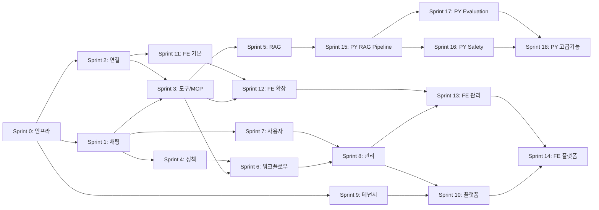
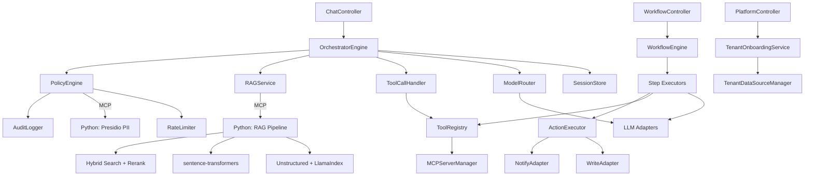
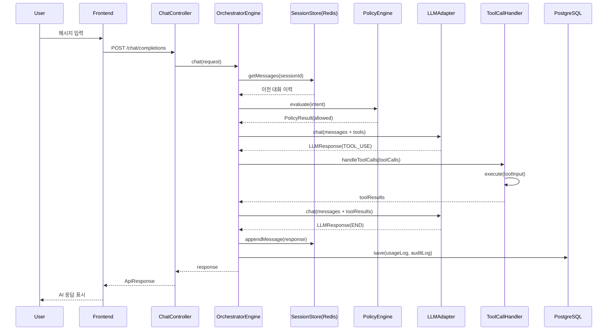

# T3-6. 실행 지시서 (Execution Specification)

> 설계 버전: 2.0 | 최종 수정: 2026-03-12 | 관련 CR: CR-002

> **프로젝트**: Aimbase
> **유형**: Fullstack (BE + FE)
> **작성일**: 2026-03-10 (역설계)

---

## 0. 프로젝트 개요

멀티테넌트 LLM 오케스트레이션 플랫폼. 여러 LLM 프로바이더(Anthropic, OpenAI, Ollama)를 통합하고, 정책 엔진(DENY/APPROVAL/RATE_LIMIT/TRANSFORM), DAG 기반 워크플로우, RAG(pgvector), MCP 도구 통합, RBAC 접근 제어를 제공한다. Database-per-Tenant 멀티테넌시로 조직 간 완전한 데이터 격리를 보장한다.

| 항목 | 내용 |
|------|------|
| 유형 | Fullstack (Spring Boot BE + React FE) |
| 모듈 수 | 16개 |
| 기능 수 | 95개 (MVP 66개) |
| 비즈니스 규칙 수 | 24개 |
| 정책 수 | 16개 |
| 핵심 결정 | Database-per-Tenant, 동기 REST + Virtual Threads, pgvector 통합 |
| 연관 서비스 | Anthropic API, OpenAI API, Ollama, Slack API, PostgreSQL, Redis |

---

## 1. 산출물 맵

### T1: 요구사항 분석

| T번호 | 산출물명 | 파일명 | 요약 |
|--------|---------|--------|------|
| T1-1 | 기능요구사항 명세서 | T1-1_기능요구사항_명세서.md | 95개 기능, 16모듈, MVP 66개 |
| T1-2 | 모듈 요약 대시보드 | T1-2_모듈_요약.md | 16개 모듈 현황 |
| T1-3 | 비즈니스 규칙 정의서 | T1-3_비즈니스_규칙.md | 24개 불변 규칙 |
| T1-4 | 정책 정의서 | T1-4_정책_정의.md | 16개 변경 가능 정책 |
| T1-5 | FSM 상태 정의서 | T1-5_FSM_상태_정의.md | 7개 엔티티 상태 머신 |
| T1-6 | 이벤트 계약서 | T1-6_이벤트_계약.md | 23개 이벤트 |
| T1-7 | Sprint 구조도 | T1-7_Sprint_구조도.md | 15개 Sprint (BE 10 + FE 4 + 인프라 1) |
| T1-8 | 시스템 가이드 | T1-8_시스템_가이드.md | 비개발자용 안내서 |

### T2: 아키텍처 설계

| T번호 | 산출물명 | 파일명 | 요약 |
|--------|---------|--------|------|
| T2-1 | 기술스택 결정서 | T2-1_기술스택_결정서.md | Java 21 + Spring Boot 3.4 + React 18 |
| T2-2 | CLAUDE.md 템플릿 | T2-2_CLAUDE_md_템플릿.md | 프로젝트 규칙/컨벤션 |

### T3: 상세 설계

| T번호 | 산출물명 | 파일명 | 요약 |
|--------|---------|--------|------|
| T3-1 | 데이터 모델 정의서 | T3-1_데이터_모델.md | Master 5 + Tenant 17 엔티티 |
| T3-2 | API 설계서 | T3-2_API_설계.md | 70+ REST 엔드포인트 |
| T3-3 | 화면/컴포넌트 구조서 | T3-3_화면_컴포넌트_구조.md | 13페이지 + 8 공통 컴포넌트 |
| T3-4 | 화면 상호작용 명세서 | T3-4_화면_상호작용.md | 6개 복잡 페이지 상호작용 |
| T3-5 | 단위테스트 명세서 | T3-5_단위테스트_명세.md | 60+ 테스트 케이스 |
| T3-6 | 실행 지시서 | T3-6_실행_지시서.md | 본 문서 |

### T4: 구현 이후

| T번호 | 산출물명 | 파일명 | 요약 |
|--------|---------|--------|------|
| T4-1 | 검증 체크리스트 | T4-1_검증_체크리스트.md | Sprint별 검증 항목 |
| T4-2 | 수동 인수테스트 | T4-2_수동_인수테스트.md | UAT 시나리오 |
| T4-3 | 오픈 점검 체크리스트 | T4-3_오픈_점검_체크리스트.md | 배포 전 점검 |
| T4-4 | 스모크 테스트 | T4-4_스모크_테스트.md | 배포 후 생존 확인 |
| T4-5 | 변경 이력 | T4-5_변경_이력.md | CR 추적 |
| T4-6 | 설치 메뉴얼 | T4-6_설치_메뉴얼.md | 개발환경 구축 |
| T4-7 | 운영 메뉴얼 | T4-7_운영_메뉴얼.md | 운영/장애 대응 |
| T4-8 | 데모 시나리오 | T4-8_데모_시나리오.md | Sprint 리뷰 시나리오 |

---

## 2. 기술 스택 요약

### Backend

| 영역 | 선택 |
|------|------|
| 언어 | Java 21 (Virtual Threads) |
| 프레임워크 | Spring Boot 3.4.2 |
| ORM | Spring Data JPA + Hibernate 6.3 |
| DB | PostgreSQL 16 + pgvector |
| 캐시 | Redis 7 |
| 마이그레이션 | Flyway |
| LLM SDK | Anthropic 2.12.0, OpenAI 2.1.0, Spring AI 1.0.0 |
| MCP | MCP SDK 0.10.0 |
| 빌드 | Gradle 8.x (Kotlin DSL) |

### Frontend

| 영역 | 선택 |
|------|------|
| 언어 | TypeScript 5.6 |
| UI | React 18.3.1 |
| 빌드 | Vite 5.4.10 |
| 상태관리 | TanStack React Query 5.90 |
| 라우팅 | React Router 6.27 |
| HTTP | Axios 1.7.7 |

---

## 3. 모듈 총괄

| 모듈 | 기능수 | 책임 | 외부연동 |
|------|--------|------|---------|
| 채팅 | 2 | LLM 채팅 (동기/스트리밍) | Anthropic, OpenAI, Ollama |
| 연결 | 6 | 외부 서비스 연결 관리 | 각 프로바이더 |
| MCP | 6 | MCP 서버/도구 관리 | MCP 서버 |
| 스키마 | 5 | JSON 스키마 관리/검증 | - |
| 정책 | 7 | 정책 규칙 관리/평가 | Redis (Rate Limit) |
| 프롬프트 | 6 | 프롬프트 템플릿 관리 | - |
| 라우팅 | 5 | 모델 라우팅 규칙 | - |
| 워크플로우 | 9 | DAG 워크플로우 실행 | - |
| RAG | 12 | 지식소스/벡터 검색 | OpenAI (임베딩) |
| 관리 | 7 | 대시보드/승인 관리 | - |
| 사용자 | 6 | 사용자 CRUD | - |
| 역할 | 5 | RBAC 역할 관리 | - |
| 모니터링 | 2 | 성능/비용 모니터링 | Prometheus |
| 플랫폼관리 | 10 | 테넌트/구독 관리 | PostgreSQL Admin |
| 오케스트레이터 | 4 | 요청 오케스트레이션 | Redis |
| 액션 | 3 | Write/Notify 실행 | PostgreSQL, Slack |

---

## 4. 데이터 모델 요약

Master DB에 5개 테이블(tenants, subscriptions, tenant_admins, global_config, tenant_usage_summary), Tenant DB에 17개 테이블(connections, mcp_servers, schemas, policies, prompts, routing_config, workflows, workflow_runs, users, roles, knowledge_sources, embeddings, retrieval_config, action_logs, audit_logs, usage_logs, pending_approvals, ingestion_logs). JSONB를 적극 활용하여 동적 설정을 저장하며, pgvector의 vector(1536) 타입으로 임베딩 벡터를 관리한다.

---

## 5. Sprint별 참조 가이드

### Sprint 0: 인프라 세팅

- **목표**: 프로젝트 기반 구축
- **작업 수**: 8

| 순서 | 파일 | 참조 범위 |
|------|------|----------|
| 1 | T2-1_기술스택_결정서.md | 전체 |
| 2 | T3-1_데이터_모델.md | 전체 (Flyway 마이그레이션 설계) |
| 3 | T2-2_CLAUDE_md_템플릿.md | 프로젝트 구조, 네이밍 규칙 |

### Sprint 1: 핵심 채팅 (BE)

- **목표**: LLM 채팅 핵심 기능 구현
- **작업 수**: 7

| 순서 | 파일 | 참조 범위 |
|------|------|----------|
| 1 | T1-1_기능요구사항_명세서.md | PRD-001, PRD-002, PRD-089~091 |
| 2 | T1-3_비즈니스_규칙.md | BIZ-001~004, BIZ-016~017 |
| 3 | T3-2_API_설계.md | Chat 섹션 |
| 4 | T3-5_단위테스트_명세.md | Sprint 1 섹션 |

### Sprint 2: 연결 관리 (BE)

- **목표**: 외부 서비스 연결 CRUD
- **작업 수**: 6

| 순서 | 파일 | 참조 범위 |
|------|------|----------|
| 1 | T1-1_기능요구사항_명세서.md | PRD-003~008 |
| 2 | T1-5_FSM_상태_정의.md | Connection FSM |
| 3 | T3-1_데이터_모델.md | connections 테이블 |
| 4 | T3-2_API_설계.md | Connections 섹션 |

### Sprint 3: 도구 & MCP (BE)

- **목표**: 도구 호출 루프 + MCP 통합
- **작업 수**: 7

| 순서 | 파일 | 참조 범위 |
|------|------|----------|
| 1 | T1-1_기능요구사항_명세서.md | PRD-009~014, PRD-092 |
| 2 | T1-3_비즈니스_규칙.md | BIZ-001, BIZ-017, BIZ-022 |
| 3 | T1-5_FSM_상태_정의.md | MCPServer FSM |
| 4 | T3-5_단위테스트_명세.md | Sprint 3 섹션 |

### Sprint 4: 정책 엔진 (BE)

- **목표**: 정책 CRUD + PolicyEngine + 감사 로깅
- **작업 수**: 7

| 순서 | 파일 | 참조 범위 |
|------|------|----------|
| 1 | T1-1_기능요구사항_명세서.md | PRD-020~026, PRD-095 |
| 2 | T1-3_비즈니스_규칙.md | BIZ-005~007, BIZ-020 |
| 3 | T1-4_정책_정의.md | POL-007 |
| 4 | T3-5_단위테스트_명세.md | Sprint 4 섹션 |

### Sprint 5: RAG (BE)

- **목표**: 인제스션 파이프라인 + 벡터 검색
- **작업 수**: 7

| 순서 | 파일 | 참조 범위 |
|------|------|----------|
| 1 | T1-1_기능요구사항_명세서.md | PRD-047~058 |
| 2 | T1-3_비즈니스_규칙.md | BIZ-012~013 |
| 3 | T1-5_FSM_상태_정의.md | KnowledgeSource FSM |
| 4 | T3-5_단위테스트_명세.md | Sprint 5 섹션 |

### Sprint 6: 워크플로우 (BE)

- **목표**: DAG 워크플로우 엔진 + 액션 실행
- **작업 수**: 8

| 순서 | 파일 | 참조 범위 |
|------|------|----------|
| 1 | T1-1_기능요구사항_명세서.md | PRD-038~046, PRD-093~094 |
| 2 | T1-3_비즈니스_규칙.md | BIZ-009~011, BIZ-023 |
| 3 | T1-5_FSM_상태_정의.md | WorkflowRun FSM, PendingApproval FSM |
| 4 | T3-5_단위테스트_명세.md | Sprint 6 섹션 |

### Sprint 7~10: 사용자/관리/테넌시/플랫폼 (BE)

| 순서 | 파일 | 참조 범위 |
|------|------|----------|
| 1 | T1-1_기능요구사항_명세서.md | PRD-059~088 |
| 2 | T1-3_비즈니스_규칙.md | BIZ-008, BIZ-014~015, BIZ-024 |
| 3 | T1-5_FSM_상태_정의.md | Tenant FSM, User FSM |
| 4 | T3-5_단위테스트_명세.md | Sprint 9 섹션 |

### Sprint 11~14: 프론트엔드

| 순서 | 파일 | 참조 범위 |
|------|------|----------|
| 1 | T3-3_화면_컴포넌트_구조.md | 전체 |
| 2 | T3-4_화면_상호작용.md | 해당 Sprint 페이지 |
| 3 | T3-2_API_설계.md | 해당 API 섹션 |
| 4 | T2-2_CLAUDE_md_템플릿.md | FE 아키텍처 규칙 |

---

## 5-A. 구현 세션 분리 전략

### 옵션 A: Sprint 단위 BE/FE 분리 (권장)
- BE Sprint 0~10 먼저 완료
- FE Sprint 11~14 순차 진행
- FE는 BE API 완성 후 진행하므로 Mock 불필요

### BE 세션 지시
1. CLAUDE.md 읽기
2. T3-6 (본 문서) Sprint별 참조 가이드 확인
3. 해당 Sprint의 참조 파일 순서대로 읽기
4. 구현 → 테스트 → 다음 Sprint

### FE 세션 지시
1. CLAUDE.md 읽기
2. T3-3 화면 구조 확인
3. T3-4 상호작용 명세 확인
4. API 프록시 설정 (Vite → localhost:8080)
5. 구현 → 다음 페이지

---

### Python 사이드카 세션 지시 (v2.0, CR-002)

**Sprint 15: RAG Pipeline**
1. CLAUDE.md 읽기
2. T2-1 Python 사이드카 기술 스택 확인
3. T1-1 PY-001~PY-005, PRD-052, PRD-053 확인
4. T3-2 MCP Server 1 API 확인
5. T3-5 TC-PY-RAG-001~007 테스트 케이스 확인
6. Python 프로젝트 세팅 (uv + FastMCP) → MCP Tool 구현 → pytest 테스트
7. Spring MCP Client 연동 테스트 (기존 IngestionPipeline/VectorSearcher → MCP 호출로 전환)

**Sprint 16: Safety**
1. T1-1 PY-009, PRD-095 확인
2. T3-2 MCP Server 3 API 확인
3. T3-5 TC-PY-SAFE-001~004 테스트 케이스 확인
4. Presidio + 한국어 커스텀 recognizer 구현 → Spring PolicyEngine 연동

**Sprint 17: Evaluation**
1. T1-1 PY-006~PY-008 확인
2. T3-2 MCP Server 2 API 확인
3. T3-5 TC-PY-EVAL-001~003 테스트 케이스 확인
4. RAGAS + DeepEval 구현 → 대시보드 연동

---

## 6. 핵심 아키텍처 원칙 (Quick Reference)

1. **Database-per-Tenant**: 테넌트별 독립 DB, TenantRoutingDataSource로 라우팅
2. **동기 REST + Virtual Threads**: 이벤트 버스 미사용, I/O-bound LLM 호출을 Virtual Threads로 처리
3. **통합 메시지 모델**: UnifiedMessage로 프로바이더 간 메시지 형식 통일
4. **정책 우선 제어**: 모든 액션/LLM 호출 전 PolicyEngine 평가 필수
5. **감사 로깅 의무화**: 주요 이벤트 AuditLogger로 기록
6. **JSONB 활용**: 동적 설정(config, rules, steps)은 JSONB로 유연하게 관리
7. **Python 사이드카 하이브리드**: AI 특화 기능은 Python MCP Server, 엔터프라이즈 오케스트레이션은 Spring (CR-002)

---

## 7. Sprint 의존관계 다이어그램

---

## 8. 설계 리뷰 시트

### 8-1. 모듈 관계도

### 8-2. 데이터 흐름도

### 8-3. 화면-API 매핑 요약

| 화면 | 주요 API | 비고 |
|------|---------|------|
| Dashboard | GET /admin/dashboard, /action-logs, /approvals, /usage | 자동 갱신 (5~30s) |
| Connections | CRUD /connections, POST /connections/{id}/test | 헬스체크 |
| MCPServers | CRUD /mcp-servers, POST /{id}/discover | 도구 탐색 |
| Schemas | CRUD /schemas, POST /{id}/{v}/validate | 검증 |
| Policies | CRUD /policies, POST /simulate | 시뮬레이션 |
| Prompts | CRUD /prompts, POST /{id}/{v}/test | 렌더링 테스트 |
| Workflows | CRUD /workflows, POST /{id}/run | 실행 |
| Knowledge | CRUD /knowledge-sources, POST /{id}/sync, POST /search | 인제스션 + 검색 |
| Auth | CRUD /users + /roles, POST /{id}/api-key | API 키 |
| Monitoring | GET /models, /admin/usage | 읽기 전용 |
| Tenants | CRUD /platform/tenants + suspend/activate | Super Admin |
| Subscriptions | GET/PUT /platform/subscriptions | Super Admin |
| PlatformMonitoring | GET /platform/usage | Super Admin |

### 8-4. 리뷰 체크리스트

- [ ] 모든 FSM 상태 전환이 화이트리스트 기반인가?
- [ ] 정책 평가가 모든 액션/LLM 호출 경로에 적용되는가?
- [ ] 멀티테넌트 격리가 API/DB/Session 레벨에서 보장되는가?
- [ ] 도구 호출 루프 최대 5회 제한이 적용되는가?
- [ ] 감사 로그가 주요 이벤트에 모두 기록되는가?
- [ ] API 응답이 ApiResponse 래퍼로 통일되는가?
- [ ] JSONB 필드 스키마가 코드와 일관성 있는가?
- [ ] pgvector HNSW 인덱스가 임베딩 테이블에 적용되는가?
- [ ] FE 자동 갱신 간격이 UX에 적절한가?
- [ ] Super Admin 경로가 Master DB에만 접근하는가?
