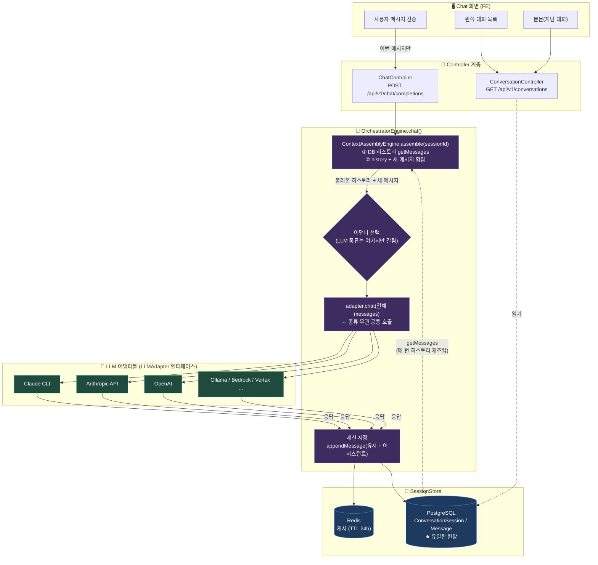

# Aimbase Chat 히스토리 — 저장 & 불러오기 전체 흐름

## 핵심 3가지

1. **저장** — 오케스트레이터가 매 대화마다 `appendMessage` → Redis + **PostgreSQL(원장)**. LLM 종류 무관.
2. **불러오기(2종류)**
   - 화면 목록/본문: `ConversationController` → DB 직접 읽기
   - 대화 맥락: `assemble()`이 매 턴 `getMessages`로 DB 히스토리를 **다시 조립**해 어댑터에 넘김
3. **LLM 종류는 "어댑터 선택" 한 지점에서만 갈림.** 그 위(assemble/저장)와 아래(DB)는 종류를 모름 → **CLI도 불러온 히스토리를 다시 내보냄.**

## 실측 근거 (파일:라인)

| 단계 | 위치 |
|---|---|
| 히스토리 불러와서 붙임 | `ContextAssemblyEngine.java:271, 277, 279` |
| 어댑터 선택 (종류 갈림) | `OrchestratorEngine.java:271~285` |
| 공통 호출 | `OrchestratorEngine.java:355~364` (CLI도 `adapter.chat()`) |
| 저장 (분기 없음) | `OrchestratorEngine.java:425~427` |
| Redis + DB 저장 | `SessionStore.java:53~56` |
| 화면 목록/본문 읽기 | `ConversationController.java` (GET /conversations) |
