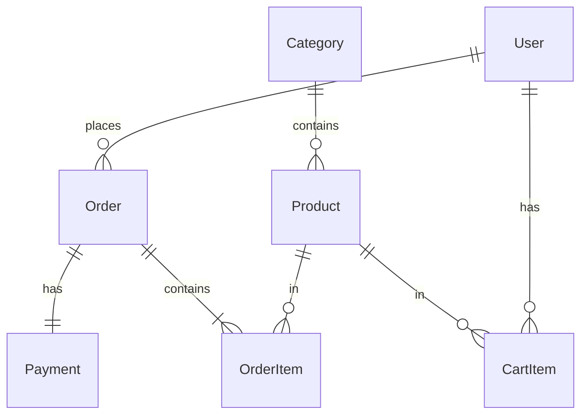

# [프로젝트명] 데이터 모델 정의

> 설계 버전: 1.0 | 최종 수정: YYYY-MM-DD | 관련 CR: -

> 단계: 3. Detail Design | 실행스펙 섹션 2에 포함
>
> 엔티티, 필드, 관계, Enum, 인덱스를 정의한다.
> Claude Code가 이 문서를 보고 엔티티 코드와 마이그레이션을 생성한다.

---

## Enum 정의

### OrderStatus (주문 상태)

| 값 | 설명 |
|----|------|
| CREATED | 주문 생성 |
| PAID | 결제 확인 |
| PROCESSING | 처리중 |
| SHIPPED | 배송중 |
| DELIVERED | 배송 완료 |
| CANCELLED | 취소 |
| RETURN_REQUESTED | 반품 요청 |
| RETURNED | 반품 완료 |

### ProductStatus (상품 상태)

| 값 | 설명 |
|----|------|
| DRAFT | 임시저장 |
| ACTIVE | 판매중 |
| SOLD_OUT | 판매 완료 |
| HIDDEN | 숨김 |

### ProductGrade (상품 등급)

| 값 | 설명 |
|----|------|
| A | 거의 새 제품 (미사용, 태그) |
| B | 양호 (경미한 사용감, 세탁 완료) |
| C | 보통 (사용감, 수선 완료) |

<!-- Enum 추가 시 같은 형식 -->

---

## 엔티티 정의

### User (회원)

| 필드 | 타입 | 필수 | 기본값 | 설명 |
|------|------|------|--------|------|
| id | UUID | PK | auto | |
| email | VARCHAR(255) | Y | | UNIQUE |
| password_hash | VARCHAR(255) | Y | | bcrypt |
| name | VARCHAR(50) | Y | | |
| phone | VARCHAR(20) | N | | |
| role | UserRole | Y | MEMBER | MEMBER, ADMIN |
| is_active | BOOLEAN | Y | true | |
| created_at | TIMESTAMP | Y | now() | |
| updated_at | TIMESTAMP | Y | now() | |

**인덱스**:
- `uniq_users_email` — email (UNIQUE)

---

### Product (상품)

| 필드 | 타입 | 필수 | 기본값 | 설명 |
|------|------|------|--------|------|
| id | UUID | PK | auto | |
| title | VARCHAR(200) | Y | | 상품명 |
| description | TEXT | N | | |
| price | INTEGER | Y | | 원 단위 |
| original_price | INTEGER | N | | 정가 (할인율 계산용) |
| grade | ProductGrade | Y | | A/B/C |
| status | ProductStatus | Y | DRAFT | |
| category_id | UUID | FK | | → Category.id |
| images | JSONB | N | [] | 이미지 URL 배열 |
| sold_out_at | TIMESTAMP | N | | SOLD_OUT 전환 시점 |
| created_at | TIMESTAMP | Y | now() | |
| updated_at | TIMESTAMP | Y | now() | |

**인덱스**:
- `idx_products_status` — status
- `idx_products_grade` — grade
- `idx_products_category_id` — category_id
- `idx_products_created_at` — created_at DESC

---

### Order (주문)

| 필드 | 타입 | 필수 | 기본값 | 설명 |
|------|------|------|--------|------|
| id | UUID | PK | auto | |
| order_number | VARCHAR(20) | Y | | UNIQUE, 표시용 주문번호 |
| user_id | UUID | FK | | → User.id |
| status | OrderStatus | Y | CREATED | |
| total_amount | INTEGER | Y | | 원 단위 |
| cancelled_at | TIMESTAMP | N | | |
| cancel_reason | VARCHAR(500) | N | | |
| created_at | TIMESTAMP | Y | now() | |
| updated_at | TIMESTAMP | Y | now() | |

**인덱스**:
- `uniq_orders_order_number` — order_number (UNIQUE)
- `idx_orders_user_id` — user_id
- `idx_orders_status` — status
- `idx_orders_created_at` — created_at DESC

<!-- 엔티티 추가 시 같은 형식 -->

---

## 엔티티 관계



---

## 작성 가이드

**Enum**: 간단한 테이블 형식 (값 + 설명)

**엔티티**: 필드 테이블 + 인덱스 목록
```
### [엔티티명] ([한글명])
| 필드 | 타입 | 필수 | 기본값 | 설명 |
**인덱스**: idx/uniq 목록
```

**관계**: 텍스트 또는 Mermaid ERD

**원칙**:
- 타입은 DB 수준으로 작성 (VARCHAR, INTEGER, TIMESTAMP 등)
- 금액은 정수(원 단위)로 저장, 소수점 불필요 시 INTEGER
- FK는 `→ [참조테이블].[참조필드]` 형식으로 명시
- 모든 테이블에 created_at, updated_at 포함
- 소프트삭제 필요 시 deleted_at 추가
