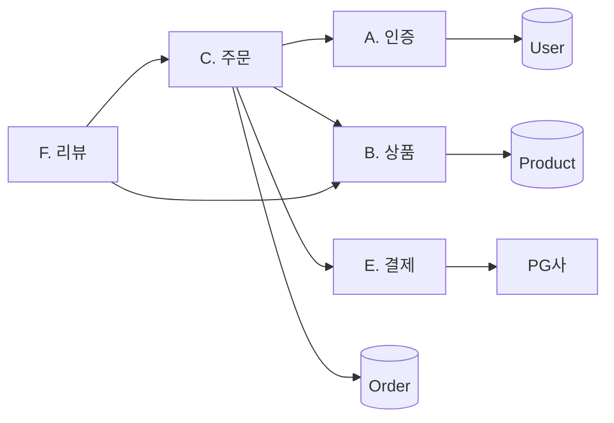
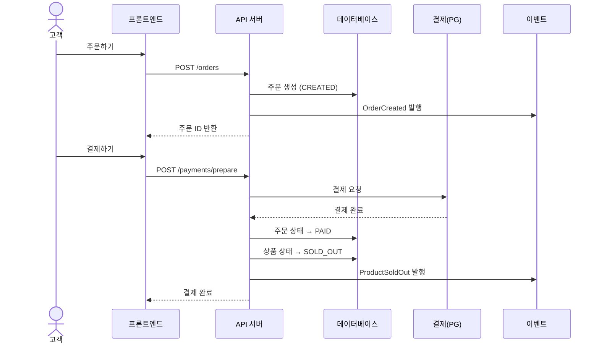

# 실행 지시서: [프로젝트명]

> 설계 버전: 1.0 | 최종 수정: YYYY-MM-DD | 관련 CR: -

> **프로젝트:** [프로젝트코드] ([프로젝트 한 줄 설명])
> **프로젝트 유형:** [BE / FE / 풀스택]
> **버전:** v1
> **최종 갱신:** YYYY-MM-DD
>
> 이 문서는 **실행 지시서**입니다.
> Claude Code는 CLAUDE.md → 이 문서 → 해당 Sprint 참조 파일 순서로 읽습니다.
> 각 산출물의 상세 내용은 개별 파일을 직접 참조하세요. 내용을 이 문서에 복사하지 않습니다.

---

## 0. 프로젝트 개요

[프로젝트 목적과 핵심 특징을 3~5줄로 요약]

- **유형:** [BE / FE / 풀스택]
- **모듈:** N개 | **기능:** N개 | **비즈니스 규칙:** N개 | **정책:** N개
- **핵심 설계 결정:** [가장 중요한 아키텍처 결정 1~2개]
- **연관 서비스:** [외부 서비스, 공통 라이브러리 등]

---

## 1. 산출물 맵

> 파일 경로는 `docs/` 기준. 프로젝트 유형에 따라 해당 산출물만 포함.

### 1단계: 요구사항 분석

| 번호 | 산출물 | 파일명 | 요약 |
|------|--------|--------|------|
| T1-1 | 기능 요구사항 명세서 | `T1-1_기능요구사항_명세서.md` | N모듈 N기능 |
| T1-7 | Sprint 구조도 | `T1-7_Sprint_구조도.md` | Sprint 0~N, 의존관계, 검증 기준 |
| T1-3 | 비즈니스 규칙 | `T1-3_비즈니스_규칙.md` | N개 불변 규칙 |
| T1-5 | FSM 상태 정의 | `T1-5_FSM_상태_정의.md` | 엔티티 FSM + UI FSM |
| T1-6 | 이벤트 계약 | `T1-6_이벤트_계약.md` | N개 이벤트, 발행/수신/FE소비 |
| T1-4 | 정책 정의 | `T1-4_정책_정의.md` | N개 변경 가능 규칙 |
| T1-2 | 모듈 요약 | `T1-2_모듈_요약.md` | 모듈별 기능 수/MVP/책임 |

### 2단계: 아키텍처 설계

| 번호 | 산출물 | 파일명 | 요약 |
|------|--------|--------|------|
| T2-1 | 기술 스택 결정서 | `T2-1_기술스택_결정서.md` | BE/FE 기술 선택과 이유 |
| T2-2 | CLAUDE.md | 프로젝트 루트 `CLAUDE.md` | 프로젝트 컨텍스트, 네이밍 규칙 |

### 3단계: 상세 설계

| 번호 | 산출물 | 파일명 | 유형 | 요약 |
|------|--------|--------|------|------|
| T3-1 | 데이터 모델 | `T3-1_데이터_모델.md` | BE/풀스택 | 엔티티, 필드, 관계 (FE전용: 타입 정의) |
| T3-2 | API 설계 | `T3-2_API_설계.md` | 공통 | BE: 제공 / FE: 소비 관점 |
| T3-3 | 화면/컴포넌트 구조 | `T3-3_화면_컴포넌트_구조.md` | FE/풀스택 | 페이지, 컴포넌트 트리, 공통 표기 |
| T3-4 | 화면 상호작용 | `T3-4_화면_상호작용.md` | FE/풀스택 | 복잡한 페이지 인터랙션 명세 |
| T3-5 | 단위테스트 명세 | `T3-5_단위테스트_명세.md` | 공통 | Sprint별 코드 레벨 테스트 케이스 |

### 관리

| 번호 | 산출물 | 파일명 | 요약 |
|------|--------|--------|------|
| CR | 변경 이력 | `CR_변경_이력.md` | CR 목록 |

---

## 2. 기술 스택 요약

### 백엔드 (BE/풀스택)

| 영역 | 선택 | 비고 |
|------|------|------|
| 언어 | — | — |
| 프레임워크 | — | — |
| DB 접근 | — | — |
| DB | — | — |
| 캐시 | — | — |
| 인증 | — | — |

### 프론트엔드 (FE/풀스택)

| 영역 | 선택 | 비고 |
|------|------|------|
| 프레임워크 | — | — |
| 상태 관리 | — | — |
| UI 라이브러리 | — | 공통 라이브러리 여부 |
| 스타일 | — | — |
| HTTP | — | — |
| 테스트 | — | — |

---

## 3. 모듈 총괄

| 모듈 | 기능 수 | 책임 | 외부 연동 |
|------|---------|------|----------|
| A. [모듈명] | N | [한 줄 책임] | — |

---

## 4. 데이터 모델 요약

> 상세: `docs/T3-1_데이터_모델.md`

[엔티티 수, FSM 관리 엔티티 목록, 핵심 설계 원칙 3~5줄만 요약]

---

## 5. Sprint별 참조 가이드

> 각 Sprint 구현 시, 아래 파일들을 지정된 순서로 읽으세요.
> 풀스택 프로젝트: BE/FE 참조를 분리하여 명시.

### FE 초기 세팅 (FE/풀스택 프로젝트만 해당)

> **1회 실행.** 최초 FE 세션 시작 시 Claude Code가 수행한다.

1. `frontend/` 디렉토리를 생성한다
2. `claude-code-fe-template`을 `frontend/`에 클론한다:
   ```
   git clone git@github-therecommerce:therecommerce-develop/claude-code-fe-template.git frontend --depth=1
   ```
3. `frontend/CLAUDE.md`를 읽고 지시에 따른다

---

### Sprint 0: [Sprint명]

**목표:** [한 줄 목표]
**작업:** N개

| 순서 | 읽을 파일 | 참조 범위 |
|------|----------|----------|
| 1 | `CLAUDE.md` | 프로젝트 개요, 디렉토리 구조, 기술 스택 |
| 2 | `AI-SDLC_공통라이브러리_레퍼런스.md` | 직접 구현 금지 목록, 확장 포인트 |
| 3 | `docs/T1-7_Sprint_구조도.md` | Sprint 0 섹션 — 검증 기준 |

**핵심 설계 결정:**
- [이 Sprint에서 Claude Code가 따라야 할 구조적 결정 3~5줄]
- 예: 인증 방식, 에러 처리 패턴, 상태관리 전략 등

**핵심 검증:** [이 Sprint의 핵심 검증 항목]

---

### Sprint 1: [Sprint명] (풀스택 예시)

**전제:** Sprint 0 완료
**구현 순서:** [순차 / 병렬 / 분리]
**기능:** N개 ([관련 모듈])

#### BE 참조

| 순서 | 읽을 파일 | 참조 범위 |
|------|----------|----------|
| 1 | `CLAUDE.md` | BE 아키텍처 규칙, 네이밍 |
| 2 | `docs/T3-1_데이터_모델.md` | [참조할 엔티티 목록] |
| 3 | `docs/T1-5_FSM_상태_정의.md` | [참조할 엔티티 FSM] |
| 4 | `docs/T1-1_기능요구사항_명세서.md` | [참조할 기능 ID 범위] |
| 5 | `docs/T1-3_비즈니스_규칙.md` | [참조할 BIZ 규칙] |
| 6 | `docs/T1-6_이벤트_계약.md` | [참조할 이벤트] |
| 7 | `docs/T3-2_API_설계.md` | [참조할 모듈 API] |
| 8 | `docs/T1-7_Sprint_구조도.md` | Sprint 1 BE 작업 + 검증 기준 |

#### FE 참조

| 순서 | 읽을 파일 | 참조 범위 |
|------|----------|----------|
| 1 | `CLAUDE.md` | FE 아키텍처 규칙, FE 공통 라이브러리 |
| 3 | `docs/T3-3_화면_컴포넌트_구조.md` | [참조할 페이지] |
| 4 | `docs/T3-4_화면_상호작용.md` | [참조할 페이지 — 해당 시] |
| 5 | `docs/T1-5_FSM_상태_정의.md` | [참조할 UI FSM — 해당 시] |
| 6 | `docs/T1-6_이벤트_계약.md` | [FE 소비 이벤트 — 해당 시] |
| 7 | `docs/T1-7_Sprint_구조도.md` | Sprint 1 FE 작업 + 검증 기준 |

**핵심 설계 결정:**
- [이 Sprint에서 Claude Code가 따라야 할 구조적 결정 3~5줄]
- 예: 트랜잭션 범위, 캐싱 전략, 컴포넌트 상태 패턴 등

**핵심 검증:** [이 Sprint의 BE/FE 핵심 검증 항목]

---

<!-- Sprint N까지 반복. BE 전용 / FE 전용 프로젝트는 해당 영역 참조만 작성 -->

---

## 5-A. 구현 세션 분리 전략

> **풀스택 / 대규모 프로젝트 해당.** BE와 FE를 별도 Claude Code 세션으로 구현할 경우 아래를 기준으로 운영한다.
> Sprint 당 기능이 적거나 단일 세션으로 충분한 경우, 이 섹션을 삭제하고 5번 Sprint별 참조 가이드만 사용한다.

### 세션 분리 전략 선택

| 전략 | 설명 | 권장 조건 |
|------|------|----------|
| **옵션 A: Sprint 단위 BE/FE 분리** | Sprint N-BE 세션 → Sprint N-FE 세션 순으로 진행 | Sprint 당 기능 10개 이상 — **권장** |
| **옵션 B: 전체 BE 완료 후 FE** | 모든 Sprint BE 완료 → 모든 Sprint FE 순으로 진행 | 후반 통합 이슈 집중 — 비권장 |

**선택한 전략:** [옵션 A / 옵션 B]

---

### BE 세션 시작 지시

> Sprint N-BE 세션 시작 시, Claude Code에 아래 메시지와 함께 파일을 읽힌다.

```
이 세션은 [프로젝트명] Sprint [N] BE 구현 세션입니다.
아래 파일을 순서대로 읽고 구현을 시작하세요.
```

| 순서 | 읽을 파일 | 목적 |
|------|----------|------|
| 1 | `docs/execution-spec.md` | 프로젝트 개요 + Sprint [N] BE 참조 가이드 |
| 2 | `CLAUDE.md` | BE 아키텍처 규칙, 네이밍 컨벤션 |
| 3 | `docs/T1-7_Sprint_구조도.md` | Sprint [N] BE 작업 목록 + 검증 기준 |
| 4 | `docs/T3-1_데이터_모델.md` | [참조 엔티티 목록] |
| 5 | `docs/T3-2_API_설계.md` | [참조 모듈 API] |
| 6 | `docs/T1-5_FSM_상태_정의.md` | [참조 FSM] |
| 7 | `docs/T1-6_이벤트_계약.md` | [참조 이벤트] |
| 8 | `docs/T3-5_단위테스트_명세.md` | Sprint [N] BE 테스트 케이스 |

---

### FE 세션 시작 지시

> Sprint N-FE 세션 시작 시, Claude Code에 아래 메시지와 함께 파일을 읽힌다.
> T3-1(DB 스키마), T1-5(FSM 전체), T1-6(Kafka 이벤트)는 FE 세션에서 읽지 않아도 된다.

```
이 세션은 [프로젝트명] Sprint [N] FE 구현 세션입니다.
아래 파일을 순서대로 읽고 구현을 시작하세요.
```

**최초 FE 세션인 경우 — 파일 읽기 전 먼저 수행:**

1. `frontend/` 디렉토리를 생성한다
2. `claude-code-fe-template`을 `frontend/`에 클론한다:
   ```
   git clone git@github-therecommerce:therecommerce-develop/claude-code-fe-template.git frontend --depth=1
   ```
3. `frontend/CLAUDE.md`를 읽고 지시에 따른다

> `frontend/` 디렉토리가 이미 존재하면 위 단계를 건너뛰고 파일 읽기부터 시작한다.

---

| 순서 | 읽을 파일 | 목적 |
|------|----------|------|
| 1 | `docs/execution-spec.md` | 프로젝트 개요 + Sprint [N] FE 참조 가이드 |
| 2 | `CLAUDE.md` | FE 아키텍처 규칙, 공통 컴포넌트 규칙 |
| 3 | `docs/T1-7_Sprint_구조도.md` | Sprint [N] FE 작업 목록 + 검증 기준 |
| 4 | `docs/T3-2_API_설계.md` | [참조 모듈 API 응답 타입] — BE↔FE 계약서 |
| 5 | `docs/T3-3_화면_컴포넌트_구조.md` | [참조 페이지 목록] |
| 6 | `docs/T3-4_화면_상호작용.md` | [복잡 페이지 해당 시] |
| 7 | `docs/T3-5_단위테스트_명세.md` | Sprint [N] FE Hook/Store 테스트 케이스 |

**MSW 목킹 전략:** BE 구현 완료 전 FE 병렬 작업 시, `T3-2_API_설계.md` 응답 스키마를 그대로 사용해 MSW 핸들러(`mocks/handlers/`)를 먼저 생성한 뒤 화면을 구현한다. BE 완료 후 실제 API로 교체(MSW 핸들러 삭제).

---

## 6. 핵심 아키텍처 원칙 (Quick Reference)

구현 중 자주 참조할 원칙들을 요약합니다. 상세는 CLAUDE.md와 T1-3 참조.

1. [원칙 1] ([근거 BIZ/POL ID])
2. [원칙 2] ([근거 BIZ/POL ID])
3. [원칙 3] ([근거 BIZ/POL ID])

---

## 7. Sprint 의존관계 다이어그램

```
Sprint 0 ([Sprint명])
    │
    ▼
Sprint 1 ([Sprint명])
    │
    ├──────────────┐
    ▼              ▼
Sprint 2        Sprint 3
([Sprint명])   ([Sprint명])
    │              │
    └──────┬───────┘
           ▼
       Sprint N ([Sprint명])
```

---

## 8. 설계 리뷰 시트

> 이 섹션은 설계 완료 시점에 작성한다.
> 사람이 "전체 설계가 맞는지" 한눈에 확인하기 위한 시각 요약.
> 상세 내용은 개별 산출물에 있으므로, 여기서는 다이어그램만 제공한다.

### 8-1. 모듈 관계도

> 어떤 모듈이 어떤 모듈을 호출/의존하는지 보여준다.



### 8-2. 데이터 흐름도

> 사용자 요청이 시스템을 거쳐 어떻게 처리되는지 보여준다.



### 8-3. 화면 - API 매핑 요약

> 각 화면이 어떤 API를 호출하는지 한눈에 확인한다.

| 화면 | 주요 API | 비고 |
|------|---------|------|
| 메인 (상품 목록) | `GET /products` | 필터, 페이징 |
| 상품 상세 | `GET /products/:id`, `GET /products/:id/reviews` | |
| 장바구니 | `GET /cart`, `POST /cart/items`, `DELETE /cart/items/:id` | |
| 주문/결제 | `POST /orders`, `POST /payments/prepare` | PG SDK 연동 |
| 내 주문 | `GET /orders`, `GET /orders/:id` | |
| 주문 취소/반품 | `POST /orders/:id/cancel`, `POST /orders/:id/return-request` | FSM 전이 |

### 8-4. 리뷰 체크리스트

> 이 시트를 보고 아래 항목을 확인한다.

- [ ] 모듈 관계도에서 빠진 의존관계가 없는가?
- [ ] 데이터 흐름에서 누락된 단계가 없는가?
- [ ] 모든 화면이 필요한 API를 호출하고 있는가?
- [ ] FSM 상태 전이가 T1-5과 일치하는가?
- [ ] 이벤트 발행/수신이 T1-6과 일치하는가?
