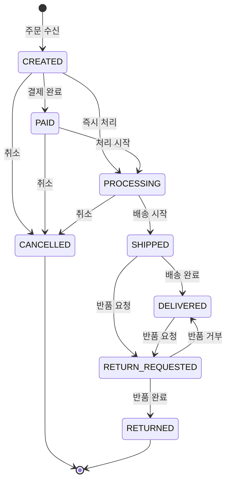
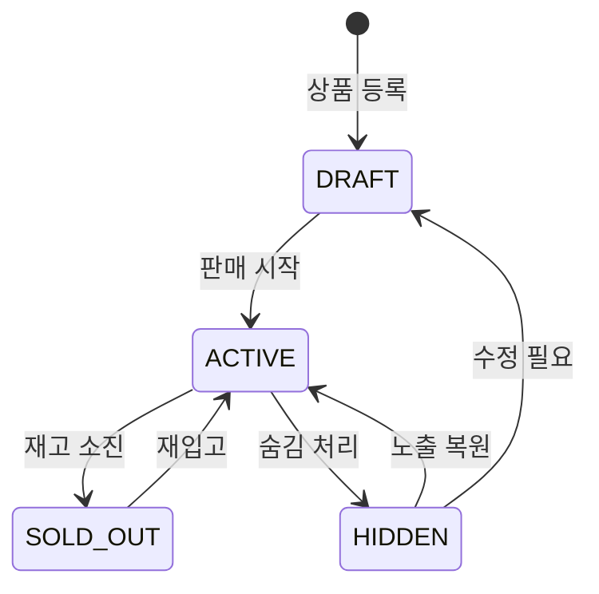

# [프로젝트명] FSM 상태 정의

> 설계 버전: 1.0 | 최종 수정: YYYY-MM-DD | 관련 CR: -

> 단계: 1. Requirements | 도구: claude.ai
>
> 모든 엔티티의 상태 흐름을 여기서 정의한다. 구현 시 상태 전이 검증의 기준이 된다.

## 전체 요약

| 엔티티 | 상태 코드 목록 |
|--------|--------------|
| Order (주문) | CREATED → PAID → PROCESSING → SHIPPED → DELIVERED → RETURN_REQUESTED → RETURNED / CANCELLED |
| Product (상품) | DRAFT → ACTIVE → SOLD_OUT / HIDDEN |

---

## Order (주문)



### CREATED | 주문 생성
- **설명**: 주문이 생성된 초기 상태
- **진입 조건**: 채널 주문 수신 및 정규화 완료
- **허용 다음 상태**: PAID, PROCESSING, CANCELLED
- **관련 기능 ID**: PRD-ORD-001

### PAID | 결제 확인
- **설명**: 결제가 확인된 상태
- **진입 조건**: 결제 완료 이벤트 수신
- **허용 다음 상태**: PROCESSING, CANCELLED
- **관련 기능 ID**: PRD-ORD-002

### PROCESSING | 처리중
- **설명**: 주문 처리 진행 중
- **진입 조건**: 결제 확인 후 처리 시작
- **허용 다음 상태**: SHIPPED, CANCELLED
- **관련 기능 ID**: PRD-ORD-003
- **비고**: 취소 제한 구간 시작

### SHIPPED | 배송중
- **설명**: 배송이 시작된 상태
- **진입 조건**: 배송 시작 이벤트 수신
- **허용 다음 상태**: DELIVERED, RETURN_REQUESTED
- **관련 기능 ID**: PRD-ORD-004
- **비고**: 취소 불가, 반품만 가능

### DELIVERED | 배송 완료
- **설명**: 배송이 완료된 상태
- **진입 조건**: 배송 완료 이벤트 수신
- **허용 다음 상태**: RETURN_REQUESTED
- **관련 기능 ID**: PRD-ORD-005

### CANCELLED | 취소
- **설명**: 주문이 취소된 상태
- **진입 조건**: 취소 처리 완료
- **허용 다음 상태**: (최종 상태)
- **관련 기능 ID**: PRD-ORD-006
- **비고**: 환불 처리 연동

### RETURN_REQUESTED | 반품 요청
- **설명**: 반품이 요청된 상태
- **진입 조건**: 구매자 반품 요청
- **허용 다음 상태**: RETURNED, DELIVERED
- **관련 기능 ID**: PRD-ORD-007
- **비고**: 반품 거부 시 DELIVERED 복원

### RETURNED | 반품 완료
- **설명**: 반품이 완료된 상태
- **진입 조건**: 반품 수거 + 검수 완료
- **허용 다음 상태**: (최종 상태)
- **관련 기능 ID**: PRD-ORD-008
- **비고**: 환불 처리 연동

---

## Product (상품)



### [상태 코드] | [상태명]
- **설명**: ...
- **진입 조건**: ...
- **허용 다음 상태**: ...
- **관련 기능 ID**: ...

<!-- 엔티티 추가 시 같은 형식으로 섹션 추가 -->

---

## 작성 규칙

1. 프로젝트의 핵심 엔티티별로 `##` 섹션을 나누어 작성한다 (Order, Product, Payment 등).
2. **'허용 다음 상태'에 명시되지 않은 전이는 전면 차단한다 (화이트리스트 방식).**
3. 각 상태의 '진입 조건'은 Claude Code가 가드 로직으로 변환할 수 있을 만큼 구체적으로 작성한다.
4. '관련 기능 ID'는 기능 요구사항 명세서(T1-1)의 ID와 매핑한다.
5. 취소/반품 등 역방향 전이는 비고에 제약 조건을 명시한다.
6. 소규모 프로젝트라도 핵심 엔티티의 상태 전이는 반드시 정의한다.

**카드 구조**:
```
## [엔티티명]
### [상태 코드] | [상태명]
- **설명**: ...
- **진입 조건**: ...
- **허용 다음 상태**: ...
- **관련 기능 ID**: ...
- **비고**: ... (선택)
```
