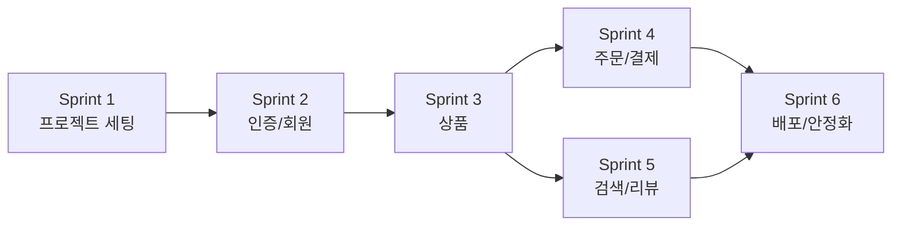

# [프로젝트명] Sprint 구조도

> 설계 버전: 1.0 | 최종 수정: YYYY-MM-DD | 관련 CR: -

> 단계: 1. Requirements | 도구: claude.ai

---

## Sprint 의존관계

> 화살표 방향 = 선행 Sprint 완료 후 진행. 같은 줄에 놓인 Sprint는 병렬 진행 가능.

---

## Sprint 구조

### Sprint 1: 프로젝트 세팅

| 기능 ID | 작업 내용 | 의존 관계 | 검증 기준 | 담당 | 상태 |
|---------|----------|----------|----------|------|------|
| 작업 1-1 | 백엔드 프로젝트 초기화 | 없음 | 서버 기동 + health check 응답 | | |
| 작업 1-2 | 프론트엔드 프로젝트 초기화 | 없음 | dev 서버 기동 + 빌드 성공 | | |

### Sprint 2: 인증/회원

| 기능 ID | 작업 내용 | 의존 관계 | 검증 기준 | 담당 | 상태 |
|---------|----------|----------|----------|------|------|
| PRD-AUTH-001 | 회원가입 API + 페이지 | Sprint 1 완료 | 회원가입 → DB 저장 → 토큰 발급 | | |
| PRD-AUTH-002 | 로그인 API + 페이지 | PRD-AUTH-001 | 로그인 → JWT 발급 → 인증 API 호출 | | |

### Sprint N: [Sprint 이름]

| 기능 ID | 작업 내용 | 의존 관계 | 검증 기준 | 담당 | 상태 |
|---------|----------|----------|----------|------|------|
| | | | | | |

---

## Sprint 분리 원칙

1. 의존관계 순서로 배치 (인증 → 상품 → 주문 → 결제)
2. 1 Sprint = Claude Code 1세션. 세션 길어지면 컨텍스트 새므로 Sprint로 끊는다.
3. 각 Sprint에 검증 기준 필수. Claude Code가 테스트 코드로 변환한다.
4. Sprint 완료 시 CLAUDE.md에 진행 상태 기록 후 commit.
